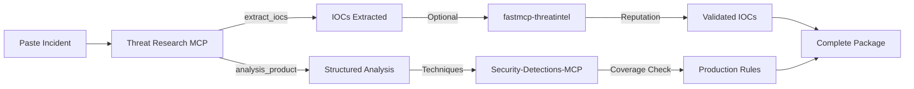

# Threat Research MCP

[](https://github.com/harshdthakur6293/threat-research-mcp/actions/workflows/ci.yml)
[](https://www.python.org/downloads/)
[](https://github.com/modelcontextprotocol/python-sdk)
[](LICENSE)

Turn threat intel into structured analysis in seconds. Paste a phishing report, get IOCs, ATT&CK techniques, hunt hypotheses, and detection drafts—all via your AI assistant.

**Threat Research MCP** is an open-source [Model Context Protocol](https://modelcontextprotocol.io/) server for **defensive security workflows**: intel ingestion → research → hunting → detection drafts.

## Why Use This?

- **Start in 2 minutes** — Clone, install, connect to Cursor/VS Code/Cline
- **No vendor lock-in** — Works locally, no mandatory APIs or cloud services
- **Production-ready today** — 15 MCP tools, 4-agent orchestration, optional SQLite persistence
- **Composable** — Chain with specialist MCPs for IOC enrichment ([fastmcp-threatintel](https://github.com/4R9UN/fastmcp-threatintel)) and detection engineering ([Security-Detections-MCP](https://github.com/MHaggis/Security-Detections-MCP))

## How It Works



1. **You paste** threat intel into your AI assistant
2. **This MCP extracts** IOCs, maps ATT&CK techniques, generates hunt ideas
3. **Optional MCPs enrich** IOCs and generate production-quality detections
4. **You get** a complete analysis package in ~1 minute

## What You Get Today (v0.2)

**15 MCP Tools** your AI can call:
- `extract_iocs` — Pull IPs, domains, URLs, hashes, emails from text
- `analysis_product` — Full workflow: research → hunt → detection → review
- `attack_map` — Map behaviors to ATT&CK techniques
- `hunt` — Generate hunt hypotheses from incidents
- `sigma` — Draft Sigma detection rules
- `ingest_sources` — Normalize intel from RSS, HTML, STIX, TAXII, local files
- `validate_sigma` — Check Sigma rule structure
- `search_ingested_intel` — Query your intel history (requires SQLite)
- ...and 7 more (see [full tool list](#mcp-tool-list))

**4-Agent Orchestration:**
1. **Research Agent** — IOC extraction, summarization, ATT&CK mapping
2. **Hunting Agent** — Hypothesis generation, timeline reconstruction
3. **Detection Agent** — Sigma/KQL/SPL draft generation
4. **Reviewer Agent** — Quality checks, confidence scoring

**Intel Ingestion:**
- RSS/Atom feeds
- HTML threat reports (URL or local file)
- STIX 2.x bundles
- TAXII 2.1 collections
- Local files (JSON, Markdown, plain text)

**Optional SQLite Persistence:**
- Workflow run history
- Ingested document search
- Analysis product archive

## Quick Start (2 Minutes)

### 1. Install

```bash
git clone https://github.com/harshdthakur6293/threat-research-mcp.git
cd threat-research-mcp
python3 -m venv .venv
source .venv/bin/activate  # Windows: .venv\Scripts\activate
pip install -e ".[dev]"
```

### 2. Test It (CLI)

```bash
python -m threat_research_mcp --workflow threat_research --text "Phishing email with malicious zip attachment"
```

You'll get JSON with IOCs, ATT&CK techniques, hunt ideas, and Sigma drafts.

### 3. Connect to Your Editor

Add to your MCP config (`mcp.json` for Cursor, `.vscode/mcp.json` for VS Code, `cline_mcp_settings.json` for Cline):

```json
{
  "mcpServers": {
    "threat-research-mcp": {
      "command": "/absolute/path/to/threat-research-mcp/.venv/bin/python",
      "args": ["-m", "threat_research_mcp.server"],
      "cwd": "/absolute/path/to/threat-research-mcp"
    }
  }
}
```

**Windows users:** Use `C:/path/to/.venv/Scripts/python.exe` for `command`.

### 4. Use It

Open your AI assistant and try:
- "Extract IOCs from this threat report: [paste]"
- "Analyze this incident and give me hunt hypotheses"
- "Generate a Sigma rule for PowerShell encoded commands"

See [`docs/using-as-a-security-engineer.md`](docs/using-as-a-security-engineer.md) for detailed walkthrough.

## Optional: Enable SQLite Persistence

Add `THREAT_RESEARCH_MCP_DB` to your MCP config to store workflow runs and intel:

```json
{
  "mcpServers": {
    "threat-research-mcp": {
      "command": "/path/to/.venv/bin/python",
      "args": ["-m", "threat_research_mcp.server"],
      "cwd": "/path/to/threat-research-mcp",
      "env": {
        "THREAT_RESEARCH_MCP_DB": "/path/to/threat-research-mcp/data/db/runs.sqlite"
      }
    }
  }
}
```

This enables:
- `search_ingested_intel` — Full-text search over normalized documents
- `search_analysis_product_history` — Query past workflow runs
- `get_stored_analysis_product` — Retrieve analysis by ID

## Recommended: Chain with Specialist MCPs

For production workflows, install these alongside this MCP:

| MCP | What It Does | Why You Need It |
|-----|--------------|-----------------|
| **[fastmcp-threatintel](https://github.com/4R9UN/fastmcp-threatintel)** | IOC enrichment (VirusTotal, OTX, AbuseIPDB, IPinfo) | Validate if extracted IOCs are actually malicious |
| **[Security-Detections-MCP](https://github.com/MHaggis/Security-Detections-MCP)** | Search 8,200+ detection rules, coverage analysis, production templates | Check existing coverage, find gaps, generate production-quality rules |
| **[mitre-attack-mcp](https://github.com/MHaggis/mitre-attack-mcp)** | Authoritative ATT&CK data, Navigator layers, threat actor profiles | Deep technique lookups beyond keyword mapping |

**Example workflow:** Paste incident → extract IOCs (yours) → enrich IOCs (fastmcp) → map techniques (yours) → check coverage (Security-Detections) → generate production rule (Security-Detections) → complete intel package in ~1 minute.

See [`docs/three-mcp-workflow.md`](docs/three-mcp-workflow.md) for detailed chaining examples.

## Roadmap: What's Coming Next

**v0.3 (Q3 2026):**
- Direct integrations with MISP, OpenCTI, Synapse
- Semantic search over ingested intel corpus
- Structured observability (logging, metrics, tracing)

**v0.4 (Q1 2027):**
- Graph-based CTI relationship reasoning
- Multi-tenant workspace isolation
- Session memory and conversation continuity

**v0.5+ (Future):**
- LLM provider abstraction for pluggable backends
- Extensible policy engine
- Hunt campaign management

See [`.github/ROADMAP.md`](.github/ROADMAP.md) for detailed feature plans and [`docs/architecture.md`](docs/architecture.md) for implementation status of scaffolded modules.

## Documentation

**Getting Started:**
- [`docs/using-as-a-security-engineer.md`](docs/using-as-a-security-engineer.md) — Step-by-step setup for Cursor, VS Code, Cline
- [`docs/three-mcp-workflow.md`](docs/three-mcp-workflow.md) — Complete incident-to-detection chain with peer MCPs
- [`docs/tool-contracts.md`](docs/tool-contracts.md) — All 15 MCP tools with inputs/outputs

**Advanced:**
- [`docs/ingestion.md`](docs/ingestion.md) — Configure RSS, STIX, TAXII sources
- [`docs/canonical-schemas.md`](docs/canonical-schemas.md) — `AnalysisProduct` JSON schema
- [`docs/architecture.md`](docs/architecture.md) — System design and module status
- [`SECURITY.md`](SECURITY.md) — Defensive scope, reporting, hardening

## Contributing

Issues and pull requests are welcome! For security vulnerabilities, use GitHub's **Security → Report a vulnerability** feature (see [`SECURITY.md`](SECURITY.md)).

**Defensive use only** in authorized environments. See [`SECURITY.md`](SECURITY.md) for scope and hardening guidance.

---

## Reference

### Optional: SQLite (`THREAT_RESEARCH_MCP_DB`)

Set `THREAT_RESEARCH_MCP_DB` to a SQLite file path (for example `data/db/runs.sqlite`). The server creates the parent directory if needed. When unset, nothing is written to disk from these code paths.

| Table | When rows are appended | Contents (high level) |
| --- | --- | --- |
| `workflow_runs` | Each successful workflow (CLI or MCP) | `request_id`, workflow type, input preview, full response JSON including `analysis_product`. |
| `normalized_documents` | After **`ingest_sources`** succeeds, and after **`intel_to_analysis_product`** when a sources config returned documents | Fingerprint, source metadata, title, normalized body (searchable), full document JSON. |
| `analysis_products` | Each successful workflow that produced an `analysis_product` | `product_id` (same as `request_id` when present), workflow type, narrative excerpt, full `AnalysisProduct` JSON (including merged ingestion **provenance** when sources were used). |

Blocked policy results are **not** stored. Tools **`search_ingested_intel`**, **`search_analysis_product_history`**, and **`get_stored_analysis_product`** require this env var; they return a clear JSON error if it is unset.

### MCP tool list

After `python -m threat_research_mcp.server`, the host can call tools such as:

- `extract_iocs`, `summarize`, `attack_map`, `hunt`, `sigma`, `explain`, `timeline`, `coverage`
- `ingest_sources` — YAML or JSON path (same shape as `configs/sources.example.yaml`); returns normalized `documents` JSON
- `intel_to_analysis_product` — optional `text` + optional `sources_config_path` + `workflow`; returns [`AnalysisProduct`](docs/canonical-schemas.md) JSON
- `analysis_product` — text-only path to the same product shape
- `validate_sigma` — Sigma YAML structural checks; returns `{ "valid", "errors" }`
- `search_ingested_intel` / `search_analysis_product_history` / `get_stored_analysis_product` — history when SQLite is configured

### Example CLI output shape (`threat_research` workflow)

```bash
python -m threat_research_mcp --workflow threat_research --text "Phishing email delivered a zip with JavaScript. Script launched PowerShell encoded command and created a scheduled task."
```

```json
{
  "request_id": "<uuid>",
  "workflow": "threat_research",
  "research": {
    "summary": "Summary: ...",
    "iocs": {"ips": [], "domains": [], "urls": [], "hashes": [], "emails": []},
    "attack": "{\"techniques\": [...]}"
  },
  "hunting": {},
  "detection": {
    "sigma": "title: Generated Detection ...",
    "ideas": "{\"ideas\": [...]}"
  },
  "review": {
    "status": "pass",
    "notes": [],
    "confidence": "medium"
  }
}
```

### Hunting workflow CLI

```bash
python -m threat_research_mcp --workflow hunt_generation --text "WINWORD spawned powershell and host connected to rare external IP"
```

### CI cache hygiene

This repository includes a workflow that can list and manually purge GitHub Actions workflow caches (`workflow_dispatch`) to avoid stale cache buildup.
