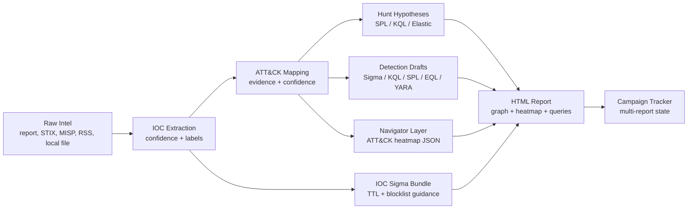
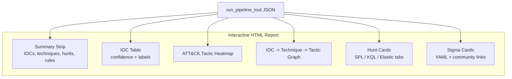
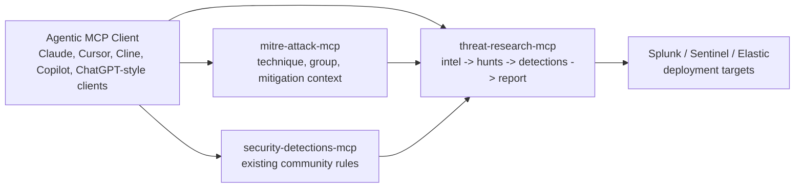

# Threat Research MCP

An offline-first MCP server for turning threat intelligence into an analyst-ready
hunt and detection package.

It takes raw threat reports, STIX bundles, MISP events, RSS/HTML feeds, or local
files and produces structured outputs: confidence-scored IOCs, ATT&CK technique
mapping with evidence, hunt hypotheses, Sigma/KQL/SPL/EQL/YARA drafts, ATT&CK
Navigator layers, IOC blocklist rules, campaign state, and an interactive HTML
report.

This project is meant to be the workflow layer around specialist security MCPs:
it can run standalone, or an agentic client can pair it with MITRE ATT&CK,
Security Detections, Splunk, Sigma, and enrichment MCPs.

[](https://github.com/harshthakur6293/threat-research-mcp/actions/workflows/ci.yml)
[](https://www.python.org/downloads/)
[]()
[]()
[](LICENSE)
[](https://modelcontextprotocol.io)

## Current State

This is a working beta, not a finished commercial product.

Verified locally on Windows with Python 3.12:

```text
118 passed, 5 skipped
coverage gate: 65.30%
ruff check: pass
ruff format --check: pass
bandit: pass
pip-audit: pass
registered MCP tools: 46
```

Known limitations:

- The package is installable locally today. PyPI, `uvx`, and npm wrapper support
  are product goals, not published channels yet.
- Built-in Sigma coverage is intentionally curated. Unsupported techniques return
  `no_curated_rule` with community search links instead of fake generic rules.
- ATT&CK lookup tools require a local SQLite database built with
  `python scripts/build_attack_db.py`; without it they return a structured
  "database not built" response.
- IOC enrichment requires optional API keys. The core pipeline works offline.
- Generated detections are analyst drafts. They should be reviewed, tuned, and
  tested before production deployment.

## Why This Exists

The painful SOC loop is predictable:

1. A threat report lands.
2. An analyst extracts IOCs.
3. They map ATT&CK techniques.
4. They write hunts.
5. They search for existing detections.
6. They draft new rules for gaps.
7. They prepare a report or ticket for review.

Threat Research MCP compresses that workflow into tool-callable stages that any
MCP-capable client can orchestrate.

The strongest path is:

```text
threat report
  -> context-aware IOC extraction
  -> ATT&CK mapping with evidence and confidence
  -> hunt hypotheses and SIEM-native queries
  -> curated Sigma / fallback gap links
  -> ATT&CK Navigator layer
  -> interactive HTML report
  -> optional campaign tracking
```

## Demo Package

The repo includes a Sapphire Sleet macOS demo package under `demo/`:

<p align="center">
  
</p>

```text
demo/sapphire_sleet_input.txt
demo/sapphire_sleet_pipeline.json
demo/sapphire_sleet_report.html
demo/sapphire_sleet_navigator_layer.json
demo/sapphire_sleet_sigma_bundle.yml
demo/sapphire_sleet_iocs.csv
demo/sapphire_sleet_demo.md
```

The HTML report is self-contained and opens in a browser. It shows:

- summary counts and completed pipeline stages
- IOC table with confidence and labels
- ATT&CK tactic heatmap
- IOC -> technique -> tactic graph
- hunt hypothesis cards with SPL, KQL, and Elastic tabs
- Sigma cards with expandable YAML and community rule links

For a demo, lead with the report rather than the tool list. The product story is
the analyst deliverable.

Open the generated report locally:

```text
demo/sapphire_sleet_report.html
```

## Workflow Visual



## Report Visual Model



## Core Capabilities

### Intelligence Intake

- Paste raw report text directly into `run_pipeline_tool`
- Ingest local files, HTML reports, RSS/Atom feeds, TAXII 2.1 sources, and STIX
  bundles
- Pull MISP events when `MISP_URL` and `MISP_KEY` are configured

### IOC Extraction

`extract_iocs` returns rich IOC objects:

```json
{
  "value": "203.0.113.10",
  "confidence": 0.8,
  "label": "MALICIOUS"
}
```

It filters common false positives such as:

- RFC1918 and loopback IPs
- software version strings that look like IPs
- known benign domains
- macOS bundle identifiers such as `com.apple.*`
- filename extensions that look like domains

The context rules live in `playbook/ioc_context_patterns.yaml`.

### ATT&CK Mapping

`map_ttp` maps free-form text to ATT&CK techniques using keyword evidence and a
confidence model. Each technique includes:

- ATT&CK ID
- name
- tactic
- matched evidence
- confidence score
- confidence label

Low-confidence matches are not discarded silently. They are returned in a
`suppressed` list for analyst review.

The scoring weights live in `playbook/confidence_weights.yaml`.

### Hunt and Detection Output

The server can generate:

- hunt hypotheses from intel text
- hunt hypotheses for specific ATT&CK techniques
- Sigma rules for curated techniques
- IOC blocklist Sigma bundles with TTL guidance
- Microsoft Sentinel KQL
- Splunk SPL
- Elastic EQL
- YARA
- ATT&CK Navigator layer JSON
- Atomic Red Team test references

Sigma behavior is intentionally conservative: no generic placeholder rule is
returned as if it were production-ready.

### Reporting and Campaign Tracking

`generate_threat_report` creates a browser-ready HTML report from pipeline JSON.

Campaign tools store multi-report campaign state in local JSON files:

- `campaign_update`
- `campaign_get`
- `campaign_list`
- `campaign_correlate_ioc`

This is simple by design. A team can point the campaign store at a shared Git
repo and review changes over time.

### Local ATT&CK Lookup

Optional ATT&CK database tools:

- `attack_get_technique`
- `attack_get_threat_groups`
- `attack_get_techniques_by_group`
- `attack_attribute_to_group`
- `attack_get_data_sources`
- `attack_get_mitigations`

Build the database:

```bash
python scripts/build_attack_db.py
```

The database is written to `playbook/attack.db`. It is not required for the core
pipeline.

## Tool Catalog

The server currently registers 46 MCP tools.

### Primary Workflow

| Tool | Purpose |
|---|---|
| `run_pipeline_tool` | Full intel -> IOC -> ATT&CK -> hunt -> Sigma pipeline |
| `generate_threat_report` | Create interactive HTML report from pipeline JSON |
| `navigator_layer` | Create ATT&CK Navigator layer JSON |
| `get_operator_context` | Show active operator/SOC profile |

### IOC and Enrichment

| Tool | Purpose |
|---|---|
| `extract_iocs` | Context-aware IOC extraction |
| `enrich_ioc_tool` | Enrich one IOC with optional external APIs |
| `enrich_iocs_tool` | Bulk-enrich comma-separated IOCs |
| `ioc_sigma_bundle` | Generate Tier 1 IOC blocklist Sigma rules |

### ATT&CK and Hunt

| Tool | Purpose |
|---|---|
| `map_ttp` | Map free-form text to ATT&CK techniques |
| `hunt_from_intel` | Generate hunts from intel text |
| `hunt_for_techniques` | Generate hunts for specific techniques |
| `atomic_tests_for_technique` | Return Atomic Red Team test IDs |

### Detection Rules

| Tool | Purpose |
|---|---|
| `generate_sigma_rule` | Build Sigma from a specific behavior |
| `sigma_for_technique` | Return curated Sigma or `no_curated_rule` |
| `sigma_bundle_for_techniques` | Bundle curated and missing Sigma coverage |
| `validate_sigma_rule` | Offline Sigma structure validation |
| `score_sigma` | Score specificity, coverage, and false-positive risk |
| `score_technique_sigma` | Score a built-in curated Sigma rule |
| `kql_for_technique` | Generate Microsoft Sentinel KQL |
| `spl_for_technique` | Generate Splunk SPL |
| `eql_for_technique` | Generate Elastic EQL |
| `yara_for_technique` | Generate YARA for supported techniques |
| `generate_yara` | Generate custom YARA from strings |

### Intake, Storage, and Integrations

| Tool | Purpose |
|---|---|
| `ingest_feed` | Ingest sources from YAML config |
| `analyze_intel` | Combine text and source config into an analysis product |
| `parse_stix` | Parse STIX 2.x bundle |
| `stix_to_text` | Flatten STIX into pipeline-ready text |
| `misp_pull` | Pull MISP events |
| `misp_push_sigma` | Push Sigma to MISP |
| `misp_create_event` | Create MISP event from pipeline output |
| `search_intel_history` | Search persisted analysis history |
| `search_ingested_docs` | Search ingested normalized documents |
| `get_intel_by_id` | Retrieve stored analysis product |
| `timeline` | Sort event notes/log lines chronologically |

### Local ATT&CK Database

| Tool | Purpose |
|---|---|
| `attack_get_technique` | Technique card, platforms, data sources, detection text |
| `attack_get_threat_groups` | Groups known to use a technique |
| `attack_get_techniques_by_group` | Techniques attributed to a group |
| `attack_attribute_to_group` | Rank groups by observed technique overlap |
| `attack_get_data_sources` | Map ATT&CK data sources to SIEM sources |
| `attack_get_mitigations` | Return ATT&CK mitigations |

## Installation

### Local Development Install

```bash
git clone https://github.com/harshthakur6293/threat-research-mcp
cd threat-research-mcp
python -m pip install -e ".[dev]"
python -m threat_research_mcp
```

### Future Install Targets

These are the intended public install paths once packaging is published:

```bash
pip install threat-research-mcp
```

```bash
uvx threat-research-mcp
```

An npm wrapper is a reasonable future option for Node-first users, but the
current implementation is Python/FastMCP.

## MCP Client Configuration

The server uses stdio transport, so it is client-agnostic. It should work with
any MCP client that supports stdio tools.

### Generic MCP Config

```json
{
  "mcpServers": {
    "threat-research-mcp": {
      "command": "python",
      "args": ["-m", "threat_research_mcp"],
      "cwd": "/path/to/threat-research-mcp",
      "env": {
        "THREAT_MCP_OFFLINE": "true"
      }
    }
  }
}
```

Use the same shape in Claude Desktop, Cursor, Cline/Roo Code, VS Code MCP
configurations, and other agentic MCP clients. Adjust `cwd` and `command` for
your environment.

### Optional Multi-MCP Workflow

This server can be used beside specialist MCPs:



```json
{
  "mcpServers": {
    "threat-research-mcp": {
      "command": "python",
      "args": ["-m", "threat_research_mcp"],
      "cwd": "/path/to/threat-research-mcp"
    },
    "mitre-attack": {
      "command": "npx",
      "args": ["-y", "mitre-attack-mcp"]
    },
    "security-detections": {
      "command": "npx",
      "args": ["-y", "security-detections-mcp"]
    }
  }
}
```

In that setup, the agentic client should orchestrate:

```text
1. threat-research-mcp: analyze report
2. mitre-attack-mcp: enrich technique context and actor usage
3. security-detections-mcp: search existing rules by technique ID
4. threat-research-mcp: generate detections only for gaps
5. threat-research-mcp: generate final report and Navigator layer
```

MCP servers usually do not call each other directly. The client coordinates the
workflow.

## Operator Profile

Copy and edit the example profile:

```bash
cp operator.yaml.example operator.yaml
```

The profile tells the server what your SOC actually has:

- primary and secondary SIEM
- available log sources
- operating systems and cloud platforms
- confidence threshold
- campaign store directory
- optional integrations

Without `operator.yaml`, safe defaults are used.

## Example Workflow

```text
User:
Analyze this Sapphire Sleet macOS report and produce a detection package.

Agent:
1. Calls run_pipeline_tool(text=<report>, log_sources="edr_macos,proxy_logs")
2. Reviews high-confidence ATT&CK techniques and evidence
3. Calls sigma_bundle_for_techniques(...)
4. Calls kql_for_technique / spl_for_technique for relevant SIEM outputs
5. Calls navigator_layer(...)
6. Calls generate_threat_report(...)
7. Calls campaign_update(...)
```

Outputs:

```text
pipeline JSON
interactive HTML report
ATT&CK Navigator layer
Sigma bundle
IOC CSV
campaign JSON state
```

## Testing Local Threat Reports

Use current public threat reports as regression/evaluation cases. Save report
text under `evals/reports/` and compare extracted IOCs, techniques, hunts, and
generated report output.

Good local test cases:

- PhantomCore / TrueConf exploitation
- fake VS Code extensions
- fake CAPTCHA / Keitaro scam infrastructure
- UNC6692 helpdesk impersonation
- China-linked GopherWhisper campaign

Suggested structure:

```text
evals/reports/
  phantomcore_trueconf.txt
  fake_vscode_extensions.txt
  fake_captcha_keitaro.txt
  unc6692_helpdesk.txt
  gopherwhisper.txt

evals/expected/
  phantomcore_trueconf.json
  fake_vscode_extensions.json
  fake_captcha_keitaro.json
  unc6692_helpdesk.json
  gopherwhisper.json
```

## Development

Install development dependencies:

```bash
python -m pip install -e ".[dev]"
```

Run the CI-equivalent checks locally:

```bash
python -m ruff check .
python -m ruff format --check .
python -m pytest -q --maxfail=1 --cov=src/threat_research_mcp --cov-fail-under=65
python -m bandit -c pyproject.toml -r src
python -m pip_audit --cache-dir .pip-audit-cache
```

`make ci` runs the same checks on systems with `make` installed.

Current local result:

```text
118 passed, 5 skipped
coverage: 65.30%
bandit: no issues
pip-audit: no known vulnerabilities
```

## Repository Layout

```text
src/threat_research_mcp/
  server.py                         FastMCP tool registration
  cli.py                            package entrypoint
  tools/
    run_pipeline.py                 end-to-end pipeline
    extract_iocs.py                 context-aware IOC extraction
    map_attack.py                   ATT&CK mapping with confidence
    generate_html_report.py         browser-ready report generator
    generate_sigma.py               curated Sigma rule wrapper
    generate_ioc_sigma.py           IOC blocklist Sigma bundle
    generate_detections.py          KQL/SPL/EQL/YARA helpers
    navigator_export.py             ATT&CK Navigator layer export
    score_sigma.py                  Sigma quality scoring
    attack_lookup.py                optional local ATT&CK SQLite lookup
    campaign_tracker.py             JSON campaign state
    misp_bridge.py                  MISP integration
  ingestion/                        local, HTML, RSS, TAXII, STIX intake
  detection/                        generators and validators
  storage/                          SQLite persistence

playbook/
  keywords.yaml                     keyword mappings
  confidence_weights.yaml           ATT&CK confidence model
  ioc_context_patterns.yaml         IOC scoring patterns
  atomic_tests.yaml                 Atomic Red Team mapping
  siems/                            SIEM field/query profiles

demo/
  sapphire_sleet_*                  demo input and generated outputs
```

## License

MIT. Contributions are welcome, especially additional report evals, ATT&CK
keyword mappings, SIEM profiles, and reviewed detection templates.
