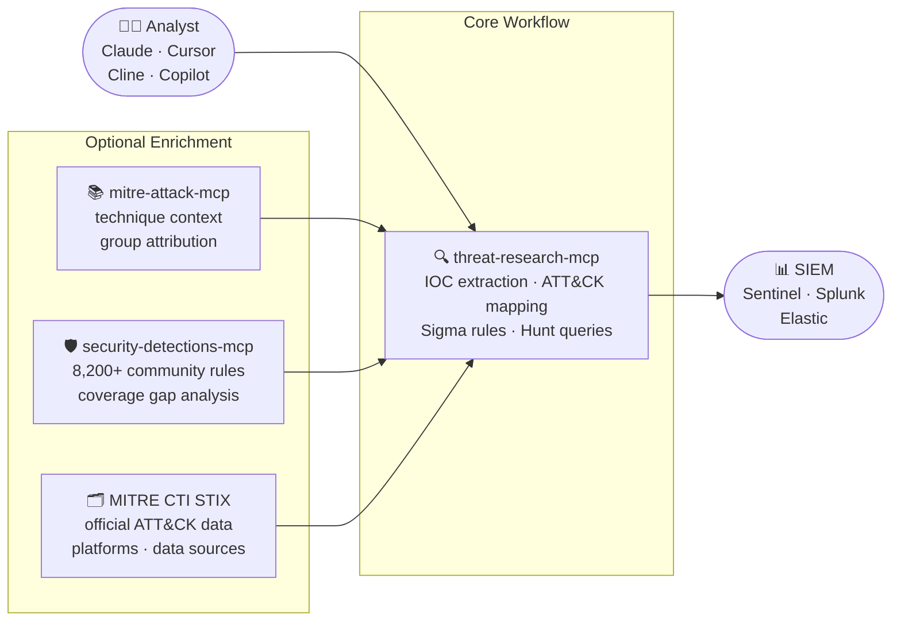
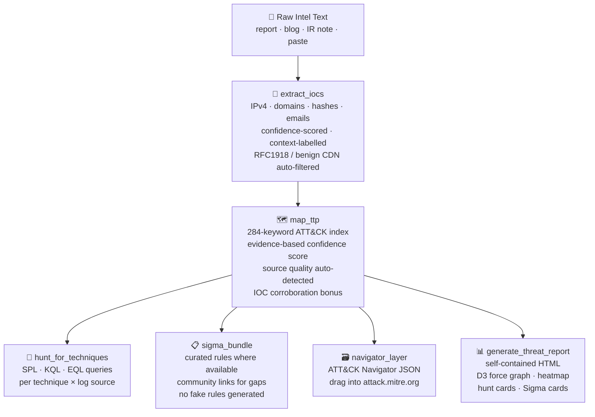

<div align="center">

# 🔍 Threat Research MCP

### Paste a threat report. Get a detection package in seconds.

IOC extraction · ATT&CK mapping · Hunt queries · Sigma rules · MITRE STIX enrichment<br>
Works with Claude Desktop · Cline · Cursor · Copilot · any MCP-compatible client

<br>

[](https://github.com/harshthakur6293/threat-research-mcp/actions/workflows/ci.yml)
[](https://github.com/harshthakur6293/threat-research-mcp/actions/workflows/codeql.yml)
[](https://github.com/harshthakur6293/threat-research-mcp/actions/workflows/security.yml)
[](https://www.python.org/downloads/)
[](tests/)
[](LICENSE)
[](https://modelcontextprotocol.io)
[](src/threat_research_mcp/server.py)

<br>

[Why this project?](#-why-this-project) · [Quick Start](#-quick-start) · [Live Example](#-live-example) · [How It Works](#-how-it-works) · [STIX Enrichment](#-stix-enrichment-new) · [Tool Catalog](#-tool-catalog) · [Contributing](#-contributing)

</div>

---

## 🎯 Why this project?

Reading a vendor threat report today looks like this:

```
Step 1  Copy IPs, domains, hashes into a spreadsheet           ~20 min
Step 2  Open ATT&CK Navigator, search techniques one by one    ~30 min
Step 3  Hunt SigmaHQ, adapt rules to your log schema           ~45 min
Step 4  Write SPL/KQL hunt queries for each technique          ~45 min
Step 5  Paste everything into a report template                ~20 min
                                                         Total: 2–4 hours
```

**Threat Research MCP automates all five steps in a single tool call.**

Paste the report text → get back IOCs with confidence scores, ATT&CK technique mappings with evidence, SPL/KQL/EQL hunt queries, curated Sigma rules, an ATT&CK Navigator heatmap, and a self-contained HTML report. No API keys required for the core pipeline.

It works alongside specialist MCPs as the **workflow orchestration layer**:



---

## ⚡ Quick Start

```bash
# 1. Clone and install
git clone https://github.com/harshthakur6293/threat-research-mcp
cd threat-research-mcp
pip install -e ".[dev]"

# 2. Verify — all 131 tests should pass
python -m pytest -q

# 3. Start the MCP server (your client connects via stdio)
python -m threat_research_mcp
```

> **PyPI / `uvx` not yet published.** Local install is the only supported path today.

<details>
<summary><b>Claude Desktop</b> — <code>claude_desktop_config.json</code></summary>

macOS: `~/Library/Application Support/Claude/claude_desktop_config.json`
Windows: `%APPDATA%\Claude\claude_desktop_config.json`

```json
{
  "mcpServers": {
    "threat-research-mcp": {
      "command": "python",
      "args": ["-m", "threat_research_mcp"],
      "cwd": "/path/to/threat-research-mcp"
    }
  }
}
```
</details>

<details>
<summary><b>VS Code / Cline / Roo Code</b> — <code>.vscode/settings.json</code></summary>

```json
{
  "cline.mcpServers": {
    "threat-research-mcp": {
      "command": "python",
      "args": ["-m", "threat_research_mcp"],
      "cwd": "${workspaceFolder}/../threat-research-mcp"
    }
  }
}
```
</details>

<details>
<summary><b>Cursor</b> — <code>~/.cursor/mcp.json</code></summary>

```json
{
  "mcpServers": {
    "threat-research-mcp": {
      "command": "python",
      "args": ["-m", "threat_research_mcp"],
      "cwd": "/path/to/threat-research-mcp"
    }
  }
}
```
</details>

---

## 🎬 Live Example

Real run against the **Google Mandiant UNC6692 Snow Flurries** report (Teams phishing → browser extension backdoor → credential theft):

**Input — paste into Claude:**
```
Source: https://cloud.google.com/blog/topics/threat-intelligence/unc6692
UNC6692 Microsoft Teams phishing impersonating IT helpdesk. AutoHotkey
scripts from S3. SNOWBELT browser extension C2 over WebSocket AES-GCM.
SNOWGLAZE Python tunneler wss://sad4w7h913-b4a57f9c36eb.herokuapp.com:443/ws
SHA256 7f1d71e1e079f3244a69205588d504ed830d4c473747bb1b5c520634cc5a2477
lsass credential dump pass-the-hash lateral movement. Black Basta ransomware.
```

**Pipeline output:**
```
Source quality auto-detected: vendor_blog (0.75)
IOCs extracted: 4  (1 domain · 3 SHA256 hashes)

ATT&CK Techniques: 14 above threshold
  T1566.004  [MEDIUM 0.59]  Spearphishing via Service
               evidence: teams phishing, teams lure, impersonating it
  T1071      [MEDIUM 0.56]  Application Layer Protocol
               evidence: c2, command and control
  T1003.001  [LOW    0.54]  LSASS Memory
               evidence: lsass, credential dump
  T1550.002  [LOW    0.43]  Pass the Hash
  T1486      [LOW    0.47]  Data Encrypted for Impact
  ... 9 more

Sigma rules generated: 14  (1 curated · 13 with SigmaHQ/Elastic links)
Hunt hypotheses: 8
```

**What you get back:**
- IOC table with confidence scores and `MALICIOUS` / `UNKNOWN` / `VICTIM` labels
- ATT&CK technique cards with keyword evidence and links to attack.mitre.org
- Ready-to-deploy Sigma YAML for detected techniques
- SPL · KQL · EQL hunt queries per technique
- ATT&CK Navigator JSON — drag into [attack.mitre.org/navigator](https://mitre-attack.github.io/attack-navigator/)
- Self-contained HTML report with D3 force graph, heatmap, and hunt cards

---

## 🔬 How It Works

### The Pipeline

`run_pipeline_tool` chains all stages automatically from a single text input:



Each stage is also callable individually.

### Confidence Scoring

Every detected technique gets a score built from four dimensions:

```
╔══════════════════════════╦════════╦══════════════════════════════════════════════╗
║ Dimension                ║ Weight ║ What it measures                             ║
╠══════════════════════════╬════════╬══════════════════════════════════════════════╣
║ keyword_specificity      ║  35%   ║ How diagnostic the keyword is                ║
║                          ║        ║ (mimikatz=0.95 vs. script=0.30)              ║
╠══════════════════════════╬════════╬══════════════════════════════════════════════╣
║ evidence_diversity       ║  25%   ║ How many independent signals fired           ║
║                          ║        ║ (1 keyword=0.30 → 5+ keywords=0.95)          ║
╠══════════════════════════╬════════╬══════════════════════════════════════════════╣
║ ioc_corroboration        ║  20%   ║ Whether extracted IOCs align with technique  ║
║                          ║        ║ (network IOC + C2 technique = +0.30 bonus)   ║
╠══════════════════════════╬════════╬══════════════════════════════════════════════╣
║ source_quality           ║  20%   ║ Authority of the intelligence source         ║
║                          ║        ║ (cisa_advisory=1.0 · vendor_blog=0.75)       ║
╚══════════════════════════╩════════╩══════════════════════════════════════════════╝
```

| Label | Score | What to do |
|:---:|:---:|---|
| 🟢 **HIGH** | ≥ 0.75 | Multiple specific signals — treat as confirmed, deploy detection |
| 🟡 **MEDIUM** | 0.55 – 0.75 | Credible — worth hunting, validate in your environment |
| 🟠 **LOW** | 0.35 – 0.55 | Weak signal — analyst review before acting |
| ⚫ **SUPPRESSED** | < 0.35 | Returned in `suppressed[]` — noise filtered from main list |

Source quality is **auto-detected** from URLs in the pasted text — CISA, Microsoft, Google/Mandiant, NCSC, and ISAC domains are all recognized automatically. No manual flag needed.

All thresholds and weights are tunable in `playbook/confidence_weights.yaml`.

---

## ✨ STIX Enrichment *(new)*

After `run_pipeline_tool` maps technique IDs, pass them to `enrich_techniques_stix` to pull authoritative detail directly from the official [MITRE CTI STIX bundle](https://github.com/mitre/cti):

```
run_pipeline_tool(text=<report>)
         │
         │  technique_ids: ["T1059.001", "T1003.001", "T1566.004"]
         ▼
enrich_techniques_stix("T1059.001,T1003.001,T1566.004")
         │
         ▼
┌─────────────────────────────────────────────────────────────────┐
│  T1059.001 — PowerShell                                         │
│  platforms:      Windows                                        │
│  data_sources:   Process: Process Creation                      │
│                  Script: Script Execution                       │
│                  Command: Command Execution                     │
│  detection:      "Monitor for events associated with PowerShell │
│                   execution and scripts..."  (MITRE guidance)   │
│  threat_groups:  APT32, Lazarus Group, Kimsuky, OilRig (+more) │
└─────────────────────────────────────────────────────────────────┘
```

**One-time setup:**
```bash
pip install "threat-research-mcp[attack]"      # installs mitreattack-python
python scripts/download_attack_stix.py          # downloads enterprise-attack.json (~50 MB)
```

Run `stix_status` to check if enrichment is active. The core pipeline works without this — STIX enrichment is fully optional and degrades gracefully.

---

## 📖 What Each Stage Produces

<details>
<summary><b>IOC Extraction</b> — <code>extract_iocs</code></summary>

Context-aware extraction with a confidence score and label per indicator. Automatically filters RFC1918 / loopback IPs, version strings, macOS bundle IDs (`com.apple.*`), and known-benign CDN domains.

```json
{
  "ips":     [{"value": "185.220.101.47",     "confidence": 0.92, "label": "MALICIOUS"}],
  "domains": [{"value": "cdn.apple-cdn.org",  "confidence": 0.85, "label": "MALICIOUS"}],
  "hashes":  [{"value": "a3f8c2d1...",        "confidence": 0.78, "label": "HASH"}],
  "emails":  [{"value": "hr@careers-talent.io","confidence": 0.71, "label": "MALICIOUS"}],
  "filtered_fps": [{"value": "192.168.1.1",   "reason": "RFC1918"}]
}
```

Context patterns (what makes something MALICIOUS vs. VICTIM) live in `playbook/ioc_context_patterns.yaml` — editable without code changes.
</details>

<details>
<summary><b>ATT&CK Mapping</b> — <code>map_ttp</code></summary>

Maps text to techniques using a **284-keyword index** loaded from `playbook/keywords.yaml` — the single source of truth for all keyword→technique mappings. No hardcoded data in Python.

```json
{
  "techniques": [
    {
      "id": "T1059.002",
      "name": "AppleScript",
      "tactic": "execution",
      "evidence": ["osascript", "applescript"],
      "confidence": 0.82,
      "confidence_label": "HIGH",
      "url": "https://attack.mitre.org/techniques/T1059/002/"
    }
  ],
  "suppressed": [...],
  "source_quality": "vendor_blog"
}
```

To add a keyword: edit `playbook/keywords.yaml` and restart the server — no Python changes needed.
</details>

<details>
<summary><b>Hunt Hypotheses</b> — <code>hunt_for_techniques</code></summary>

Returns one hypothesis per technique × log source with a ready-to-run query in three SIEM flavours:

```json
{
  "hypothesis": "Attacker invoked osascript to execute in-memory payload",
  "technique_id": "T1059.002",
  "log_source_key": "edr_macos",
  "spl":     "index=edr source=macos process_name=osascript ...",
  "kql":     "DeviceProcessEvents | where FileName =~ 'osascript' ...",
  "elastic": "process.name: osascript AND ..."
}
```
</details>

<details>
<summary><b>Sigma Rules</b> — <code>sigma_bundle_for_techniques</code></summary>

Returns curated rules for ~16 supported techniques. For all others, returns a structured `no_curated_rule` with direct search links to SigmaHQ, Elastic detection-rules, and Splunk Security Content — **no plausible-looking fake rules are generated.**

```json
{"technique_id": "T1059.001", "status": "curated",       "rule_yaml": "title: PowerShell Download Cradle ..."}
{"technique_id": "T1190",     "status": "no_curated_rule","fallback": {"sigmahq_search": "...", "elastic_rules": "..."}}
```
</details>

---

## 🗂️ Tool Catalog

**48 registered MCP tools** across 8 categories.

### 🚀 Primary Workflow

| Tool | What it does |
|---|---|
| `run_pipeline_tool` | Full pipeline: text → IOCs → ATT&CK → hunts → Sigma (one call) |
| `extract_iocs` | Context-aware IOC extraction with confidence scores |
| `map_ttp` | ATT&CK technique mapping with evidence + confidence |
| `hunt_from_intel` | Hunt hypotheses directly from raw text |
| `hunt_for_techniques` | Hunt hypotheses for specific technique IDs |
| `list_log_sources_tool` | List available log source keys for filtering |
| `generate_threat_report` | Self-contained HTML report from pipeline JSON |
| `navigator_layer` | ATT&CK Navigator layer JSON |

### 🌐 STIX Enrichment *(optional — requires setup)*

| Tool | What it does |
|---|---|
| `enrich_techniques_stix` | Platforms · data sources · detection notes · threat groups from MITRE STIX |
| `stix_status` | Check if `mitreattack-python` + STIX bundle are ready |

### 📋 Sigma and Detection Drafts

| Tool | What it does |
|---|---|
| `generate_sigma_rule` | Build Sigma from title + behavior description |
| `sigma_for_technique` | Curated Sigma or `no_curated_rule` for a technique |
| `sigma_bundle_for_techniques` | Batch Sigma for multiple techniques |
| `validate_sigma_rule` | Offline structure validation (no CLI needed) |
| `score_sigma` | Score specificity, coverage, FP risk |
| `score_technique_sigma` | Score a built-in curated rule |
| `kql_for_technique` | Microsoft Sentinel KQL Analytics Rule |
| `spl_for_technique` | Splunk SPL Saved Search |
| `eql_for_technique` | Elastic EQL Detection Rule |
| `yara_for_technique` | YARA file-scanning rules |
| `generate_yara` | Custom YARA from string patterns |
| `ioc_sigma_bundle` | IOC blocklist Sigma bundle with TTL guidance |
| `detection_coverage_gap` | Gap analysis: tracked techniques vs existing detections |
| `atomic_tests_for_technique` | Atomic Red Team test IDs for validation |

### 🔬 IOC Enrichment *(optional — requires API keys)*

| Tool | What it does |
|---|---|
| `enrich_ioc_tool` | Single IOC: VirusTotal · OTX · AbuseIPDB · URLhaus |
| `enrich_iocs_tool` | Bulk enrich comma-separated IOCs (capped at 20) |

### 📥 Intake and Parsing

| Tool | What it does |
|---|---|
| `ingest_feed` | TAXII 2.1 · RSS/Atom · HTML · local file ingestion |
| `analyze_intel` | Pipeline on text + ingested feed documents |
| `parse_stix` | Parse STIX 2.x bundle JSON |
| `stix_to_text` | Flatten STIX to pipeline-ready text |
| `timeline` | Sort log lines / event notes chronologically |

### 🔗 MISP Integration *(optional — requires `MISP_URL` + `MISP_KEY`)*

| Tool | What it does |
|---|---|
| `misp_pull` | Pull events → IOCs + pipeline-ready text |
| `misp_push_sigma` | Push Sigma rule as attribute to a MISP event |
| `misp_create_event` | Create MISP event from pipeline output |

### 📁 Campaign Tracking

| Tool | What it does |
|---|---|
| `campaign_update` | Store / update campaign state (JSON, file-based) |
| `campaign_get` | Retrieve campaign state |
| `campaign_list` | List all tracked campaigns |
| `campaign_correlate_ioc` | Find campaigns sharing an IOC |

### 🗄️ Storage and Search

| Tool | What it does |
|---|---|
| `search_intel_history` | Search stored analysis products (SQLite) |
| `get_intel_by_id` | Retrieve stored product by row ID |
| `search_ingested_docs` | Search ingested document store |

### 🧬 Local ATT&CK Database *(optional — requires `python scripts/build_attack_db.py`)*

| Tool | What it does |
|---|---|
| `attack_get_technique` | Full technique card: platforms, data sources, detection |
| `attack_get_threat_groups` | Groups known to use a technique |
| `attack_get_techniques_by_group` | Techniques attributed to a threat group |
| `attack_attribute_to_group` | Rank groups by technique overlap (Jaccard similarity) |
| `attack_get_data_sources` | Map ATT&CK data sources to SIEM log sources |
| `attack_get_mitigations` | ATT&CK recommended mitigations |

```bash
python scripts/build_attack_db.py
# Builds playbook/attack.db from MITRE STIX (~30 MB, ~600 techniques, ~130 groups)
```

---

## 🔧 Playbook Files

Everything tunable lives in `playbook/` — no Python changes needed:

| File | Controls |
|---|---|
| `keywords.yaml` | 284-entry keyword → ATT&CK technique index (single source of truth) |
| `confidence_weights.yaml` | Scoring dimensions, thresholds, specificity tiers |
| `ioc_context_patterns.yaml` | IOC context scoring (MALICIOUS / VICTIM / RESEARCHER) |
| `atomic_tests.yaml` | Atomic Red Team test ID mapping per technique |
| `siems/` | SIEM field profiles for KQL / SPL / EQL generation |

**Add a new keyword** — edit `playbook/keywords.yaml` and restart:

```yaml
entries:
  - keyword: "your-new-keyword"
    tactic: initial-access
    technique_id: T1190
    technique_name: Exploit Public-Facing Application
```

---

## ⚠️ Honest Limitations

| Limitation | Detail |
|---|---|
| **Sigma coverage** | Curated rules for ~16 techniques only. All others return `no_curated_rule` + SigmaHQ/Elastic/Splunk search links. No fake rules. |
| **Confidence scores** | Keyword-based heuristic — not ground truth. LOW-confidence techniques require analyst review before acting. |
| **ATT&CK SQLite DB** | The 6 `attack_*` tools require `python scripts/build_attack_db.py` run once. They return a structured error until then. |
| **STIX enrichment** | Requires `pip install 'threat-research-mcp[attack]'` + `python scripts/download_attack_stix.py`. Core pipeline works without it. |
| **IOC enrichment** | Requires optional API keys (`VIRUSTOTAL_API_KEY`, `OTX_API_KEY`, `ABUSEIPDB_API_KEY`). Core pipeline works with zero keys. |
| **Detection drafts** | Generated KQL/SPL/EQL/YARA are analyst starting points. Review and tune before deploying to production. |
| **PyPI / uvx** | Not published yet. Local install via `pip install -e .` is the only supported path today. |
| **Campaign tracking** | JSON file-based — suitable for a single analyst or shared-git workflows, not a full relational DB. |

---

## 🛠️ Development

```bash
pip install -e ".[dev]"

# Full CI check — identical to GitHub Actions
python -m ruff check .
python -m ruff format --check .
python -m pytest -q --cov=src/threat_research_mcp --cov-fail-under=65
python -m bandit -c pyproject.toml -r src
python -m pip_audit --cache-dir .pip-audit-cache
```

```
131 passed, 5 skipped
coverage: 65%   ruff: pass   bandit: pass   pip-audit: pass
```

---

## 📁 Repository Layout

```
src/threat_research_mcp/
  server.py                   MCP tool registration (48 tools)
  tools/
    run_pipeline.py           end-to-end pipeline orchestrator
    extract_iocs.py           context-aware IOC extraction
    map_attack.py             ATT&CK mapping (loads from keywords.yaml)
    attack_enrichment.py      MITRE STIX enrichment via mitreattack-python
    generate_html_report.py   D3.js self-contained HTML report
    generate_sigma.py         curated Sigma rules wrapper
    generate_ioc_sigma.py     IOC blocklist Sigma bundle
    generate_detections.py    KQL / SPL / EQL / YARA helpers
    navigator_export.py       ATT&CK Navigator layer export
    score_sigma.py            Sigma quality scoring
    attack_lookup.py          optional local ATT&CK SQLite lookup
    campaign_tracker.py       JSON campaign state
    misp_bridge.py            MISP integration
  utils/
    paths.py                  playbook file location helpers

playbook/
  keywords.yaml               ATT&CK keyword index — 284 entries, single source of truth
  confidence_weights.yaml     confidence model + scoring thresholds
  ioc_context_patterns.yaml   IOC context scoring patterns
  atomic_tests.yaml           Atomic Red Team mapping
  siems/                      SIEM field profiles (Splunk · Sentinel · Elastic · QRadar)

scripts/
  build_attack_db.py          build local ATT&CK SQLite from MITRE STIX
  download_attack_stix.py     download enterprise-attack.json from github.com/mitre/cti

demo/
  sapphire_sleet_*            pre-generated DPRK/BlueNoroff macOS detection package

evals/
  run_test.py                 pipeline regression test against real vendor reports
```

---

## 🤝 Contributing

Contributions are welcome — all PRs require CI to pass and owner review before merging.

**Highest-value areas:**

**1. New ATT&CK keyword mappings** — edit `playbook/keywords.yaml`, no Python needed:
```yaml
- keyword: "your-keyword"
  tactic: execution
  technique_id: T1059.001
  technique_name: PowerShell
```

**2. Curated Sigma rules** — add to `src/threat_research_mcp/tools/generate_sigma.py`.
Priority gaps: `T1190` `T1059.003` `T1105` `T1098.004` `T1136.001` `T1219` `T1496`

**3. Eval cases** — add threat reports with expected IOC counts and technique IDs to `evals/`. Format matches `evals/run_test.py`.

**4. SIEM profiles** — extend `playbook/siems/` with field mappings for additional log sources.

**Workflow:**
```bash
git clone https://github.com/harshthakur6293/threat-research-mcp
pip install -e ".[dev]"
git checkout -b feat/your-change

# Make changes, then verify
python -m pytest -q
python -m ruff check . && python -m ruff format --check .

git push -u origin feat/your-change
# Open a pull request — CI must pass and owner must approve before merge
```

Please open an issue before starting large changes.

---

## 📄 License

MIT © [Harsh Thakur](https://github.com/harshthakur6293)
