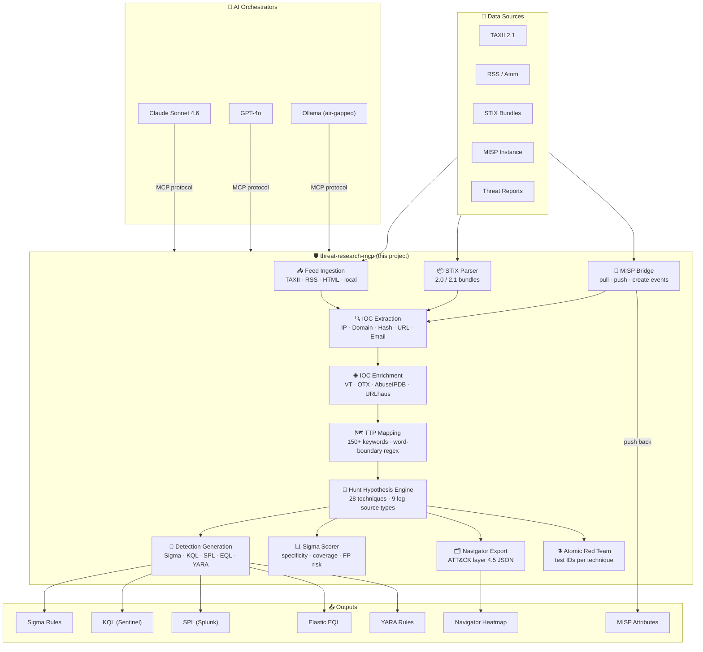
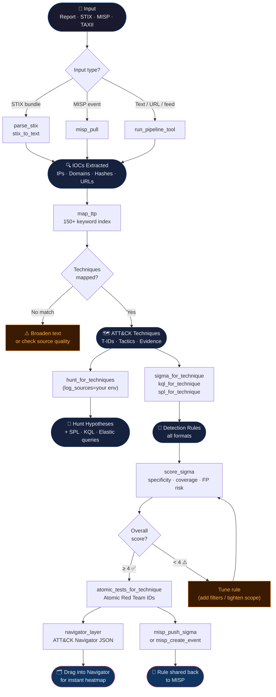
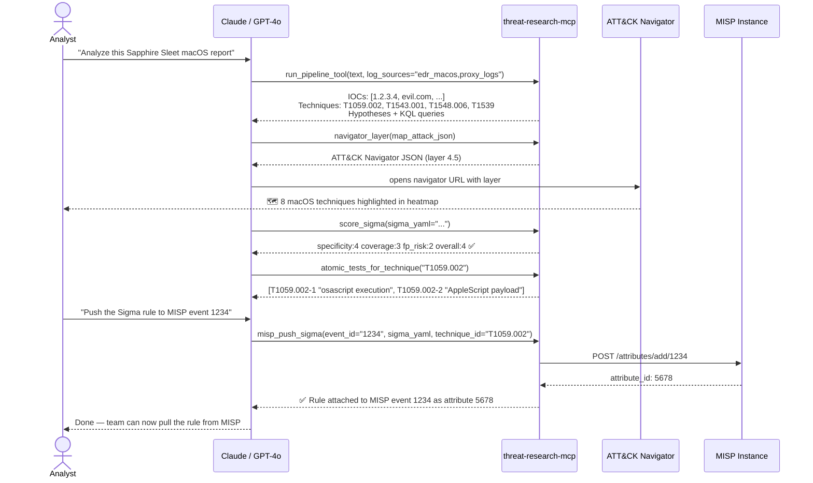
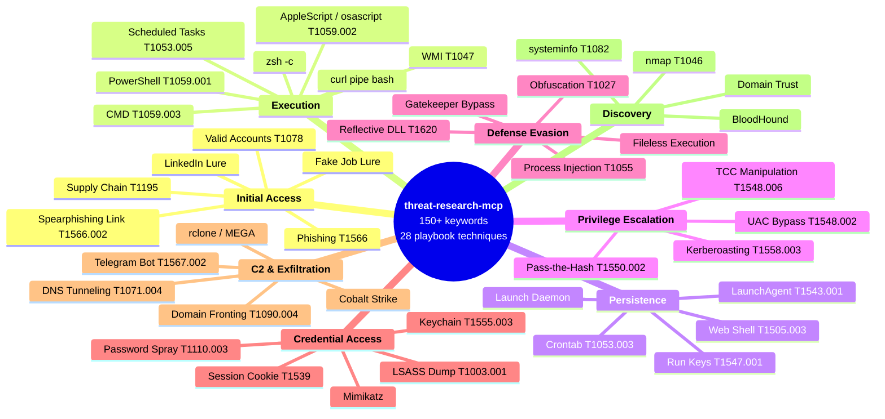
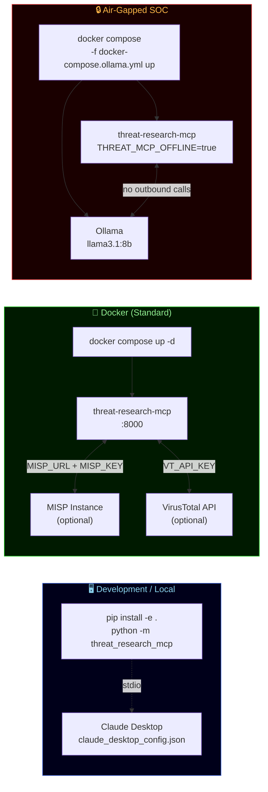
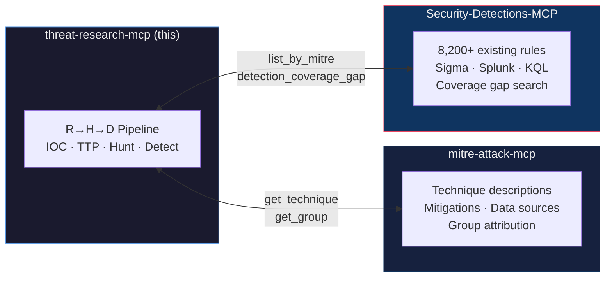

# Threat Research MCP

<div align="center">

[](https://github.com/harshthakur6293/threat-research-mcp/actions/workflows/ci.yml)
[](https://www.python.org/downloads/)
[]()
[]()
[](LICENSE)
[](https://modelcontextprotocol.io)
[](https://anthropic.com)
[](https://openai.com)
[](https://ollama.com)

**Turn any threat report, STIX bundle, or MISP event into hunt hypotheses, Sigma rules, and ATT&CK heatmaps — in a single Claude conversation.**

*Deterministic. Offline-first. No LLM calls inside the toolbox.*

[Quick Start](#setup) · [Tool Catalog](#tools) · [Workflows](#analyst-workflows) · [Contribute](#contributing-techniques-no-python-required) · [Docker](#docker-standard)

</div>

---

## The Problem This Solves

Every SOC analyst knows the loop: a threat report lands, you spend two hours manually extracting IOCs, googling ATT&CK technique IDs, writing Sigma rules from scratch, then fighting your SIEM to validate them. Then the next report drops.

This MCP breaks that loop. You paste a report (or point at a TAXII feed, STIX bundle, or MISP event) and your AI assistant orchestrates the full pipeline — IOC extraction → TTP mapping → hunt hypotheses → detection rules → Sigma quality scoring → ATT&CK Navigator heatmap — in one conversation.

---

## Architecture



---

## The Research → Hunt → Detection Pipeline



---

## Typical Analyst Workflow



---

## ATT&CK Coverage Mind Map



---

## Deployment Options



---

## Tools

### Feed Ingestion

| Tool | What it does |
|---|---|
| `ingest_feed(config_path)` | Pull from TAXII 2.1, RSS, HTML, or local files using a YAML sources config |
| `analyze_intel(text, sources_config_path)` | Run the full pipeline on text + feed documents combined |

### STIX 2.x Parsing

| Tool | What it does |
|---|---|
| `parse_stix(bundle_json)` | Parse a STIX 2.0/2.1 bundle — IOCs, ATT&CK techniques, malware families, threat actors. No external deps. |
| `stix_to_text(bundle_json)` | Flatten a STIX bundle into pipeline-ready text for `run_pipeline_tool` |

### IOC Extraction & Enrichment

| Tool | What it does |
|---|---|
| `extract_iocs(text)` | Extract IPs, domains, URLs, hashes, emails. macOS extension blocklist prevents `.app`/`.plist`/`.kext` false positives. |
| `enrich_ioc_tool(ioc)` | Check a single IOC against VT, OTX, AbuseIPDB, URLhaus |
| `enrich_iocs_tool(iocs_csv)` | Bulk enrich up to 20 IOCs |

### TTP Mapping

| Tool | What it does |
|---|---|
| `map_ttp(text)` | Map free-form threat text to ATT&CK technique IDs, names, tactics, and evidence keywords. Word-boundary matching prevents substring false positives. |

### ATT&CK Navigator Export

| Tool | What it does |
|---|---|
| `navigator_layer(map_attack_json, layer_name, domain)` | Generate an ATT&CK Navigator 4.5 layer JSON from `map_ttp` output. Drag into [mitre-attack.github.io/attack-navigator](https://mitre-attack.github.io/attack-navigator/) for an instant color-coded heatmap. |

### Full Pipeline (single call)

| Tool | What it does |
|---|---|
| `run_pipeline_tool(text, sources_config, log_sources, enrich)` | One call: feed ingestion → IOC extraction → enrichment → TTP mapping → hunt hypotheses → Sigma rules |
| `list_log_sources_tool()` | All available log source keys + environment presets (windows_sysmon, network, perimeter, edr, macos) |

### Hunt Hypothesis Generation

| Tool | What it does |
|---|---|
| `hunt_from_intel(text)` | Full pipeline: text → techniques → hypotheses + SIEM queries |
| `hunt_for_techniques(technique_ids, log_sources)` | Given technique IDs, get hypotheses + SPL/KQL/Elastic per log source |

### Detection Generation — Sigma

| Tool | What it does |
|---|---|
| `generate_sigma_rule(title, behavior, logsource)` | Generate a Sigma rule from a title and behavior description |
| `sigma_for_technique(technique_id)` | Production-ready Sigma rule for a specific ATT&CK technique |
| `sigma_bundle_for_techniques(technique_ids)` | Sigma rules for multiple techniques at once |
| `validate_sigma_rule(yaml_text)` | Validate Sigma YAML structure offline (no Sigma CLI required) |

### Sigma Quality Scoring

| Tool | What it does |
|---|---|
| `score_sigma(sigma_yaml)` | Score a Sigma rule on specificity (1-5), coverage (1-5), and FP risk (1-5) with rationale |
| `score_technique_sigma(technique_id)` | Score the built-in Sigma rule for any technique — quick triage for tuning priority |
| `atomic_tests_for_technique(technique_id)` | Atomic Red Team test IDs for a technique — validate detections fire before production |

#### Sigma Score Interpretation

```
Specificity  │ 1 = generic (any process)      5 = hash/event-ID-specific
Coverage     │ 1 = single SIEM               5 = Splunk + Sentinel + Elastic
FP Risk      │ 1 = safe (tight, specific)     5 = noisy (broad wildcards, no filters)
Overall      │ 1 = needs tuning              4-5 = production-ready
```

### Detection Generation — Native SIEM Formats

| Tool | What it does |
|---|---|
| `kql_for_technique(technique_id)` | KQL Analytics Rule for Microsoft Sentinel (severity, frequency, alert details) |
| `spl_for_technique(technique_id)` | SPL Saved Search for Splunk (cron schedule, drilldown, recommended actions) |
| `eql_for_technique(technique_id)` | Elastic Security rule (risk score, threat mapping, Kibana Detection Engine format) |

### Detection Generation — YARA

| Tool | What it does |
|---|---|
| `yara_for_technique(technique_id)` | YARA file-scanning rule for a technique |
| `generate_yara(rule_name, strings_csv, condition)` | Build a custom YARA rule from IOC strings (hashes, strings, patterns) |

### Coverage & Gap Analysis

| Tool | What it does |
|---|---|
| `detection_coverage_gap(techniques_csv, detections_csv)` | Find techniques you track but have no detection for |

### MISP Integration

| Tool | What it does |
|---|---|
| `misp_pull(tags, limit, threat_level)` | Pull MISP events filtered by tag/threat level → IOCs + pipeline-ready text |
| `misp_push_sigma(event_id, sigma_yaml, technique_id)` | Push a generated Sigma rule as a MISP attribute to an existing event |
| `misp_create_event(pipeline_result)` | Create a new MISP event from pipeline output — IOC attributes + ATT&CK tags auto-populated |

### Storage & Utilities

| Tool | What it does |
|---|---|
| `search_intel_history(text_query, workflow)` | Search previously analyzed intel from local SQLite DB |
| `search_ingested_docs(text_query, source_name)` | Search normalized feed documents |
| `get_intel_by_id(row_id)` | Retrieve a full stored analysis product by ID |
| `timeline(text)` | Sort log lines or event notes into chronological order |

---

## Analyst Workflows

### Workflow 1 — Paste a threat report

```
You: "Analyze this report on Sapphire Sleet macOS intrusion"

Claude → run_pipeline_tool(text=<report>, log_sources="edr_macos,proxy_logs")
       → navigator_layer(...)         # instant heatmap
       → score_sigma(sigma_yaml=...)  # FP risk check
       → atomic_tests_for_technique("T1059.002")  # lab validation IDs
```

### Workflow 2 — Pull from MISP and feed back

```
You: "Pull our latest high-severity MISP events and generate detections"

Claude → misp_pull(threat_level=1, limit=5)
       → run_pipeline_tool(pipeline_text=...)
       → sigma_for_technique("T1059.001")
       → score_sigma(sigma_yaml=...)   # ≥ 4 → push back
       → misp_push_sigma(event_id="...", sigma_yaml=...)
```

### Workflow 3 — STIX bundle → Navigator layer

```
You: "Parse this MITRE STIX bundle and show me the coverage heatmap"

Claude → parse_stix(bundle_json=...)
       → map_ttp(techniques from bundle)
       → navigator_layer(map_attack_json=..., layer_name="Q2 Campaign")
       # → opens ATT&CK Navigator with color-coded heatmap
```

### Workflow 4 — Air-gapped SOC (Ollama)

```bash
docker compose -f docker-compose.ollama.yml up -d
# No internet. Ollama runs llama3.1:8b locally.
# All tools work. Enrichment APIs are skipped (THREAT_MCP_OFFLINE=true).
```

---

## Companion MCPs



Neither companion MCP is required. This server works fully standalone.

---

## Setup

### Install (local)

```bash
git clone https://github.com/harshthakur6293/threat-research-mcp
cd threat-research-mcp
pip install -e .
python -m threat_research_mcp
```

### Configure Claude Desktop

```json
{
  "mcpServers": {
    "threat-research-mcp": {
      "command": "python",
      "args": ["-m", "threat_research_mcp"],
      "env": {
        "VIRUSTOTAL_API_KEY": "optional",
        "MISP_URL": "https://misp.example.org",
        "MISP_KEY": "your_automation_key"
      }
    }
  }
}
```

### Docker (standard)

```bash
# Copy and edit env
cp .env.example .env

docker compose up -d
```

### Docker (air-gapped SOC with Ollama)

```bash
# Pre-pull model into the Ollama volume before going offline
docker compose -f docker-compose.ollama.yml run ollama ollama pull llama3.1:8b

# Start the stack — no internet required
docker compose -f docker-compose.ollama.yml up -d
```

### Environment Variables

| Variable | Required | Purpose |
|---|---|---|
| `VIRUSTOTAL_API_KEY` | Optional | IOC enrichment via VirusTotal API v3 |
| `OTX_API_KEY` | Optional | IOC enrichment via AlienVault OTX |
| `ABUSEIPDB_API_KEY` | Optional | IP reputation via AbuseIPDB |
| `MISP_URL` | Optional | Base URL of your MISP instance |
| `MISP_KEY` | Optional | MISP automation key (User → My Profile → Auth key) |
| `MISP_VERIFY_SSL` | Optional | Set `false` for self-signed certs in lab environments |
| `THREAT_MCP_OFFLINE` | Optional | `true` = skip all outbound API calls (air-gapped mode) |
| `THREAT_RESEARCH_MCP_DB` | Optional | Path to SQLite DB for persisting intel history |

URLhaus enrichment is free with no API key. All enrichment sources are optional.

---

## Hunt Coverage

The hypothesis engine ships with **28 ATT&CK techniques** across Windows, Linux, cloud, and macOS:

```mermaid
gantt
    title Hunt Playbook Coverage by Log Source
    dateFormat X
    axisFormat %s techniques

    section Windows
    Sysmon Process Creation        : 0, 6
    Sysmon Process Access (EID 10) : 0, 1
    Sysmon Registry (EID 13)       : 0, 1
    Sysmon File Events (EID 11)    : 0, 1
    Sysmon CreateRemoteThread      : 0, 1
    PowerShell Script Block        : 0, 2
    Windows Security Events        : 0, 6
    Windows System Events          : 0, 1

    section Network
    Web Proxy Logs                 : 0, 3
    DNS Query Logs                 : 0, 2
    Email Gateway                  : 0, 1
    Web Server / WAF               : 0, 2
    Firewall / Flow Logs           : 0, 1

    section macOS
    macOS Unified Log              : 0, 4
    EDR macOS                      : 0, 8
```



---

## Contributing Techniques (no Python required)

Add new ATT&CK coverage by editing two YAML files — no Python knowledge needed.

### `playbook/keywords.yaml` — add detection keywords

```yaml
# keyword (lowercase, word-boundary matched) → [technique_id, name, tactic]
"living off the land":
  - ["T1218", "Signed Binary Proxy Execution", "defense-evasion"]

"mshta":
  - ["T1218.005", "Mshta", "defense-evasion"]

"wscript":
  - ["T1059.005", "Visual Basic", "execution"]
```

> Word-boundary regex is applied automatically. `"tor"` will not match "authorization".

### `playbook/atomic_tests.yaml` — map Atomic Red Team test IDs

```yaml
T1059.001:
  - T1059.001-1   # Mimikatz - Credential Dumping via PowerShell
  - T1059.001-2   # Run BloodHound from Local Disk

T1003.001:
  - T1003.001-1   # Dump LSASS via ProcDump
  - T1003.001-2   # Dump LSASS via comsvcs.dll
```

Open a pull request with new keywords or test mappings. The CI will catch any formatting issues.

---

## ATT&CK Keyword Coverage — 150+ phrases across 14 tactics

<details>
<summary>Click to expand the full keyword index</summary>

| Tactic | Example Keywords |
|---|---|
| **Execution** | powershell, encoded command, wmi, vbscript, msiexec, rundll32, regsvr32, cscript, osascript, applescript, zsh -c, curl pipe bash |
| **Persistence** | run key, scheduled task, startup folder, web shell, crontab, systemd, launch agent, launchd, launch daemon |
| **Privilege Escalation** | uac bypass, token impersonation, pass-the-hash, sudo, kerberoasting, tcc manipulation, tcc database |
| **Defense Evasion** | obfuscation, process injection, timestomp, lolbins, masquerading, reflective dll, gatekeeper, quarantine attribute, fileless, in-memory execution |
| **Credential Access** | mimikatz, lsass, ntds.dit, brute force, password spray, keylogging, keychain, security find-generic-password, session hijack, session cookie |
| **Discovery** | nmap, bloodhound, net commands, systeminfo, domain trust |
| **Lateral Movement** | psexec, smb, rdp, ssh tunnel, wmi exec |
| **Collection** | zip archive, archive collected, screen capture |
| **C2** | dns tunneling, domain fronting, cobalt strike, sliver, tor network, telegram bot, telegram bot api |
| **Exfiltration** | rclone, mega, ftp, dns exfil, telegram bot api |
| **Initial Access** | phishing, spearphishing link, drive-by, supply chain, valid accounts, sql injection, remote code execution, linkedin lure, fake job, ledger live, crypto wallet |
| **Impact** | ransomware, wiper, defacement, ddos |

</details>

---

## Development

```bash
# Install dev deps
pip install -e ".[dev]"

# Run tests (must stay ≥ 65% coverage)
pytest tests/ --cov=src/threat_research_mcp -q

# Lint (zero warnings policy)
ruff check src/

# Format
ruff format src/

# Check a specific new test class
pytest tests/test_new_tools_v2.py -v
```

### CI Checks

Every push runs four GitHub Actions workflows:

| Workflow | What it checks |
|---|---|
| `ci` | ruff lint + pytest (coverage gate ≥ 65%) |
| `build` | package install + import smoke test |
| `security` | pip-audit CVE scan |
| `codeql` | GitHub CodeQL static analysis |

---

## Tested With

| AI Assistant | Version | Notes |
|---|---|---|
| Claude | Sonnet 4.6 | Primary target — full MCP tool-calling support |
| GPT-4o | 2024-11 | Via OpenAI Responses API with MCP support |
| Ollama | llama3.1:8b | Air-gapped mode via `docker-compose.ollama.yml` |

---

## Project Structure

```
threat-research-mcp/
├── src/threat_research_mcp/
│   ├── server.py                        # FastMCP server — ~33 registered tools
│   ├── tools/
│   │   ├── extract_iocs.py              # Regex IOC extraction (macOS extension blocklist)
│   │   ├── map_attack.py                # ATT&CK keyword index (150+ keywords, word-boundary)
│   │   ├── generate_hunt_hypothesis.py  # Hunt hypothesis + SIEM query engine (28 techniques)
│   │   ├── generate_sigma.py            # Sigma rule generation (per-technique templates)
│   │   ├── parse_stix.py                # STIX 2.x bundle parser (no external deps)
│   │   ├── navigator_export.py          # ATT&CK Navigator 4.5 layer export
│   │   ├── score_sigma.py               # Sigma quality scorer + Atomic Red Team mapping
│   │   ├── misp_bridge.py               # MISP pull / push / create integration
│   │   ├── validate_sigma.py            # Sigma YAML validation (offline)
│   │   └── detection_gap_analysis.py    # Coverage gap calculator
│   ├── enrichment/enrich.py             # VT · OTX · AbuseIPDB · URLhaus API calls
│   ├── ingestion/adapters/              # TAXII 2.1 · RSS · HTML · local file adapters
│   ├── detection/generators/            # SigmaRule · KQL · SPL · EQL · YARA templates
│   └── storage/sqlite.py                # SQLite intel history
│
├── playbook/
│   ├── keywords.yaml                    # Community-editable keyword → ATT&CK index
│   └── atomic_tests.yaml                # Atomic Red Team test IDs per technique
│
├── Dockerfile                           # Standard container image
├── docker-compose.yml                   # Standard deployment
└── docker-compose.ollama.yml            # Air-gapped SOC: MCP + Ollama sidecar
```

---

## License

MIT — contributions welcome. Open issues, submit PRs, or add new YAML playbook entries.
