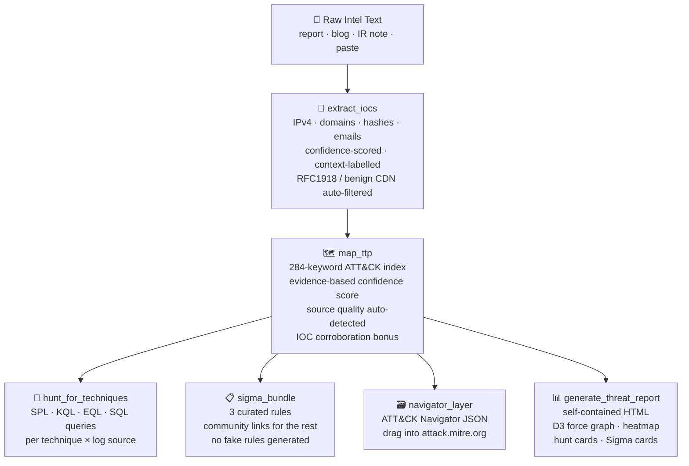

<div align="center">

# 🔍 Threat Research MCP

### Paste a threat report. Get a triage package in seconds.

IOC extraction · ATT&CK mapping · Hunt queries · Sigma rules · MITRE STIX enrichment<br>
Works with Claude Desktop · Cline · Cursor · Copilot · any MCP-compatible client

<br>

[](https://github.com/harshthakur6293/threat-research-mcp/actions/workflows/ci.yml)
[](https://github.com/harshthakur6293/threat-research-mcp/actions/workflows/codeql.yml)
[](https://github.com/harshthakur6293/threat-research-mcp/actions/workflows/security.yml)
[](https://www.python.org/downloads/)
[](LICENSE)
[](https://modelcontextprotocol.io)
[-ef4444)](#-at-a-glance)

<br>

[At a glance](#-at-a-glance) · [Quick Start](#-quick-start) · [Live Example](#-live-example) · [Coverage Matrix](#-coverage-matrix) · [How It Works](#-how-it-works) · [Tool Catalog](#-tool-catalog) · [Limitations](#-limitations) · [Contributing](#-contributing)

</div>

---

## 🎯 At a glance

<table>
<tr>
<th width="50%">What it does</th>
<th width="50%">What it doesn't do</th>
</tr>
<tr>
<td valign="top">

- A **workflow orchestrator** that takes free-form threat report text and emits a structured triage package: IOCs, ATT&CK technique guesses, hunt queries, and a navigator layer.
- A **deterministic, offline-first** MCP server — no LLM calls inside the toolbox, no hallucinated technique IDs, runs air-gapped.
- A **284-keyword ATT&CK index** loaded from one YAML file ([keywords.yaml](src/threat_research_mcp/playbook/keywords.yaml)) that contributors can edit without touching Python.
- A **hunt playbook with 37 techniques** of hand-written SPL / KQL / Elastic / SQL queries embedded per log source.
- A **self-contained HTML report** with a D3 force graph, IOC table, and hunt cards — the strongest deliverable in the box.
- An **honest scaffold** for SOC teams to fork, extend with their own curated rules, and pipe into Claude Desktop / Cursor / Cline.

</td>
<td valign="top">

- **Not a replacement for SigmaHQ or Elastic detection-rules.** Only **3** full hand-written Sigma rules ship in the box. Everything else returns `no_curated_rule` + community search links.
- **Not "production-ready" out of the box.** Outputs are analyst drafts. Review, tune, and test against your environment before deploying.
- **Not authoritative ATT&CK.** Mapping is keyword-based; semantic gaps exist. Pair with `mitre-attack-mcp` or use the optional STIX enrichment for authoritative technique data.
- **Not a TIP.** Campaign tracking is JSON files on disk — fine for one analyst, not for a shared SOC platform.
- **Not a SIEM connector.** It produces queries; you copy/paste or deploy them via your own pipeline. No `deploy_to_siem` tool exists yet.
- **Not a threat-intel feed.** It analyzes intel that you paste or ingest — it doesn't subscribe to feeds for you.

</td>
</tr>
</table>

---

## 📊 Component status

| Component | Status | Notes |
|---|:---:|---|
| **Project hygiene** | 🟢 Strong | 129 tests, 65% coverage gate, ruff/bandit/pip-audit clean, pinned deps |
| **MCP wiring** | 🟢 Strong | 49 tools registered via FastMCP, stdio transport idiomatic |
| **HTML report** | 🟢 Strong | Self-contained, D3 force graph + heatmap + IOC table — the marquee output |
| **IOC extraction** | 🟡 Decent | Context-aware confidence + FP filtering; known edge cases on multi-dot TLDs |
| **ATT&CK keyword mapping** | 🟡 Decent | 284 keywords, 119 techniques covered; semantic gaps remain |
| **Hunt query coverage** | 🟡 Decent | 37 techniques × multi-SIEM in the hunt playbook |
| **Curated Sigma rules** | 🟠 Thin | **Only 3 hand-written rules.** Everything else returns `no_curated_rule` + community links |
| **Confidence calibration** | 🟠 Thin | Heuristic; tends to label LOW on noisy reports. Tunable in `confidence_weights.yaml` |
| **SOC operational integration** | 🔴 Absent | No environment profile, no `deploy_to_siem`, no deployment registry |
| **Eval harness** | 🔴 Absent | `evals/run_test.py` exists but no curated public-report eval set |
| **PyPI distribution** | 🟠 In progress | Publish workflow merged; first `pip install threat-research-mcp` pending PyPI account setup |

---

## ⚡ Quick Start

```bash
# 1. Clone and install
git clone https://github.com/harshthakur6293/threat-research-mcp
cd threat-research-mcp
pip install -e ".[dev]"

# 2. Verify — 129 tests should pass (5 skipped: optional deps)
python -m pytest -q

# 3. Start the MCP server (your client connects via stdio)
python -m threat_research_mcp
```

> **PyPI / `uvx` distribution coming.** Publish workflow is merged; first release pending PyPI Trusted Publisher setup. Local install is the supported path today.

<details>
<summary><b>Claude Desktop</b> — <code>claude_desktop_config.json</code></summary>

macOS: `~/Library/Application Support/Claude/claude_desktop_config.json`
Windows: `%APPDATA%\Claude\claude_desktop_config.json`

```json
{
  "mcpServers": {
    "threat-research-mcp": {
      "command": "python",
      "args": ["-m", "threat_research_mcp"],
      "cwd": "/path/to/threat-research-mcp"
    }
  }
}
```
</details>

<details>
<summary><b>VS Code / Cline / Roo Code</b> — <code>.vscode/settings.json</code></summary>

```json
{
  "cline.mcpServers": {
    "threat-research-mcp": {
      "command": "python",
      "args": ["-m", "threat_research_mcp"],
      "cwd": "${workspaceFolder}/../threat-research-mcp"
    }
  }
}
```
</details>

<details>
<summary><b>Cursor</b> — <code>~/.cursor/mcp.json</code></summary>

```json
{
  "mcpServers": {
    "threat-research-mcp": {
      "command": "python",
      "args": ["-m", "threat_research_mcp"],
      "cwd": "/path/to/threat-research-mcp"
    }
  }
}
```
</details>

---

## 🎬 Live Example

Real run against the **Google Mandiant UNC6692 Snow Flurries** report (Teams phishing → browser extension backdoor → credential theft):

**Input — paste into Claude:**
```
Source: https://cloud.google.com/blog/topics/threat-intelligence/unc6692
UNC6692 Microsoft Teams phishing impersonating IT helpdesk. AutoHotkey
scripts from S3. SNOWBELT browser extension C2 over WebSocket AES-GCM.
SNOWGLAZE Python tunneler wss://sad4w7h913-b4a57f9c36eb.herokuapp.com:443/ws
SHA256 7f1d71e1e079f3244a69205588d504ed830d4c473747bb1b5c520634cc5a2477
lsass credential dump pass-the-hash lateral movement. Black Basta ransomware.
```

**Pipeline output:**
```
Source quality auto-detected: vendor_blog (0.75)
IOCs extracted: 4  (1 domain · 3 SHA256 hashes)

ATT&CK Techniques: 14 above threshold
  T1566.004  [MEDIUM 0.59]  Spearphishing via Service
               evidence: teams phishing, teams lure, impersonating it
  T1071      [MEDIUM 0.56]  Application Layer Protocol
               evidence: c2, command and control
  T1003.001  [LOW    0.54]  LSASS Memory
               evidence: lsass, credential dump
  T1550.002  [LOW    0.43]  Pass the Hash
  T1486      [LOW    0.47]  Data Encrypted for Impact
  ... 9 more

Sigma rules generated: 14  (1 curated · 13 with SigmaHQ/Elastic links)
Hunt hypotheses: 8
```

**What you get back:**
- IOC table with confidence scores and `MALICIOUS` / `UNKNOWN` / `VICTIM` labels
- ATT&CK technique cards with keyword evidence and links to attack.mitre.org
- Hunt queries (SPL · KQL · EQL · SQL) per technique × log source
- Curated Sigma YAML for the 3 supported techniques; community search links for the rest
- ATT&CK Navigator JSON — drag into [attack.mitre.org/navigator](https://mitre-attack.github.io/attack-navigator/)
- Self-contained HTML report with D3 force graph, heatmap, and hunt cards

> ℹ️ The confidence model is intentionally conservative — even high-quality `vendor_blog` sources often land in LOW / MEDIUM. Thresholds and weights are tunable in [`playbook/confidence_weights.yaml`](src/threat_research_mcp/playbook/confidence_weights.yaml). See [Limitations](#-limitations) for details.

---

## 🧭 Coverage Matrix

**Legend:**
&nbsp;✅ hand-written / curated&nbsp;&nbsp;·&nbsp;&nbsp;🟡 playbook query (hand-written, embedded in hunt playbook)&nbsp;&nbsp;·&nbsp;&nbsp;🔗 community link only (`no_curated_rule`)&nbsp;&nbsp;·&nbsp;&nbsp;❌ not covered

| Technique | Keyword index | Hunt hypothesis | Full Sigma | KQL | SPL | EQL | SQL | YARA |
|---|:---:|:---:|:---:|:---:|:---:|:---:|:---:|:---:|
| **T1059.001** PowerShell | ✅ | ✅ | ✅ | 🟡 | 🟡 | 🟡 | 🟡 | ✅ |
| **T1003.001** LSASS Memory | ✅ | ✅ | ✅ | 🟡 | 🟡 | 🟡 | 🟡 | ✅ |
| **T1071.001** C2 over Web Protocols | ✅ | ✅ | ✅ | 🟡 | 🟡 | 🟡 | 🟡 | ✅ |
| **T1053.005** Scheduled Task | ✅ | ✅ | 🔗 | 🟡 | 🟡 | 🟡 | 🟡 | ✅ |
| **T1547.001** Registry Run Key | ✅ | ✅ | 🔗 | 🟡 | 🟡 | 🟡 | 🟡 | ✅ |
| **T1505.003** Web Shell | ✅ | ✅ | 🔗 | 🟡 | 🟡 | 🟡 | 🟡 | ✅ |
| **T1566.001** Spearphishing Attachment | ✅ | ✅ | 🔗 | 🟡 | 🟡 | 🟡 | 🟡 | ✅ |
| **T1021.001 / .002** RDP / SMB | ✅ | ✅ | 🔗 | 🟡 | 🟡 | 🟡 | 🟡 | ❌ |
| **T1078** Valid Accounts | ✅ | ✅ | 🔗 | 🟡 | 🟡 | 🟡 | 🟡 | ❌ |
| **T1110.003** Password Spraying | ✅ | ✅ | 🔗 | 🟡 | 🟡 | 🟡 | 🟡 | ❌ |
| **T1486** Ransomware Encryption | ✅ | ✅ | 🔗 | 🟡 | 🟡 | 🟡 | 🟡 | ✅ |
| **T1558.003** Kerberoasting | ✅ | ✅ | 🔗 | 🟡 | 🟡 | 🟡 | 🟡 | ❌ |
| **T1190** Exploit Public-Facing App | ✅ | ✅ | 🔗 | 🟡 | 🟡 | 🟡 | 🟡 | ❌ |
| **T1055** Process Injection | ✅ | ✅ | 🔗 | 🟡 | 🟡 | 🟡 | 🟡 | ✅ |
| **T1027** Obfuscated Files | ✅ | ✅ | 🔗 | 🟡 | 🟡 | 🟡 | 🟡 | ✅ |
| **T1543.003** Windows Service | ✅ | ✅ | 🔗 | 🟡 | 🟡 | 🟡 | 🟡 | ❌ |
| **T1041 / T1567.002** Exfiltration | ✅ | ✅ | 🔗 | 🟡 | 🟡 | 🟡 | 🟡 | ❌ |
| **T1046** Network Port Scanning | ✅ | ✅ | 🔗 | 🟡 | 🟡 | 🟡 | 🟡 | ❌ |
| **T1539** Steal Web Cookies | ✅ | ✅ | 🔗 | 🟡 | 🟡 | 🟡 | 🟡 | ❌ |
| **T1204.002** Malicious File | ✅ | ✅ | 🔗 | 🟡 | 🟡 | 🟡 | 🟡 | ❌ |
| **T1560.001** Archive (rar/7z) | ✅ | ✅ | 🔗 | 🟡 | 🟡 | 🟡 | 🟡 | ❌ |
| **T1059.002** AppleScript | ✅ | ✅ | 🔗 | 🟡 | 🟡 | 🟡 | 🟡 | ❌ |
| **T1543.001** Launch Agent (macOS) | ✅ | ✅ | 🔗 | 🟡 | 🟡 | 🟡 | 🟡 | ❌ |
| **T1548.006** TCC Manipulation (macOS) | ✅ | ✅ | 🔗 | 🟡 | 🟡 | 🟡 | 🟡 | ❌ |
| **T1555.003** Browser Credentials | ✅ | ✅ | 🔗 | 🟡 | 🟡 | 🟡 | 🟡 | ❌ |
| **T1195.001 / .002** Supply Chain | ✅ | ✅ | 🔗 | 🟡 | 🟡 | 🟡 | 🟡 | ❌ |
| **T1530** Cloud Storage Access | ✅ | ✅ | 🔗 | 🟡 | 🟡 | 🟡 | 🟡 | ❌ |
| **T1552.005** IMDS Credentials | ✅ | ✅ | 🔗 | 🟡 | 🟡 | 🟡 | 🟡 | ❌ |
| **T1078.004** Cloud Valid Accounts | ✅ | ✅ | 🔗 | 🟡 | 🟡 | 🟡 | 🟡 | ❌ |
| **T1609 / T1610 / T1613** Containers | ✅ | ✅ | 🔗 | 🟡 | 🟡 | 🟡 | 🟡 | ❌ |
| **Other 80+ techniques** in keyword index | ✅ | ❌ | 🔗 | 🔗 | 🔗 | 🔗 | 🔗 | ❌ |

**Bottom line:**
- **3** full hand-written Sigma rules (T1059.001, T1003.001, T1071.001)
- **37** techniques with embedded SPL/KQL/Elastic/SQL queries in the hunt playbook
- **119** unique techniques in the keyword index (mapping only, no hand-written queries)
- **All other techniques** fall through to `no_curated_rule` with community search links

This matrix is **manually maintained**. If it drifts from reality, please open an issue.

---

## 🔬 How It Works

### The pipeline

`run_pipeline_tool` chains all stages automatically from a single text input:



Each stage is also callable individually.

### Confidence scoring

Every detected technique gets a score built from four dimensions:

| Dimension | Weight | What it measures |
|---|:---:|---|
| **keyword_specificity** | 35% | How diagnostic the keyword is (`mimikatz`=0.95 vs. `script`=0.30) |
| **evidence_diversity** | 25% | How many independent signals fired (1 keyword=0.30 → 5+ keywords=0.95) |
| **ioc_corroboration** | 20% | Whether extracted IOCs align with the technique (network IOC + C2 technique = +0.30 bonus) |
| **source_quality** | 20% | Authority of the intelligence source (`cisa_advisory`=1.0 · `vendor_blog`=0.75) |

| Label | Score | What to do |
|:---:|:---:|---|
| 🟢 **HIGH** | ≥ 0.75 | Multiple specific signals — treat as confirmed, deploy detection |
| 🟡 **MEDIUM** | 0.55 – 0.75 | Credible — worth hunting, validate in your environment |
| 🟠 **LOW** | 0.35 – 0.55 | Weak signal — analyst review before acting |
| ⚫ **SUPPRESSED** | < 0.35 | Returned in `suppressed[]` — noise filtered from main list |

> ⚠️ **Calibration is conservative.** On many real-world vendor reports, most techniques will land in **LOW / MEDIUM**. Tune thresholds and dimension weights in [`playbook/confidence_weights.yaml`](src/threat_research_mcp/playbook/confidence_weights.yaml) for your environment.

Source quality is **auto-detected** from URLs in the pasted text — CISA, Microsoft, Google/Mandiant, NCSC, and ISAC domains are all recognized automatically.

---

## ✨ STIX Enrichment *(optional)*

After `run_pipeline_tool` maps technique IDs, pass them to `enrich_techniques_stix` to pull authoritative detail directly from the official [MITRE CTI STIX bundle](https://github.com/mitre/cti):

```
T1059.001 — PowerShell
platforms:      Windows
data_sources:   Process: Process Creation
                Script: Script Execution
                Command: Command Execution
detection:      MITRE official guidance string
threat_groups:  APT32, Lazarus Group, Kimsuky, OilRig (+more)
```

**One-time setup:**
```bash
pip install "threat-research-mcp[attack]"      # installs mitreattack-python
python scripts/download_attack_stix.py          # downloads enterprise-attack.json (~50 MB)
```

Run `stix_status` to check if enrichment is active. The core pipeline works without this — STIX enrichment degrades gracefully.

---

## 📖 What Each Stage Produces

<details>
<summary><b>IOC Extraction</b> — <code>extract_iocs</code></summary>

Context-aware extraction with a confidence score and label per indicator. Automatically filters RFC1918 / loopback IPs, version strings, macOS bundle IDs (`com.apple.*`), and known-benign CDN domains.

```json
{
  "ips":     [{"value": "185.220.101.47",     "confidence": 0.92, "label": "MALICIOUS"}],
  "domains": [{"value": "cdn.apple-cdn.org",  "confidence": 0.85, "label": "MALICIOUS"}],
  "hashes":  [{"value": "a3f8c2d1...",        "confidence": 0.78, "label": "HASH"}],
  "emails":  [{"value": "hr@careers-talent.io","confidence": 0.71, "label": "MALICIOUS"}],
  "filtered_fps": [{"value": "192.168.1.1",   "reason": "RFC1918"}]
}
```

Context patterns live in [`playbook/ioc_context_patterns.yaml`](src/threat_research_mcp/playbook/ioc_context_patterns.yaml) — editable without code changes.

**Known edge case:** multi-dot TLDs (`*.trycloudflare.com`, `*.net.br`) and sketchy newer TLDs (`.site`, `.sh`) may be over-rejected. Tracked in [Limitations](#-limitations).
</details>

<details>
<summary><b>ATT&CK Mapping</b> — <code>map_ttp</code></summary>

Maps text to techniques using a **284-keyword index** loaded from [`playbook/keywords.yaml`](src/threat_research_mcp/playbook/keywords.yaml) — the **single source of truth** for all keyword→technique mappings. No hardcoded data in Python.

```json
{
  "techniques": [
    {
      "id": "T1059.002",
      "name": "AppleScript",
      "tactic": "execution",
      "evidence": ["osascript", "applescript"],
      "confidence": 0.82,
      "confidence_label": "HIGH",
      "url": "https://attack.mitre.org/techniques/T1059/002/"
    }
  ],
  "suppressed": [...],
  "source_quality": "vendor_blog"
}
```

To add a keyword: edit [`playbook/keywords.yaml`](src/threat_research_mcp/playbook/keywords.yaml) and restart the server — no Python changes needed.
</details>

<details>
<summary><b>Hunt Hypotheses</b> — <code>hunt_for_techniques</code></summary>

Returns one hypothesis per technique × log source with a ready-to-run query in **four SIEM flavours**:

```json
{
  "hypothesis": "Attacker invoked osascript to execute in-memory payload",
  "technique_id": "T1059.002",
  "log_source_key": "edr_macos",
  "queries": {
    "spl":     "index=edr source=macos process_name=osascript ...",
    "kql":     "DeviceProcessEvents | where FileName =~ 'osascript' ...",
    "elastic": "process.name: osascript AND ...",
    "sql":     "SELECT * FROM process_events WHERE process_name = 'osascript' ..."
  }
}
```

37 techniques have hand-written queries in the hunt playbook. Techniques outside the playbook return a `techniques_not_in_playbook` notice.
</details>

<details>
<summary><b>Sigma Rules</b> — <code>sigma_bundle_for_techniques</code></summary>

Returns hand-written Sigma rules for **3 techniques only**: `T1059.001`, `T1003.001`, `T1071.001`.

For everything else, returns a structured `no_curated_rule` response with direct search links to SigmaHQ, Elastic detection-rules, and Splunk Security Content — **no plausible-looking fake rules are generated.**

```json
{"technique_id": "T1059.001", "status": "curated",         "rule_yaml": "title: PowerShell Download Cradle ..."}
{"technique_id": "T1190",     "status": "no_curated_rule", "fallback": {"sigmahq_search": "...", "elastic_rules": "..."}}
```

This is intentional. Generating a plausible-looking generic rule for every technique is worse than honestly returning "I don't have this — here's where to look."
</details>

---

## 🗂️ Tool Catalog

**49 registered MCP tools** across 12 categories. Full inventory in [server.py](src/threat_research_mcp/server.py).

### 🚀 Primary Workflow

| Tool | What it does |
|---|---|
| `run_pipeline_tool` | Full pipeline: text → IOCs → ATT&CK → hunts → Sigma (one call) |
| `extract_iocs` | Context-aware IOC extraction with confidence scores |
| `map_ttp` | ATT&CK technique mapping with evidence + confidence |
| `hunt_from_intel` | Hunt hypotheses directly from raw text |
| `hunt_for_techniques` | Hunt hypotheses for specific technique IDs |
| `list_log_sources_tool` | List available log source keys for filtering |
| `generate_threat_report` | Self-contained HTML report from pipeline JSON |
| `navigator_layer` | ATT&CK Navigator layer JSON |

### 🌐 STIX Enrichment *(optional — requires setup)*

| Tool | What it does |
|---|---|
| `enrich_techniques_stix` | Platforms · data sources · detection notes · threat groups from MITRE STIX |
| `stix_status` | Check if `mitreattack-python` + STIX bundle are ready |

### 📋 Sigma and Detection Drafts

| Tool | What it does |
|---|---|
| `generate_sigma_rule` | Build Sigma from title + behavior description |
| `sigma_for_technique` | Curated Sigma (3 techniques) or `no_curated_rule` with community links |
| `sigma_bundle_for_techniques` | Batch Sigma for multiple techniques |
| `validate_sigma_rule` | Offline structure validation (no CLI needed) |
| `score_sigma` | Score specificity, coverage, FP risk — *see [known issue](#-limitations)* |
| `score_technique_sigma` | Score a built-in curated rule — *see [known issue](#-limitations)* |
| `kql_for_technique` | Microsoft Sentinel KQL — 37 techniques from hunt playbook |
| `spl_for_technique` | Splunk SPL — 37 techniques from hunt playbook |
| `eql_for_technique` | Elastic EQL — 37 techniques from hunt playbook |
| `sql_detection` | Generic SQL (Snowflake / BigQuery / Athena / Databricks) — 37 techniques |
| `yara_for_technique` | YARA file-scanning rules — 10 techniques |
| `generate_yara` | Custom YARA from string patterns |
| `ioc_sigma_bundle` | IOC blocklist Sigma bundle with TTL guidance |
| `detection_coverage_gap` | Gap analysis: tracked techniques vs existing detections |
| `atomic_tests_for_technique` | Atomic Red Team test IDs for validation |

### 🔬 IOC Enrichment *(optional — requires API keys)*

| Tool | What it does |
|---|---|
| `enrich_ioc_tool` | Single IOC: VirusTotal · OTX · AbuseIPDB · URLhaus |
| `enrich_iocs_tool` | Bulk enrich comma-separated IOCs (capped at 20) |

### 📥 Intake and Parsing

| Tool | What it does |
|---|---|
| `ingest_feed` | TAXII 2.1 · RSS/Atom · HTML · local file ingestion |
| `analyze_intel` | Pipeline on text + ingested feed documents |
| `parse_stix` | Parse STIX 2.x bundle JSON |
| `stix_to_text` | Flatten STIX to pipeline-ready text |
| `timeline` | Sort log lines / event notes chronologically |

### 🔗 MISP Integration *(optional — requires `MISP_URL` + `MISP_KEY`)*

| Tool | What it does |
|---|---|
| `misp_pull` | Pull events → IOCs + pipeline-ready text |
| `misp_push_sigma` | Push Sigma rule as attribute to a MISP event |
| `misp_create_event` | Create MISP event from pipeline output |

### 📁 Campaign Tracking *(JSON file-based — not a TIP)*

| Tool | What it does |
|---|---|
| `campaign_update` | Store / update campaign state |
| `campaign_get` | Retrieve campaign state |
| `campaign_list` | List all tracked campaigns |
| `campaign_correlate_ioc` | Find campaigns sharing an IOC |

### 🗄️ Storage and Search

| Tool | What it does |
|---|---|
| `search_intel_history` | Search stored analysis products (SQLite) |
| `get_intel_by_id` | Retrieve stored product by row ID |
| `search_ingested_docs` | Search ingested document store |

### 🧬 Local ATT&CK Database *(optional — requires `python scripts/build_attack_db.py`)*

| Tool | What it does |
|---|---|
| `attack_get_technique` | Full technique card: platforms, data sources, detection |
| `attack_get_threat_groups` | Groups known to use a technique |
| `attack_get_techniques_by_group` | Techniques attributed to a threat group |
| `attack_attribute_to_group` | Rank groups by technique overlap (Jaccard similarity) |
| `attack_get_data_sources` | Map ATT&CK data sources to SIEM log sources |
| `attack_get_mitigations` | ATT&CK recommended mitigations |

---

## 🔧 Playbook Files

Everything tunable lives in `playbook/` — no Python changes needed:

| File | Controls |
|---|---|
| [`keywords.yaml`](src/threat_research_mcp/playbook/keywords.yaml) | 284-entry keyword → ATT&CK technique index (**single source of truth**) |
| [`confidence_weights.yaml`](src/threat_research_mcp/playbook/confidence_weights.yaml) | Scoring dimensions, thresholds, specificity tiers |
| [`ioc_context_patterns.yaml`](src/threat_research_mcp/playbook/ioc_context_patterns.yaml) | IOC context scoring (MALICIOUS / VICTIM / RESEARCHER) |
| [`atomic_tests.yaml`](src/threat_research_mcp/playbook/atomic_tests.yaml) | Atomic Red Team test ID mapping per technique |
| [`siems/`](src/threat_research_mcp/playbook/siems/) | SIEM field profiles for KQL / SPL / EQL generation |

**Add a new keyword** — edit `keywords.yaml` and restart:

```yaml
entries:
  - keyword: "your-new-keyword"
    tactic: initial-access
    technique_id: T1190
    technique_name: Exploit Public-Facing Application
```

---

## ⚠️ Limitations

Generated outputs are analyst drafts — review and tune before deploying anything to production.

### Coverage

| Limitation | Detail |
|---|---|
| **Curated Sigma rules** | **Only 3 hand-written full Sigma rules** (T1059.001, T1003.001, T1071.001). All others return `no_curated_rule` + SigmaHQ / Elastic / Splunk search links. By design — no fake rules generated. |
| **Hunt playbook coverage** | 37 techniques with hand-written SPL / KQL / Elastic / SQL queries. Techniques outside the playbook get a `techniques_not_in_playbook` notice from the standalone detection tools. |
| **Sigma platform awareness** | Curated Sigma rules are Windows-focused. macOS / Linux / cloud campaigns may receive Windows-shaped logsources. Tracked as a roadmap item. |
| **YARA coverage** | Hand-written rules for 10 techniques only — predominantly Windows. |

### Confidence model

| Limitation | Detail |
|---|---|
| **Conservative calibration** | On real-world reports, most techniques tend to land in LOW / MEDIUM, even for high-quality `vendor_blog` sources. Tune thresholds/weights in `confidence_weights.yaml`. |
| **Keyword-based heuristic** | Not ground truth. A LOW confidence label means "weak signal" — review evidence before acting. |
| **Semantic gaps** | Substring matching can miss paraphrased adversary behavior. Expand `keywords.yaml` to improve coverage for your common report sources. |

### Known issues

| Issue | Detail | Severity |
|---|---|:---:|
| **`score_sigma` coverage metric** | The metric scans rule text for `splunk:` / `kql:` / `elastic:` substrings that don't exist in Sigma YAML. Coverage dimension is effectively always 0. | 🟡 Medium |
| **`score_technique_sigma` envelope** | Passes a JSON envelope from `generate_sigma_for_technique` to a YAML scorer. Rationale will reference wrong fields. | 🟡 Medium |
| **Unstable Sigma rule UUIDs** | Rule IDs are generated via `uuid.uuid4()` on every invocation rather than `uuid5(namespace, technique_id)`. Breaks detection-as-code change management — same rule gets a new UUID every run. | 🟡 Medium |
| **Multi-dot domain extraction** | `*.trycloudflare.com`, `*.net.br`, and similar are over-rejected by the domain extractor's TLD heuristic. Real C2 may be missed. | 🟠 Lower (filtered output is visible in `filtered_fps`) |

These are tracked as roadmap items — see [Contributing](#-contributing) if you want to take one on.

### Operational gaps

| Limitation | Detail |
|---|---|
| **No environment profile** | No `configs/my-soc.yaml` to filter output to your SIEM stack. Every analyst gets all 49 tools and all SIEM flavours regardless of which they use. |
| **No `deploy_to_siem`** | Generated queries are text. You copy/paste or build your own deployment pipeline. |
| **No deployment registry** | The MCP doesn't remember which rules you've already promoted. Coverage delta analysis is per-call, not cumulative. |
| **No SIEM-native artifacts** | Output is loose KQL / SPL / EQL. Not `savedsearches.conf`, ARM templates, or Kibana detection-rules TOML. |
| **No SIEM query syntactic validation** | Generated queries are templated strings — not linted against pySigma backends or SIEM schemas. |
| **No eval harness** | `evals/run_test.py` exists but no curated public-report eval set. Every change is anecdotally validated. |
| **Campaign tracking is files on disk** | One analyst, shared-git workflow only. Not a relational TIP. |
| **Enrichment rate limiting** | Bulk enrich caps at 20 IOCs but has no per-source quota tracking or circuit breakers. |

### Setup requirements

| Component | Requires |
|---|---|
| **ATT&CK SQLite DB** (6 `attack_*` tools) | `python scripts/build_attack_db.py` run once |
| **STIX enrichment** | `pip install 'threat-research-mcp[attack]'` + `python scripts/download_attack_stix.py` |
| **IOC enrichment** | Optional API keys (`VIRUSTOTAL_API_KEY`, `OTX_API_KEY`, `ABUSEIPDB_API_KEY`) |
| **MISP integration** | `MISP_URL` + `MISP_KEY` env vars |
| **PyPI / `uvx`** | Publish workflow merged; first release pending PyPI Trusted Publisher setup |

---

## 🛣️ Roadmap

Honest priorities, in order:

1. **Recalibrate the confidence model** so high-quality vendor advisories land MEDIUM, not LOW
2. **Hand-author 10–15 more curated Sigma rules** targeting top-10 enterprise techniques + macOS / cloud gaps
3. **Fix `score_sigma` coverage metric** and `score_technique_sigma` envelope bug
4. **Stable rule UUIDs** via `uuid5(namespace, technique_id)` for change management
5. **Platform-aware Sigma dispatch** so macOS reports don't receive Windows rules
6. **Domain extractor**: loosen TLD heuristic for multi-dot domains (`*.trycloudflare.com` etc.)
7. **Eval harness** with 10+ public reports + expected outputs as pytest fixtures
8. **Environment profile config** (`configs/my-soc.yaml`) for SOC filtering
9. **Native SIEM artifact output** (savedsearches.conf, ARM, detection-rules TOML)
10. **PyPI publish + `uvx threat-research-mcp` support**

If one of these matters to you, open an issue or PR — see [Contributing](#-contributing).

---

## 🛠️ Development

```bash
pip install -e ".[dev]"

# Full CI check — identical to GitHub Actions
python -m ruff check .
python -m ruff format --check .
python -m pytest -q --cov=src/threat_research_mcp --cov-fail-under=65
python -m bandit -c pyproject.toml -r src
python -m pip_audit --cache-dir .pip-audit-cache
```

```
129 passed, 5 skipped
coverage: 65%   ruff: pass   bandit: pass   pip-audit: pass
```

---

## 📁 Repository Layout

```
src/threat_research_mcp/
  server.py                   MCP tool registration (49 tools)
  tools/
    run_pipeline.py           end-to-end pipeline orchestrator
    extract_iocs.py           context-aware IOC extraction
    map_attack.py             ATT&CK mapping (loads from keywords.yaml)
    attack_enrichment.py      MITRE STIX enrichment via mitreattack-python
    generate_html_report.py   D3.js self-contained HTML report
    generate_sigma.py         curated Sigma rules wrapper (3 curated)
    generate_ioc_sigma.py     IOC blocklist Sigma bundle
    generate_detections.py    KQL / SPL / EQL / SQL / YARA helpers
    generate_hunt_hypothesis.py hunt playbook (37 techniques)
    navigator_export.py       ATT&CK Navigator layer export
    score_sigma.py            Sigma quality scoring (see Known Issues)
    attack_lookup.py          optional local ATT&CK SQLite lookup
    campaign_tracker.py       JSON campaign state
    misp_bridge.py            MISP integration

playbook/
  keywords.yaml               ATT&CK keyword index — 284 entries, single source of truth
  confidence_weights.yaml     confidence model + scoring thresholds
  ioc_context_patterns.yaml   IOC context scoring patterns
  atomic_tests.yaml           Atomic Red Team mapping
  siems/                      SIEM field profiles (Splunk · Sentinel · Elastic · QRadar)

scripts/
  build_attack_db.py          build local ATT&CK SQLite from MITRE STIX
  download_attack_stix.py     download enterprise-attack.json from github.com/mitre/cti

demo/
  sapphire_sleet_*            pre-generated DPRK/BlueNoroff macOS detection package

evals/
  run_test.py                 pipeline regression test against real vendor reports
```

---

## 🤝 Contributing

Contributions are welcome — all PRs require CI to pass and owner review before merging.

**Highest-impact areas (matched to the [Roadmap](#-roadmap)):**

**1. Curated Sigma rules** — add to [`src/threat_research_mcp/tools/generate_sigma.py`](src/threat_research_mcp/tools/generate_sigma.py).
Priority gaps: `T1190` `T1059.003` `T1105` `T1098.004` `T1136.001` `T1219` `T1496` `T1543.001 (macOS)` `T1548.006 (macOS)`

**2. New ATT&CK keyword mappings** — edit `playbook/keywords.yaml`, no Python needed:
```yaml
- keyword: "your-keyword"
  tactic: execution
  technique_id: T1059.001
  technique_name: PowerShell
```

**3. Eval cases** — add threat reports with expected IOC counts and technique IDs to `evals/`. Format matches `evals/run_test.py`.

**4. SIEM profiles** — extend `playbook/siems/` with field mappings for additional log sources.

**5. Known issue fixes** — the [Limitations](#-limitations) section enumerates each with severity. Start there for a clear-scoped first PR.

**Workflow:**
```bash
git clone https://github.com/harshthakur6293/threat-research-mcp
pip install -e ".[dev]"
git checkout -b feat/your-change

# Make changes, then verify
python -m pytest -q
python -m ruff check . && python -m ruff format --check .

git push -u origin feat/your-change
# Open a pull request — CI must pass and owner must approve before merge
```

Please open an issue before starting large changes.

---

## 📄 License

MIT © [Harsh Thakur](https://github.com/harshthakur6293)
