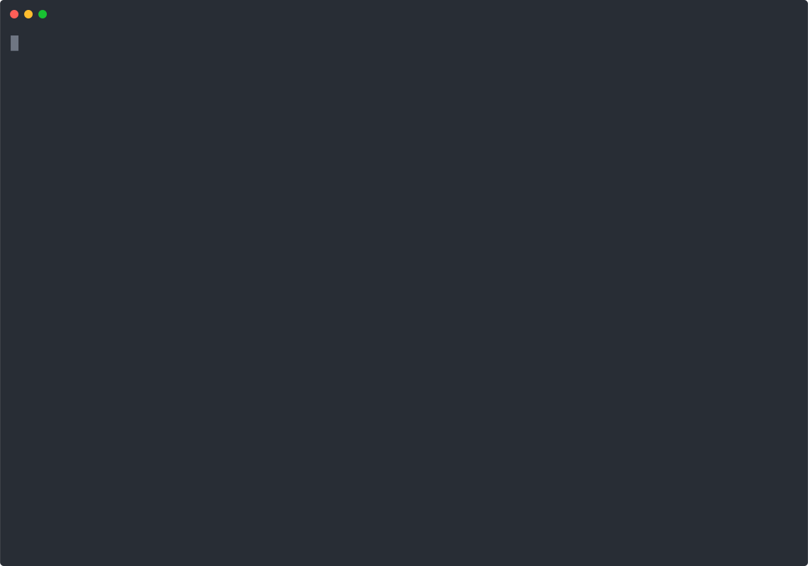
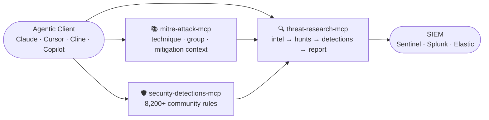

<div align="center">

# 🔍 Threat Research MCP

**Paste a threat report. Get IOCs, ATT&CK mappings, hunt queries, and Sigma rules — in one call.**

An offline-first MCP server that chains the full threat-intel-to-detection workflow into a single callable pipeline. Works with Claude Desktop, Cline, Cursor, Copilot, and any MCP-compatible client.

---

[](https://github.com/harshthakur6293/threat-research-mcp/actions/workflows/ci.yml)
[](https://www.python.org/downloads/)
[](tests/)
[](tests/)
[](LICENSE)
[](https://modelcontextprotocol.io)
[](src/threat_research_mcp/server.py)

[Why this project?](#why-this-project) · [Quick Start](#quick-start) · [Usage Example](#usage-example) · [The Pipeline](#the-pipeline) · [Tool Catalog](#tool-catalog) · [Contributing](#contributing)

</div>

---

## Why this project?

Reading a vendor threat report today looks like this:

1. Manually copy out IPs, domains, and hashes into a spreadsheet
2. Open ATT&CK Navigator, search for techniques one by one, and note IDs
3. Hunt SigmaHQ for relevant rules, adapt them to your log schema
4. Write hunt hypotheses for each technique in your SIEM query language
5. Paste it all into a report template

This takes 2–4 hours per report. It is manual, error-prone, and doesn't scale when your threat-intel queue has 20 reports in it.

**Threat Research MCP automates steps 1–5.** Paste the report text, get back a structured detection package: IOCs with confidence scores, ATT&CK techniques with evidence, SPL/KQL/EQL hunt queries, curated Sigma rules, a Navigator heatmap layer, and a browser-ready HTML report — no API keys required for the core pipeline.

It sits alongside specialist MCPs ([mitre-attack-mcp](https://github.com/zxkane/mitre-attack-mcp), [security-detections-mcp](https://github.com/CyberSecAI/security-detections-mcp)) as the workflow orchestration layer, not a replacement for them.

---

## Quick Start

```bash
# Clone and install
git clone https://github.com/harshthakur6293/threat-research-mcp
cd threat-research-mcp
pip install -e ".[dev]"

# Verify — runs all 118 tests
python -m pytest -q

# Start the MCP server (stdio — your MCP client connects here)
python -m threat_research_mcp
```

> **PyPI / uvx not yet published.** The above local install is the only supported path today. `pip install threat-research-mcp` is on the roadmap.

### Connect to Claude Desktop

Add this to `~/Library/Application Support/Claude/claude_desktop_config.json` (macOS) or `%APPDATA%\Claude\claude_desktop_config.json` (Windows):

```json
{
  "mcpServers": {
    "threat-research-mcp": {
      "command": "python",
      "args": ["-m", "threat_research_mcp"],
      "cwd": "/path/to/threat-research-mcp"
    }
  }
}
```

Restart Claude Desktop, then paste any threat report and ask:

```
Run this through the threat research pipeline and give me the detection package.
```

---

## Usage Example

Below is a real run against a condensed excerpt from the **Google Mandiant UNC6692 Snow Flurries** report (Microsoft Teams phishing → browser extension backdoor → credential theft):

**Input — paste this into Claude:**

```
UNC6692 Microsoft Teams phishing impersonating IT helpdesk. AutoHotkey scripts
from S3. SNOWBELT browser extension C2 over WebSocket AES-GCM. SNOWGLAZE Python
tunneler wss://sad4w7h913-b4a57f9c36eb.herokuapp.com:443/ws. SHA256
7f1d71e1e079f3244a69205588d504ed830d4c473747bb1b5c520634cc5a2477
lsass credential dump pass-the-hash lateral movement. Black Basta ransomware.
Source: https://cloud.google.com/blog/topics/threat-intelligence/unc6692
```

**Pipeline output (condensed):**

```
IOCs extracted (4 total)
  Domains: sad4w7h913-b4a57f9c36eb.herokuapp.com
  Hashes:  7f1d71e1e079f3244a69... (SHA256)

Source quality auto-detected: vendor_blog (0.75)

ATT&CK Techniques (14 above threshold)
  T1566.004  [MEDIUM 0.59]  Spearphishing via Service
               evidence: teams phishing, teams lure, impersonating it
  T1071      [MEDIUM 0.56]  Application Layer Protocol
               evidence: c2, command and control
  T1003.001  [LOW    0.54]  LSASS Memory
               evidence: lsass, credential dump
  T1550.002  [LOW    0.43]  Pass the Hash
               evidence: pass-the-hash
  T1486      [LOW    0.47]  Data Encrypted for Impact
               evidence: ransomware
  ... 9 more

Sigma rules: 14  (1 curated, 13 with community links)
Hunt hypotheses: 8
```

**What Claude returns to you:**
- An IOC table with confidence scores and MALICIOUS / UNKNOWN labels
- ATT&CK technique cards with evidence and links to attack.mitre.org
- Ready-to-deploy Sigma YAML for T1566.004, with community search links for gaps
- SPL / KQL / EQL hunt queries for each technique
- A Navigator layer JSON (drag into [attack.mitre.org/navigator](https://mitre-attack.github.io/attack-navigator/))
- A self-contained HTML report with D3 force graph, heatmap, and hunt cards

---

## Demo

The `demo/` folder contains a pre-generated **Sapphire Sleet (DPRK/BlueNoroff macOS)** detection package — browse it with no setup:

<p align="center">
  
</p>

```
demo/sapphire_sleet_input.txt           ← raw threat intel text used
demo/sapphire_sleet_pipeline.json       ← full pipeline JSON output
demo/sapphire_sleet_report.html         ← open in browser (no server needed)
demo/sapphire_sleet_navigator_layer.json
demo/sapphire_sleet_sigma_bundle.yml
demo/sapphire_sleet_iocs.csv
```

The HTML report includes:

| Section | What you see |
|---|---|
| Summary strip | IOC count · technique count · hunt count · Sigma count |
| IOC table | Value · type · confidence · MALICIOUS / UNKNOWN / VICTIM label |
| ATT&CK heatmap | Tactic columns, technique tiles, confidence colour |
| D3 force graph | IOC → technique → tactic, click to drill down |
| Hunt cards | Per-technique hypothesis · SPL / KQL / Elastic tab switcher |
| Sigma cards | Curated YAML (expandable) · community rule links for gaps |

---

## The Pipeline

One tool — `run_pipeline_tool` — chains all stages automatically:

```
raw intel text  (paste report, IR note, blog post, anything)
       │
       ▼
   extract_iocs ──────────────────── IPv4s, domains, hashes, emails
       │                             confidence-scored, context-labelled
       │
       ▼
     map_ttp ────────────────────── ATT&CK technique IDs + evidence
       │                            evidence-based confidence score
       │                            source quality auto-detected from URLs
       │                            IOC corroboration bonus applied
       │
       ├──▶ hunt_for_techniques ─── SPL / KQL / Elastic hunt queries
       │
       ├──▶ sigma_bundle ────────── curated Sigma rules (or community
       │                            search links for gaps — no fake rules)
       │
       ├──▶ navigator_layer ─────── ATT&CK Navigator JSON
       │                            drag into attack.mitre.org
       │
       └──▶ generate_threat_report ─ self-contained HTML report
                                     D3.js graph · heatmap · hunt cards
```

Each stage is also callable individually. Source quality is auto-detected from Microsoft, Google/Mandiant, CISA, and NCSC URLs found in the pasted text — no manual flag needed.

---

## MCP Client Configuration

The server uses **stdio transport** — no HTTP, no port, no authentication.

<details>
<summary><b>Claude Desktop</b></summary>

`~/Library/Application Support/Claude/claude_desktop_config.json` (macOS)
`%APPDATA%\Claude\claude_desktop_config.json` (Windows)

```json
{
  "mcpServers": {
    "threat-research-mcp": {
      "command": "python",
      "args": ["-m", "threat_research_mcp"],
      "cwd": "/path/to/threat-research-mcp"
    }
  }
}
```
</details>

<details>
<summary><b>VS Code / Cline / Roo Code</b></summary>

`.vscode/settings.json`

```json
{
  "cline.mcpServers": {
    "threat-research-mcp": {
      "command": "python",
      "args": ["-m", "threat_research_mcp"],
      "cwd": "${workspaceFolder}/../threat-research-mcp"
    }
  }
}
```
</details>

<details>
<summary><b>Cursor</b></summary>

`~/.cursor/mcp.json`

```json
{
  "mcpServers": {
    "threat-research-mcp": {
      "command": "python",
      "args": ["-m", "threat_research_mcp"],
      "cwd": "/path/to/threat-research-mcp"
    }
  }
}
```
</details>

<details>
<summary><b>Any other MCP client</b></summary>

Use the same shape — `command`, `args`, `cwd`. The server communicates via stdio and fits any client that supports the MCP stdio transport spec.
</details>

---

## What Each Stage Produces

### IOC Extraction — `extract_iocs`

Context-aware extraction with a confidence score and label per indicator:

```json
{
  "ips":     [{"value": "185.220.101.47", "confidence": 0.92, "label": "MALICIOUS"}],
  "domains": [{"value": "cdn.apple-cdn.org", "confidence": 0.85, "label": "MALICIOUS"}],
  "hashes":  [{"value": "a3f8c2d1...", "confidence": 0.78, "label": "HASH"}],
  "emails":  [{"value": "hr@careers-talent.io", "confidence": 0.71, "label": "MALICIOUS"}],
  "filtered_fps": [{"value": "192.168.1.1", "reason": "RFC1918"}]
}
```

Automatically filters: RFC1918 / loopback IPs, version strings, macOS bundle IDs (`com.apple.*`), known-benign CDN/cloud domains. Context patterns live in `playbook/ioc_context_patterns.yaml`.

---

### ATT&CK Mapping — `map_ttp`

Maps text to techniques using a **284-keyword index** loaded from `playbook/keywords.yaml`, with a four-dimensional confidence model:

| Dimension | Weight | What it measures |
|---|---|---|
| keyword_specificity | 35% | How diagnostic the matched keyword is (mimikatz vs. "script") |
| evidence_diversity | 25% | How many independent signals fired |
| ioc_corroboration | 20% | Whether extracted IOCs align with the technique |
| source_quality | 20% | Authority of the intelligence source |

```json
{
  "techniques": [
    {
      "id": "T1059.002",
      "name": "AppleScript",
      "tactic": "execution",
      "evidence": ["osascript", "applescript"],
      "confidence": 0.82,
      "confidence_label": "HIGH"
    }
  ],
  "suppressed": [...]
}
```

| Label | Score | Meaning |
|---|---|---|
| HIGH | ≥ 0.75 | Multiple specific signals — treat as confirmed |
| MEDIUM | 0.55 – 0.75 | Credible — worth hunting |
| LOW | 0.35 – 0.55 | Weak signal — analyst review recommended |
| SUPPRESSED | < 0.35 | Returned in `suppressed[]`, not the main list |

Scoring thresholds live in `playbook/confidence_weights.yaml` and are tunable per deployment.

---

### Hunt Hypotheses — `hunt_for_techniques`

Returns one hypothesis per technique × log source, each with a ready-to-run query:

```json
{
  "hypothesis": "Attacker invoked osascript to execute in-memory payload",
  "technique_id": "T1059.002",
  "log_source": "edr_macos",
  "spl": "index=edr source=macos process_name=osascript ...",
  "kql": "DeviceProcessEvents | where FileName =~ 'osascript' ...",
  "elastic": "process.name: osascript AND ..."
}
```

---

### Sigma Rules — `sigma_bundle_for_techniques`

Returns **curated rules** for supported techniques. For unsupported techniques, returns a structured `no_curated_rule` response with direct search links — no plausible-looking fake rules.

```json
{
  "technique_id": "T1059.001",
  "status": "curated",
  "rule_yaml": "title: PowerShell Download Cradle ..."
}
```

```json
{
  "technique_id": "T1190",
  "status": "no_curated_rule",
  "fallback": {
    "sigmahq_search": "https://github.com/SigmaHQ/sigma/search?q=T1190",
    "elastic_rules":  "https://github.com/elastic/detection-rules/search?q=T1190"
  }
}
```

---

## Tool Catalog

46 registered MCP tools total.

### Primary Workflow

| Tool | What it does |
|---|---|
| `run_pipeline_tool` | Full pipeline: text → IOCs → ATT&CK → hunts → Sigma |
| `extract_iocs` | Context-aware IOC extraction with confidence |
| `map_ttp` | ATT&CK technique mapping with evidence + confidence |
| `hunt_from_intel` | Hunt hypotheses from raw text |
| `hunt_for_techniques` | Hunt hypotheses for specific technique IDs |
| `list_log_sources_tool` | List available log source keys for filtering |
| `generate_threat_report` | Self-contained HTML report from pipeline JSON |
| `navigator_layer` | ATT&CK Navigator layer JSON |

### Sigma and Detection Drafts

| Tool | What it does |
|---|---|
| `generate_sigma_rule` | Build Sigma from title + behavior description |
| `sigma_for_technique` | Curated Sigma or `no_curated_rule` for a technique |
| `sigma_bundle_for_techniques` | Batch Sigma for multiple techniques |
| `validate_sigma_rule` | Offline structure validation (no CLI needed) |
| `score_sigma` | Score specificity, coverage, FP risk |
| `score_technique_sigma` | Score a built-in curated rule |
| `kql_for_technique` | Microsoft Sentinel KQL |
| `spl_for_technique` | Splunk SPL |
| `eql_for_technique` | Elastic EQL |
| `yara_for_technique` | YARA file-scanning rules |
| `generate_yara` | Custom YARA from string patterns |
| `ioc_sigma_bundle` | IOC blocklist Sigma bundle with TTL guidance |
| `detection_coverage_gap` | Gap analysis: tracked techniques vs existing detections |
| `atomic_tests_for_technique` | Atomic Red Team test IDs for validation |

### IOC Enrichment (optional — requires API keys)

| Tool | What it does |
|---|---|
| `enrich_ioc_tool` | Single IOC: VT / OTX / AbuseIPDB / URLhaus |
| `enrich_iocs_tool` | Bulk enrich comma-separated IOCs (capped at 20) |

### Intake and Parsing

| Tool | What it does |
|---|---|
| `ingest_feed` | TAXII 2.1, RSS/Atom, HTML, local file ingestion |
| `analyze_intel` | Pipeline on text + ingested feed docs |
| `parse_stix` | Parse STIX 2.x bundle JSON |
| `stix_to_text` | Flatten STIX to pipeline-ready text |
| `timeline` | Sort log lines/event notes chronologically |

### MISP Integration (optional — requires `MISP_URL` + `MISP_KEY`)

| Tool | What it does |
|---|---|
| `misp_pull` | Pull events, returns IOCs + pipeline-ready text |
| `misp_push_sigma` | Push Sigma rule as attribute to a MISP event |
| `misp_create_event` | Create MISP event from pipeline output |

### Campaign Tracking

| Tool | What it does |
|---|---|
| `campaign_update` | Store/update campaign state (JSON, file-based) |
| `campaign_get` | Retrieve campaign state |
| `campaign_list` | List all tracked campaigns |
| `campaign_correlate_ioc` | Find campaigns sharing an IOC |

### Storage and Search

| Tool | What it does |
|---|---|
| `search_intel_history` | Search stored analysis products (SQLite) |
| `get_intel_by_id` | Retrieve stored product by row ID |
| `search_ingested_docs` | Search ingested document store |

### Local ATT&CK Database (optional — requires `python scripts/build_attack_db.py`)

| Tool | What it does |
|---|---|
| `attack_get_technique` | Full technique card: platforms, data sources, detection |
| `attack_get_threat_groups` | Groups known to use a technique |
| `attack_get_techniques_by_group` | Techniques attributed to a group |
| `attack_attribute_to_group` | Rank groups by technique overlap (Jaccard similarity) |
| `attack_get_data_sources` | Map ATT&CK data sources to SIEM log sources |
| `attack_get_mitigations` | ATT&CK recommended mitigations |

```bash
python scripts/build_attack_db.py
# → playbook/attack.db (~30 MB, ~600 techniques, ~130 groups)
```

---

## Multi-MCP Workflow

This server is the **workflow orchestration layer** — pair it with specialist MCPs for the deepest results:



```json
{
  "mcpServers": {
    "threat-research-mcp": {
      "command": "python",
      "args": ["-m", "threat_research_mcp"],
      "cwd": "/path/to/threat-research-mcp"
    },
    "mitre-attack": { "command": "npx", "args": ["-y", "mitre-attack-mcp"] },
    "security-detections": { "command": "npx", "args": ["-y", "security-detections-mcp"] }
  }
}
```

Typical orchestration flow:

```
1. threat-research-mcp  → run_pipeline_tool(text=<report>)
2. mitre-attack-mcp     → get_technique for each mapped technique
3. security-detections  → list_by_mitre for each technique
4. threat-research-mcp  → sigma_for_technique for gaps only
5. threat-research-mcp  → generate_threat_report
```

---

## Playbook Files

Everything tunable lives in `playbook/` — no code changes needed:

| File | Controls |
|---|---|
| `keywords.yaml` | Keyword → ATT&CK technique mapping (284 entries, single source of truth) |
| `confidence_weights.yaml` | Confidence model dimensions, thresholds, specificity tiers |
| `ioc_context_patterns.yaml` | IOC context scoring patterns (malicious / victim / researcher) |
| `atomic_tests.yaml` | Atomic Red Team test ID mapping per technique |
| `siems/` | SIEM field profiles for KQL / SPL / EQL generation |

To add a new ATT&CK keyword mapping, edit `playbook/keywords.yaml` and restart the server:

```yaml
entries:
  - keyword: "your-new-keyword"
    tactic: initial-access
    technique_id: T1190
    technique_name: Exploit Public-Facing Application
```

---

## Honest Limitations

| Limitation | Detail |
|---|---|
| **Sigma coverage** | Curated rules exist for ~16 techniques. Others return `no_curated_rule` + community search links. No fake rules are generated. |
| **ATT&CK DB** | The 6 `attack_*` lookup tools require `python scripts/build_attack_db.py` run once. They return a structured error until then. |
| **IOC enrichment** | Requires optional API keys (`VIRUSTOTAL_API_KEY`, `OTX_API_KEY`, `ABUSEIPDB_API_KEY`). The core pipeline works with zero keys. |
| **Detection drafts** | Generated KQL/SPL/EQL/YARA are analyst starting points. Review and tune before deploying to production. |
| **PyPI/uvx** | Not published yet. Local install via `pip install -e .` is the only supported path today. |
| **Campaign tracking** | JSON file-based — good for a single analyst or shared-git workflows, not a full relational campaign DB. |

---

## Development

```bash
pip install -e ".[dev]"

# Full CI check (mirrors GitHub Actions exactly)
python -m ruff check .
python -m ruff format --check .
python -m pytest -q --cov=src/threat_research_mcp --cov-fail-under=65
python -m bandit -c pyproject.toml -r src
python -m pip_audit --cache-dir .pip-audit-cache
```

Current local status:

```
118 passed, 5 skipped
coverage: 65%
ruff: pass · bandit: pass · pip-audit: pass
```

---

## Repository Layout

```
src/threat_research_mcp/
  server.py               MCP tool registration (46 tools)
  tools/
    run_pipeline.py       end-to-end pipeline orchestrator
    extract_iocs.py       context-aware IOC extraction
    map_attack.py         ATT&CK mapping (loads from keywords.yaml)
    generate_html_report.py  D3.js HTML report generator
    generate_sigma.py     curated Sigma wrapper
    generate_ioc_sigma.py IOC blocklist Sigma bundle
    generate_detections.py   KQL / SPL / EQL / YARA helpers
    navigator_export.py   ATT&CK Navigator layer export
    score_sigma.py        Sigma quality scoring
    attack_lookup.py      optional local ATT&CK SQLite lookup
    campaign_tracker.py   JSON campaign state
    misp_bridge.py        MISP integration

playbook/
  keywords.yaml           ATT&CK keyword index (single source of truth)
  confidence_weights.yaml confidence model + thresholds
  ioc_context_patterns.yaml  IOC context scoring
  atomic_tests.yaml       Atomic Red Team mapping
  siems/                  SIEM field profiles

demo/
  sapphire_sleet_*        pre-generated DPRK macOS detection package

scripts/
  build_attack_db.py      build local ATT&CK SQLite from MITRE STIX
```

---

## Contributing

Contributions are welcome. The highest-value areas right now:

**New ATT&CK keyword mappings** — edit `playbook/keywords.yaml` (no Python needed):

```yaml
- keyword: "your-keyword"
  tactic: execution
  technique_id: T1059.001
  technique_name: PowerShell
```

**Curated Sigma rules** — add rules in `src/threat_research_mcp/tools/generate_sigma.py` for techniques currently returning `no_curated_rule`. Highest priority: T1190, T1059.003, T1105, T1098.004, T1136.001, T1219, T1496.

**Eval cases** — add threat reports with expected IOC counts and technique IDs to `evals/` for regression testing. Format matches `evals/run_test.py`.

**SIEM profiles** — extend `playbook/siems/` with field mappings for additional log sources.

**How to contribute:**

```bash
git clone https://github.com/harshthakur6293/threat-research-mcp
pip install -e ".[dev]"

# Run the test suite before and after your change
python -m pytest -q

# Check your code passes linting
python -m ruff check . && python -m ruff format --check .

# Submit a pull request with a description of what you changed and why
```

Please open an issue before starting large changes so we can discuss approach first.

---

## License

MIT
