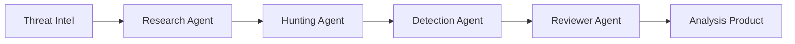

# Threat Research MCP

[](https://github.com/harshdthakur6293/threat-research-mcp/actions/workflows/ci.yml)
[](https://www.python.org/downloads/)
[](https://github.com/modelcontextprotocol/python-sdk)
[](LICENSE)
[]()

> **Enterprise-grade threat intelligence analysis and detection engineering platform powered by AI**

Transform raw threat intelligence into actionable security detections in seconds. Paste a threat report, get IOCs, ATT&CK techniques, hunt hypotheses, SIEM queries, and production-ready detection rules—all via your AI assistant.

**Threat Research MCP** is an open-source [Model Context Protocol](https://modelcontextprotocol.io/) server for **defensive security operations**: intel ingestion → analysis → threat hunting → detection engineering → validation.

---

## 🎯 Key Features

### Core Capabilities
- **🔍 IOC Extraction** — Automatically extract IPs, domains, URLs, hashes, emails from any text
- **🎯 ATT&CK Mapping** — Auto-detect techniques from threat intelligence using keyword-based heuristics
- **📊 Log Source Recommendations** — Get specific log sources (Windows Event IDs, CloudTrail, Sysmon) for 20+ techniques
- **🔎 SIEM Query Generation** — Ready-to-run queries for Splunk, Microsoft Sentinel, Elastic, AWS Athena, Chronicle
- **🛡️ Detection Engineering** — Draft Sigma rules, KQL, SPL with validation
- **🎭 Threat Actor Profiles** — Test against 6 realistic APT/UNC group scenarios
- **🔗 Optional MCP Integrations** — Chain with 4 specialist MCPs for enhanced capabilities

### Enterprise Features
- **✅ 100 Passing Tests** — Comprehensive test coverage including 29 threat actor scenario tests
- **🏢 Production Ready** — 19 MCP tools, 4-agent orchestration, optional SQLite persistence
- **🔒 Security First** — Defensive use only, no offensive capabilities, comprehensive security documentation
- **📈 Scalable** — Standalone or integrated with specialist MCPs for enterprise workflows
- **🔄 CI/CD Ready** — Pre-commit hooks, Makefile, GitHub Actions for quality assurance
- **📚 Enterprise Documentation** — 15+ comprehensive guides for deployment and operations

---

## 🚀 Quick Start (2 Minutes)

### 1. Install

```bash
git clone https://github.com/harshdthakur6293/threat-research-mcp.git
cd threat-research-mcp
python3 -m venv .venv
source .venv/bin/activate  # Windows: .venv\Scripts\activate
pip install -e ".[dev]"
```

### 2. Validate Installation

```bash
# Run comprehensive test suite (100 tests)
pytest tests/ -v

# Test threat actor scenarios (29 tests)
pytest tests/test_threat_actor_scenarios.py -v

# Run interactive demo
python examples/demo_threat_actor_testing.py
```

### 3. Connect to Your AI Assistant

Add to your MCP config (`mcp.json` for Cursor, `.vscode/mcp.json` for VS Code, `cline_mcp_settings.json` for Cline):

```json
{
  "mcpServers": {
    "threat-research-mcp": {
      "command": "/absolute/path/to/threat-research-mcp/.venv/bin/python",
      "args": ["-m", "threat_research_mcp.server"],
      "cwd": "/absolute/path/to/threat-research-mcp"
    }
  }
}
```

**Windows users:** Use `C:/path/to/.venv/Scripts/python.exe` for `command`.

### 4. Start Using

Open your AI assistant and try:
- "Extract IOCs from this threat report: [paste]"
- "Analyze this incident and give me hunt hypotheses"
- "Generate log sources for APT29 techniques"
- "Create a Sigma rule for PowerShell encoded commands"

---

## 📊 What You Get (v0.4)

### 19 MCP Tools

| Category | Tools | Description |
|----------|-------|-------------|
| **Analysis** | `extract_iocs`, `summarize`, `attack_map` | Extract IOCs, summarize intel, map to ATT&CK |
| **Detection** | `sigma`, `validate_sigma`, `generate_detection_ideas` | Draft and validate Sigma rules |
| **Hunting** | `hunt`, `timeline`, `intel_to_log_sources` | Generate hunt hypotheses, reconstruct timelines |
| **Log Sources** | `recommend_log_sources`, `intel_to_log_sources` | Get specific log sources and SIEM queries |
| **Integration** | `enhanced_intel_analysis`, `get_integration_status` | Orchestrate multiple MCPs, check availability |
| **Ingestion** | `ingest_sources`, `intel_to_analysis_product` | Ingest from RSS, STIX, TAXII, HTML |
| **History** | `search_ingested_intel`, `search_analysis_product_history` | Search past analyses (requires SQLite) |

### 4-Agent Orchestration



1. **Research Agent** — IOC extraction, summarization, ATT&CK mapping
2. **Hunting Agent** — Hypothesis generation, timeline reconstruction
3. **Detection Agent** — Sigma/KQL/SPL draft generation
4. **Reviewer Agent** — Quality checks, confidence scoring

### Threat Actor Testing Framework

Test your detections against 6 realistic threat actor profiles:

| Actor | Attribution | Key Campaign | Coverage |
|-------|-------------|--------------|----------|
| **APT29** | Russian SVR | SolarWinds | 29 techniques, 11 tactics |
| **APT28** | Russian GRU | Spearphishing | 27 techniques, 11 tactics |
| **APT41** | Chinese State | Healthcare/Telecom | 29 techniques, 12 tactics |
| **UNC2452** | Russian SVR | Supply Chain | 25 techniques, 11 tactics |
| **UNC3890** | Chinese Nexus | ProxyShell | 25 techniques, 11 tactics |
| **Lazarus** | North Korean | Cryptocurrency | 29 techniques, 12 tactics |

**Run tests:** `pytest tests/test_threat_actor_scenarios.py -v`

---

## 🏢 Enterprise Deployment

### Standalone Deployment

```bash
# Production installation
pip install -e .

# Start MCP server
python -m threat_research_mcp.server

# Enable SQLite persistence
export THREAT_RESEARCH_MCP_DB=/path/to/data/db/runs.sqlite
python -m threat_research_mcp.server
```

### Enhanced Deployment (with Optional MCPs)

Integrate with specialist MCPs for enterprise-grade capabilities:

| MCP | Purpose | Enterprise Use Case |
|-----|---------|---------------------|
| **[fastmcp-threatintel](https://github.com/4R9UN/fastmcp-threatintel)** | IOC enrichment | Validate IOCs against VirusTotal, OTX, AbuseIPDB |
| **[Security-Detections-MCP](https://github.com/MHaggis/Security-Detections-MCP)** | Coverage analysis | Check against 8,200+ existing detection rules |
| **[threat-hunting-mcp](https://github.com/THORCollective/threat-hunting-mcp-server)** | Behavioral hunting | Hunt for behaviors that survive IOC rotation |
| **[Splunk MCP](https://github.com/splunk/splunk-mcp-server2)** | Query validation | Validate SPL queries with risk scoring |

**Setup:** See [`docs/OPTIONAL-INTEGRATIONS.md`](docs/OPTIONAL-INTEGRATIONS.md)

### CI/CD Integration

```bash
# Pre-commit hooks (automatic code quality)
pre-commit install

# Local CI checks (run before push)
make ci

# Run specific checks
make test      # Run pytest
make lint      # Run ruff
make security  # Run bandit
```

### Docker Deployment (Coming Soon)

```bash
docker build -t threat-research-mcp .
docker run -p 8000:8000 threat-research-mcp
```

---

## 📚 Documentation

### Getting Started
- **[Quick Start Guide](docs/using-as-a-security-engineer.md)** — Step-by-step setup for Cursor, VS Code, Cline
- **[Threat Actor Testing](docs/THREAT-ACTOR-TESTING.md)** — Test against realistic APT scenarios
- **[Detection Engineering Workflows](docs/THREAT-ACTOR-QUICK-START.md)** — Build detections from threat actor profiles
- **[Adding Threat Actors](docs/ADDING-THREAT-ACTORS.md)** — Add custom profiles from public intelligence

### Integration Guides
- **[Complete MCP Ecosystem](docs/complete-mcp-ecosystem.md)** — 5-MCP integration guide
- **[Optional Integrations](docs/OPTIONAL-INTEGRATIONS.md)** — Setup guide for specialist MCPs
- **[Integration Architecture](docs/INTEGRATION-ARCHITECTURE.md)** — Technical architecture details
- **[Quick Reference](docs/QUICK-REFERENCE.md)** — One-page cheat sheet

### Feature Documentation
- **[Log Source Recommendations](docs/log-source-recommendations.md)** — Specific log sources for 20+ techniques
- **[Automatic Technique Detection](docs/automatic-technique-detection.md)** — Auto-detect ATT&CK techniques
- **[Behavioral Hunting](docs/threat-hunting-mcp-integration.md)** — Hunt behaviors, not IOCs
- **[Splunk Integration](docs/splunk-mcp-integration.md)** — Query validation and execution

### Technical Reference
- **[Tool Contracts](docs/tool-contracts.md)** — All 19 MCP tools with inputs/outputs
- **[Architecture](docs/architecture.md)** — System design and module status
- **[Canonical Schemas](docs/canonical-schemas.md)** — `AnalysisProduct` JSON schema
- **[Ingestion](docs/ingestion.md)** — Configure RSS, STIX, TAXII sources
- **[Security](SECURITY.md)** — Security policy and hardening guidance

---

## 🔬 Use Cases

### 1. Threat Intelligence Analysis

```python
# Analyze threat intelligence report
{
  "tool": "intel_to_log_sources",
  "arguments": {
    "intel_text": "APT29 using ICP Canister C2 via blockchain...",
    "environment": "aws",
    "siem_platforms": "splunk,sentinel"
  }
}

# Output: Auto-detected techniques, 25+ log sources, ready-to-run queries
```

### 2. Detection Engineering

```python
# Build detections for specific threat actor
from tests.threat_actor_profiles import get_threat_actor_profile

profile = get_threat_actor_profile("APT29")
techniques = profile["ttps"]["initial_access"]

# Generate log sources and SIEM queries
log_guidance = get_log_sources_for_techniques(techniques)
hunt_queries = generate_hunt_queries(techniques, siem_platforms=["splunk"])
```

### 3. Threat Hunting

```python
# Hunt for APT41 activity
profile = get_threat_actor_profile("APT41")

# Build hunt hypotheses
hypotheses = [
    "APT41 exploited public-facing applications",
    "APT41 deployed web shells for persistence",
    "APT41 used Cobalt Strike for C2"
]

# Generate hunt queries
queries = generate_hunt_queries(
    profile["ttps"]["initial_access"],
    siem_platforms=["splunk"]
)
```

### 4. Coverage Analysis

```python
# Find common techniques across multiple actors
actors = ["APT28", "APT29", "UNC2452"]
common_techniques = find_common_techniques(actors)

# Build detections that cover multiple actors
# Efficiency: 15 detections cover 50+ total techniques
```

### 5. IOC-Based Blocking

```python
# Extract IOCs from threat actor profile
profile = get_threat_actor_profile("Lazarus Group")
iocs = profile["iocs"]

# Generate firewall rules, DNS blocklist, EDR hash blocks
for ip in iocs["ips"]:
    print(f"deny ip any any {ip} any")
```

---

## 🧪 Testing & Quality Assurance

### Test Coverage

```bash
# Run all tests (100 tests)
pytest tests/ -v

# Run specific test suites
pytest tests/test_threat_actor_scenarios.py -v  # 29 tests
pytest tests/test_mcp_integrations.py -v        # 20 tests
pytest tests/test_log_source_mapper.py -v       # 12 tests

# Run with coverage report
pytest tests/ --cov=src/threat_research_mcp --cov-report=html
```

### Quality Checks

```bash
# Run all CI checks locally
make ci

# Individual checks
make test      # Pytest with coverage
make lint      # Ruff linting and formatting
make security  # Bandit security scanning
```

### Pre-commit Hooks

```bash
# Install pre-commit hooks
pre-commit install

# Run manually
pre-commit run --all-files
```

---

## 🗺️ Roadmap

### v0.4 (Current - April 2026) ✅

- **Threat Actor Testing Framework** ✅
  - 6 realistic APT/UNC group profiles
  - 29 comprehensive scenario tests
  - Detection engineering workflows
  - Public intelligence scraping templates

- **Log Source Recommendations** ✅
  - 20 common techniques mapped to specific log sources
  - Ready-to-run queries for 5 SIEM platforms
  - Deployment checklists

- **Optional MCP Integrations** ✅
  - Integration layer with graceful degradation
  - One-click orchestration tool
  - Support for 4 specialist MCPs

- **Enterprise Documentation** ✅
  - 15+ comprehensive guides
  - Detection engineering workflows
  - Threat actor testing guides

### v0.5 (Q3 2026)

- **Expanded Threat Actor Coverage**
  - 20+ threat actor profiles
  - Automated scraping from CISA, MITRE, Mandiant
  - Quarterly profile updates

- **Enhanced Detection Engineering**
  - 100+ technique mappings
  - Environment profiler
  - Coverage gap detection
  - ATT&CK Navigator integration

- **Full MCP Protocol Client**
  - Replace placeholder implementation
  - Retry logic and circuit breakers
  - Response caching
  - Parallel MCP calls

### v0.6 (Q1 2027)

- **Platform Integrations**
  - MISP, OpenCTI, Synapse connectors
  - Semantic search over intel corpus
  - Graph-based CTI reasoning

- **Enterprise Features**
  - Multi-tenant workspace isolation
  - RBAC and audit logging
  - Hunt campaign management
  - Custom playbook engine

### v1.0 (Q3 2027)

- **Production Hardening**
  - Docker/Kubernetes deployment
  - High availability configuration
  - Performance optimization
  - Enterprise support options

See [`.github/ROADMAP.md`](.github/ROADMAP.md) for detailed feature plans.

---

## 🤝 Contributing

We welcome contributions from the security community!

### Ways to Contribute

1. **Add Threat Actor Profiles** — See [`docs/ADDING-THREAT-ACTORS.md`](docs/ADDING-THREAT-ACTORS.md)
2. **Improve Detection Logic** — Enhance technique detection, log source mappings
3. **Add SIEM Support** — Contribute query templates for additional platforms
4. **Write Documentation** — Help others adopt the platform
5. **Report Issues** — Found a bug? Open an issue
6. **Submit Pull Requests** — Code contributions are welcome

### Development Setup

```bash
# Clone and install
git clone https://github.com/harshdthakur6293/threat-research-mcp.git
cd threat-research-mcp
pip install -e ".[dev]"

# Install pre-commit hooks
pre-commit install

# Run tests
make test

# Run all CI checks
make ci
```

### Security Vulnerabilities

For security vulnerabilities, use GitHub's **Security → Report a vulnerability** feature. See [`SECURITY.md`](SECURITY.md) for details.

**Defensive use only** in authorized environments. See [`SECURITY.md`](SECURITY.md) for scope and hardening guidance.

---

## 📄 License

MIT License - see [LICENSE](LICENSE) for details.

Copyright (c) 2026 Harsh Thakur

---

## 🙏 Acknowledgments

This project builds on the excellent work of:
- [Model Context Protocol](https://modelcontextprotocol.io/) by Anthropic
- [MITRE ATT&CK Framework](https://attack.mitre.org/)
- [Sigma Rules](https://github.com/SigmaHQ/sigma)
- [fastmcp-threatintel](https://github.com/4R9UN/fastmcp-threatintel)
- [Security-Detections-MCP](https://github.com/MHaggis/Security-Detections-MCP)
- [threat-hunting-mcp-server](https://github.com/THORCollective/threat-hunting-mcp-server)

Special thanks to the threat intelligence community for public reporting that makes this work possible.

---

## 📞 Support

- **Documentation:** [docs/](docs/)
- **Issues:** [GitHub Issues](https://github.com/harshdthakur6293/threat-research-mcp/issues)
- **Discussions:** [GitHub Discussions](https://github.com/harshdthakur6293/threat-research-mcp/discussions)
- **Security:** See [SECURITY.md](SECURITY.md)

---

## 🌟 Star History

If you find this project useful, please consider giving it a star! ⭐

---

<div align="center">

**Built with ❤️ for the defensive security community**

[Documentation](docs/) · [Quick Start](docs/using-as-a-security-engineer.md) · [Contributing](CONTRIBUTING.md) · [Security](SECURITY.md)

</div>
