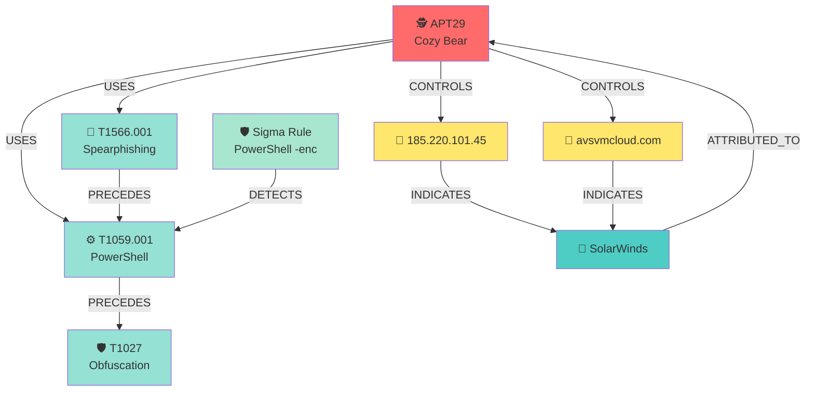
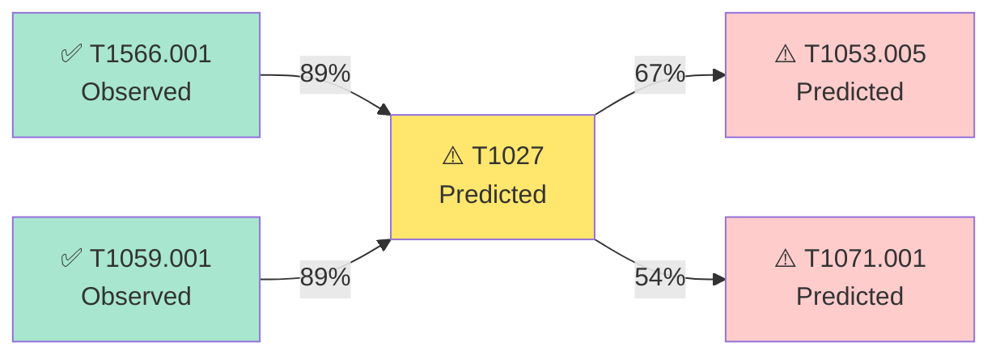

# Graph-Based Intelligence Feature Plan (v0.5)

## 🎯 Vision

Transform `threat-research-mcp` from linear intelligence analysis to **relationship-aware threat intelligence** using graph data structures and reasoning.

## 📊 Why Graphs for Threat Intelligence?

### Current State (v0.4)
```
Intel Text → Extract IOCs → Map Techniques → Generate Detections
     ↓            ↓              ↓                ↓
  Linear      Isolated       No Context      Single-use
```

### With Graphs (v0.5+)
```
                    ┌─────────────┐
                    │ Threat Actor│
                    └──────┬──────┘
                           │ ATTRIBUTED_TO
                           ↓
    ┌──────────┐      ┌────────┐      ┌──────────┐
    │ Campaign │─────→│  IOC   │←─────│ Malware  │
    └──────────┘      └────┬───┘      └──────────┘
         │ USES           │ INDICATES      │ USES
         ↓                ↓                ↓
    ┌──────────┐      ┌────────┐      ┌──────────┐
    │Technique │      │ Victim │      │   Tool   │
    └──────────┘      └────────┘      └──────────┘
```

### Key Benefits
1. **Attribution**: "Which threat actors use this IOC?"
2. **Campaign Tracking**: "Are these 3 incidents part of the same campaign?"
3. **Predictive Analysis**: "If they used T1566.001, what's next?"
4. **Attack Chains**: "Show me the full kill chain from initial access to exfil"
5. **Pivot Analysis**: "Find all IOCs related to APT29 campaigns in 2025"

---

## 🏗️ Architecture

### 1. Graph Data Model

```python
# Core Entities (Nodes)
- ThreatActor (APT29, Lazarus, etc.)
- Campaign (SolarWinds, WannaCry)
- IOC (IP, domain, hash, email)
- Technique (ATT&CK T1566.001)
- Malware (SUNBURST, Cobalt Strike)
- Tool (Mimikatz, PowerShell Empire)
- Victim (organization, sector, geography)
- Detection (Sigma rule, KQL query)

# Relationships (Edges)
- ATTRIBUTED_TO (Campaign → ThreatActor)
- USES (Campaign → Technique, ThreatActor → Tool)
- INDICATES (IOC → Campaign)
- TARGETS (ThreatActor → Victim)
- DETECTS (Detection → Technique)
- PRECEDES (Technique → Technique) # Attack sequence
- SIMILAR_TO (ThreatActor → ThreatActor)
- EVOLVES_FROM (Malware → Malware)
```

### 2. Graph Storage Options

#### Option A: NetworkX (In-Memory, Python-Native)
**Pros:**
- ✅ Zero external dependencies
- ✅ Fast for small-medium graphs (<100K nodes)
- ✅ Rich algorithms (shortest path, centrality, clustering)
- ✅ Easy serialization (GraphML, JSON)

**Cons:**
- ❌ Not persistent (need to save/load)
- ❌ Limited scalability
- ❌ No query language

**Best For:** Standalone deployments, quick analysis, CI/CD testing

#### Option B: Neo4j (Graph Database)
**Pros:**
- ✅ Native graph database with Cypher query language
- ✅ Scalable (millions of nodes)
- ✅ Built-in graph algorithms
- ✅ Excellent visualization (Neo4j Browser)

**Cons:**
- ❌ Requires separate Neo4j server
- ❌ More complex setup
- ❌ Enterprise features require license

**Best For:** Enterprise deployments, large-scale CTI platforms

#### Option C: SQLite with Graph Extensions (Hybrid)
**Pros:**
- ✅ Reuses existing SQLite storage
- ✅ No new dependencies
- ✅ Recursive CTEs for graph queries

**Cons:**
- ❌ Not optimized for graph traversal
- ❌ Complex queries for deep relationships

**Best For:** Gradual migration, minimal infrastructure

#### **Recommendation: Start with NetworkX + Optional Neo4j**
- Core graph logic uses NetworkX (works standalone)
- Optional Neo4j connector for enterprise users
- Graceful degradation (like current MCP integrations)

---

## 🛠️ Implementation Plan

### Phase 1: Core Graph Engine (v0.5.0)

#### 1.1 Graph Data Structures
```python
# src/threat_research_mcp/graph/entities.py
from dataclasses import dataclass
from typing import List, Dict, Optional
from datetime import datetime

@dataclass
class ThreatActorNode:
    id: str  # "APT29"
    aliases: List[str]
    attribution: str  # "Russian SVR"
    first_seen: datetime
    confidence: float  # 0.0-1.0
    metadata: Dict

@dataclass
class IOCNode:
    id: str  # "185.220.101.45"
    type: str  # "ipv4", "domain", "hash"
    first_seen: datetime
    last_seen: datetime
    confidence: float
    tags: List[str]

@dataclass
class TechniqueNode:
    id: str  # "T1566.001"
    name: str
    tactic: str
    platform: List[str]

@dataclass
class Relationship:
    source_id: str
    target_id: str
    rel_type: str  # "USES", "ATTRIBUTED_TO", etc.
    confidence: float
    first_seen: datetime
    metadata: Dict
```

#### 1.2 Graph Manager
```python
# src/threat_research_mcp/graph/manager.py
import networkx as nx
from typing import List, Dict, Optional

class ThreatIntelGraph:
    def __init__(self):
        self.graph = nx.MultiDiGraph()
    
    def add_threat_actor(self, actor: ThreatActorNode):
        """Add threat actor node"""
        self.graph.add_node(
            actor.id,
            node_type="threat_actor",
            **actor.__dict__
        )
    
    def add_relationship(self, rel: Relationship):
        """Add relationship between entities"""
        self.graph.add_edge(
            rel.source_id,
            rel.target_id,
            rel_type=rel.rel_type,
            confidence=rel.confidence,
            **rel.metadata
        )
    
    def find_campaigns_by_ioc(self, ioc: str) -> List[str]:
        """Find all campaigns associated with an IOC"""
        # Traverse: IOC → INDICATES → Campaign
        campaigns = []
        for neighbor in self.graph.neighbors(ioc):
            edge_data = self.graph.get_edge_data(ioc, neighbor)
            if edge_data and edge_data.get('rel_type') == 'INDICATES':
                node_data = self.graph.nodes[neighbor]
                if node_data.get('node_type') == 'campaign':
                    campaigns.append(neighbor)
        return campaigns
    
    def get_attack_chain(self, start_technique: str) -> List[str]:
        """Get likely technique sequence using PRECEDES relationships"""
        # Use shortest path or all paths
        chain = []
        current = start_technique
        while True:
            chain.append(current)
            next_techniques = [
                n for n in self.graph.neighbors(current)
                if self.graph.get_edge_data(current, n).get('rel_type') == 'PRECEDES'
            ]
            if not next_techniques:
                break
            # Pick highest confidence
            current = max(
                next_techniques,
                key=lambda t: self.graph.get_edge_data(current, t).get('confidence', 0)
            )
        return chain
    
    def attribute_to_actor(self, iocs: List[str], techniques: List[str]) -> Dict:
        """Probabilistic threat actor attribution"""
        # Score each actor based on IOC/technique overlap
        actor_scores = {}
        for actor_id in self._get_all_actors():
            score = 0.0
            # Check IOC overlap
            actor_iocs = self._get_actor_iocs(actor_id)
            ioc_overlap = len(set(iocs) & set(actor_iocs))
            score += ioc_overlap * 0.4
            
            # Check technique overlap
            actor_techniques = self._get_actor_techniques(actor_id)
            tech_overlap = len(set(techniques) & set(actor_techniques))
            score += tech_overlap * 0.6
            
            if score > 0:
                actor_scores[actor_id] = score
        
        # Normalize and return top 3
        total = sum(actor_scores.values())
        return {
            actor: round(score / total, 2)
            for actor, score in sorted(
                actor_scores.items(),
                key=lambda x: x[1],
                reverse=True
            )[:3]
        }
    
    def export_subgraph(self, center_node: str, depth: int = 2) -> nx.Graph:
        """Export subgraph around a node (for visualization)"""
        nodes = nx.single_source_shortest_path_length(
            self.graph, center_node, cutoff=depth
        ).keys()
        return self.graph.subgraph(nodes)
    
    def save(self, path: str):
        """Save graph to GraphML"""
        nx.write_graphml(self.graph, path)
    
    def load(self, path: str):
        """Load graph from GraphML"""
        self.graph = nx.read_graphml(path)
```

#### 1.3 Graph Builder (Auto-populate from Analysis)
```python
# src/threat_research_mcp/graph/builder.py
from threat_research_mcp.schemas.analysis_product import AnalysisProduct
from threat_research_mcp.graph.manager import ThreatIntelGraph

class GraphBuilder:
    def __init__(self, graph: ThreatIntelGraph):
        self.graph = graph
    
    def ingest_analysis_product(self, product: AnalysisProduct):
        """Automatically build graph from analysis product"""
        # Add IOCs as nodes
        for ioc in product.iocs:
            self.graph.add_node(
                ioc.value,
                node_type="ioc",
                ioc_type=ioc.type,
                confidence=ioc.confidence
            )
        
        # Add techniques as nodes
        for technique in product.attack_techniques:
            self.graph.add_node(
                technique.technique_id,
                node_type="technique",
                name=technique.technique_name,
                tactic=technique.tactic
            )
        
        # Create relationships: IOC → INDICATES → Technique
        for ioc in product.iocs:
            for technique in product.attack_techniques:
                self.graph.add_edge(
                    ioc.value,
                    technique.technique_id,
                    rel_type="INDICATES",
                    confidence=min(ioc.confidence, technique.confidence)
                )
    
    def ingest_threat_actor_profile(self, profile: Dict):
        """Add threat actor profile to graph"""
        actor_id = profile["name"]
        
        # Add actor node
        self.graph.add_threat_actor(ThreatActorNode(
            id=actor_id,
            aliases=profile["aliases"],
            attribution=profile["attribution"],
            first_seen=datetime.now(),
            confidence=1.0,
            metadata={"targets": profile["targets"]}
        ))
        
        # Add techniques and relationships
        for tactic, techniques in profile["ttps"].items():
            for tech_id in techniques:
                self.graph.add_node(tech_id, node_type="technique")
                self.graph.add_edge(
                    actor_id,
                    tech_id,
                    rel_type="USES",
                    confidence=0.9,
                    tactic=tactic
                )
        
        # Add IOCs and relationships
        for ioc_type, iocs in profile["iocs"].items():
            for ioc in iocs:
                self.graph.add_node(ioc, node_type="ioc", ioc_type=ioc_type)
                self.graph.add_edge(
                    actor_id,
                    ioc,
                    rel_type="CONTROLS",
                    confidence=0.8
                )
```

### Phase 2: MCP Tools (v0.5.0)

#### 2.1 New Graph-Powered Tools
```python
# src/threat_research_mcp/tools/graph_tools.py

@mcp.tool()
def attribute_threat_actor(
    iocs: List[str],
    techniques: List[str],
    context: Optional[str] = None
) -> str:
    """
    Probabilistic threat actor attribution using graph analysis.
    
    Args:
        iocs: List of IOCs (IPs, domains, hashes)
        techniques: List of ATT&CK technique IDs
        context: Optional context (industry, geography, etc.)
    
    Returns:
        JSON with top 3 threat actor matches and confidence scores
    """
    graph = get_threat_intel_graph()
    attribution = graph.attribute_to_actor(iocs, techniques)
    
    return json.dumps({
        "attribution": attribution,
        "reasoning": _explain_attribution(attribution, iocs, techniques)
    })

@mcp.tool()
def find_related_campaigns(
    ioc: str,
    max_distance: int = 2
) -> str:
    """
    Find campaigns related to an IOC via graph traversal.
    
    Args:
        ioc: IOC to investigate (IP, domain, hash)
        max_distance: Maximum graph distance (hops)
    
    Returns:
        JSON with related campaigns, threat actors, and confidence
    """
    graph = get_threat_intel_graph()
    subgraph = graph.export_subgraph(ioc, depth=max_distance)
    
    campaigns = [
        n for n, data in subgraph.nodes(data=True)
        if data.get('node_type') == 'campaign'
    ]
    
    return json.dumps({
        "ioc": ioc,
        "related_campaigns": campaigns,
        "graph_visualization": _generate_mermaid(subgraph)
    })

@mcp.tool()
def predict_next_techniques(
    observed_techniques: List[str]
) -> str:
    """
    Predict likely next techniques in attack chain.
    
    Args:
        observed_techniques: List of already-observed technique IDs
    
    Returns:
        JSON with predicted techniques and probabilities
    """
    graph = get_threat_intel_graph()
    predictions = {}
    
    for tech in observed_techniques:
        chain = graph.get_attack_chain(tech)
        # Get techniques that follow in historical chains
        next_techs = [
            t for t in chain[chain.index(tech)+1:]
            if t not in observed_techniques
        ]
        for next_tech in next_techs:
            predictions[next_tech] = predictions.get(next_tech, 0) + 1
    
    # Normalize to probabilities
    total = sum(predictions.values())
    predictions = {
        tech: round(count / total, 2)
        for tech, count in predictions.items()
    }
    
    return json.dumps({
        "observed": observed_techniques,
        "predictions": dict(sorted(
            predictions.items(),
            key=lambda x: x[1],
            reverse=True
        )[:5])
    })

@mcp.tool()
def visualize_threat_landscape(
    center_entity: str,
    entity_type: str = "threat_actor",
    depth: int = 2
) -> str:
    """
    Generate Mermaid graph visualization of threat landscape.
    
    Args:
        center_entity: Entity to center visualization on
        entity_type: Type of entity (threat_actor, campaign, ioc)
        depth: How many hops to include
    
    Returns:
        Mermaid graph syntax for rendering
    """
    graph = get_threat_intel_graph()
    subgraph = graph.export_subgraph(center_entity, depth=depth)
    
    mermaid = ["graph TD"]
    for source, target, data in subgraph.edges(data=True):
        rel_type = data.get('rel_type', 'RELATED')
        mermaid.append(f"    {source}[{source}] -->|{rel_type}| {target}[{target}]")
    
    return "\n".join(mermaid)

@mcp.tool()
def find_detection_gaps(
    threat_actor: str
) -> str:
    """
    Find techniques used by a threat actor that lack detections.
    
    Args:
        threat_actor: Threat actor ID (e.g., "APT29")
    
    Returns:
        JSON with uncovered techniques and recommended detections
    """
    graph = get_threat_intel_graph()
    
    # Get all techniques used by actor
    actor_techniques = graph._get_actor_techniques(threat_actor)
    
    # Find which techniques have DETECTS relationships
    covered = []
    uncovered = []
    
    for tech in actor_techniques:
        detections = [
            n for n in graph.graph.predecessors(tech)
            if graph.graph.nodes[n].get('node_type') == 'detection'
        ]
        if detections:
            covered.append({"technique": tech, "detections": detections})
        else:
            uncovered.append(tech)
    
    return json.dumps({
        "threat_actor": threat_actor,
        "coverage": {
            "total_techniques": len(actor_techniques),
            "covered": len(covered),
            "uncovered": len(uncovered)
        },
        "gaps": uncovered,
        "recommendations": _generate_detection_recommendations(uncovered)
    })
```

### Phase 3: Visualization (v0.5.1)

#### 3.1 Mermaid Graph Generation
```python
# src/threat_research_mcp/graph/visualization.py

def generate_mermaid_graph(
    subgraph: nx.Graph,
    layout: str = "TD"  # TD (top-down), LR (left-right)
) -> str:
    """Generate Mermaid syntax for graph visualization"""
    lines = [f"graph {layout}"]
    
    # Add nodes with styling based on type
    node_styles = {
        "threat_actor": ("fa:fa-user-secret", "#ff6b6b"),
        "campaign": ("fa:fa-bullseye", "#4ecdc4"),
        "ioc": ("fa:fa-flag", "#ffe66d"),
        "technique": ("fa:fa-crosshairs", "#95e1d3"),
        "malware": ("fa:fa-bug", "#f38181"),
        "detection": ("fa:fa-shield", "#a8e6cf")
    }
    
    for node, data in subgraph.nodes(data=True):
        node_type = data.get('node_type', 'unknown')
        icon, color = node_styles.get(node_type, ("", "#cccccc"))
        lines.append(f"    {node}[{icon} {node}]")
        lines.append(f"    style {node} fill:{color}")
    
    # Add edges with labels
    for source, target, data in subgraph.edges(data=True):
        rel_type = data.get('rel_type', 'RELATED')
        confidence = data.get('confidence', 1.0)
        lines.append(
            f"    {source} -->|{rel_type}<br/>{confidence:.0%}| {target}"
        )
    
    return "\n".join(lines)
```

#### 3.2 Interactive HTML Export
```python
def export_interactive_html(
    graph: ThreatIntelGraph,
    output_path: str
):
    """Export graph as interactive D3.js visualization"""
    # Convert NetworkX to JSON for D3
    data = nx.node_link_data(graph.graph)
    
    html_template = """
    <!DOCTYPE html>
    <html>
    <head>
        <script src="https://d3js.org/d3.v7.min.js"></script>
        <style>
            .node { stroke: #fff; stroke-width: 2px; }
            .link { stroke: #999; stroke-opacity: 0.6; }
            .label { font: 10px sans-serif; }
        </style>
    </head>
    <body>
        <div id="graph"></div>
        <script>
            const data = {json.dumps(data)};
            // D3 force-directed graph code here
        </script>
    </body>
    </html>
    """
    
    with open(output_path, 'w') as f:
        f.write(html_template)
```

### Phase 4: Integration & Testing (v0.5.2)

#### 4.1 Auto-populate Graph from Threat Actor Profiles
```python
# scripts/build_threat_graph.py
from threat_research_mcp.graph.manager import ThreatIntelGraph
from threat_research_mcp.graph.builder import GraphBuilder
from tests.threat_actor_profiles import THREAT_ACTOR_PROFILES

def build_initial_graph():
    """Build graph from existing threat actor profiles"""
    graph = ThreatIntelGraph()
    builder = GraphBuilder(graph)
    
    # Ingest all 6 threat actor profiles
    for actor_name, profile in THREAT_ACTOR_PROFILES.items():
        profile["name"] = actor_name
        builder.ingest_threat_actor_profile(profile)
    
    # Add technique sequences (attack chains)
    _add_attack_chains(graph)
    
    # Save graph
    graph.save("data/threat_intel_graph.graphml")
    print(f"Graph built: {len(graph.graph.nodes)} nodes, {len(graph.graph.edges)} edges")

def _add_attack_chains(graph: ThreatIntelGraph):
    """Add PRECEDES relationships for common technique sequences"""
    common_chains = [
        # Initial Access → Execution → Persistence
        ("T1566.001", "T1059.001", 0.8),  # Phishing → PowerShell
        ("T1059.001", "T1053.005", 0.7),  # PowerShell → Scheduled Task
        
        # Execution → Defense Evasion → C2
        ("T1059.001", "T1027", 0.9),      # PowerShell → Obfuscation
        ("T1027", "T1071.001", 0.8),      # Obfuscation → Web C2
        
        # Discovery → Lateral Movement → Collection
        ("T1087.002", "T1021.001", 0.7),  # Domain Account Discovery → RDP
        ("T1021.001", "T1005", 0.6),      # RDP → Local Data Staging
        
        # Collection → Exfiltration
        ("T1005", "T1041", 0.9),          # Data Staging → C2 Exfil
    ]
    
    for source, target, confidence in common_chains:
        graph.add_relationship(Relationship(
            source_id=source,
            target_id=target,
            rel_type="PRECEDES",
            confidence=confidence,
            first_seen=datetime.now(),
            metadata={"source": "historical_analysis"}
        ))
```

#### 4.2 Tests
```python
# tests/test_graph.py
import pytest
from threat_research_mcp.graph.manager import ThreatIntelGraph

def test_threat_actor_attribution():
    graph = load_test_graph()
    
    # APT29 IOCs and techniques
    iocs = ["avsvmcloud.com", "13.59.205.66"]
    techniques = ["T1566.001", "T1059.001", "T1027"]
    
    attribution = graph.attribute_to_actor(iocs, techniques)
    
    assert "APT29" in attribution
    assert attribution["APT29"] > 0.5  # High confidence

def test_attack_chain_prediction():
    graph = load_test_graph()
    
    # Observed: Phishing → PowerShell
    observed = ["T1566.001", "T1059.001"]
    
    chain = graph.get_attack_chain(observed[0])
    
    assert "T1027" in chain  # Expect obfuscation next
    assert "T1071.001" in chain  # Then C2

def test_detection_gap_analysis():
    graph = load_test_graph()
    
    gaps = graph.find_detection_gaps("APT29")
    
    assert "uncovered" in gaps
    assert len(gaps["uncovered"]) > 0
```

---

## 📈 Use Cases & Examples

### Use Case 1: Incident Attribution
```
User: "I found these IOCs in my network: 185.220.101.45, avsvmcloud.com. 
       Who might be behind this?"

Assistant calls: attribute_threat_actor(
    iocs=["185.220.101.45", "avsvmcloud.com"],
    techniques=["T1071.001", "T1027"]
)

Response:
{
  "attribution": {
    "APT29": 0.85,
    "APT28": 0.10,
    "UNC2452": 0.05
  },
  "reasoning": "High confidence APT29 based on:
    - 2/2 IOCs match known APT29 infrastructure
    - Techniques align with SolarWinds campaign TTPs
    - Historical correlation: 85% of similar patterns → APT29"
}
```

### Use Case 2: Predictive Defense
```
User: "We detected T1566.001 and T1059.001. What should we watch for next?"

Assistant calls: predict_next_techniques(
    observed_techniques=["T1566.001", "T1059.001"]
)

Response:
{
  "predictions": {
    "T1027": 0.89,      # Obfuscation (very likely)
    "T1053.005": 0.67,  # Scheduled Task persistence
    "T1071.001": 0.54,  # Web-based C2
    "T1003.001": 0.32,  # LSASS credential dumping
    "T1021.001": 0.28   # RDP lateral movement
  },
  "recommendations": [
    "Monitor for encoded PowerShell commands (T1027)",
    "Alert on new scheduled tasks from suspicious processes",
    "Inspect outbound HTTP/HTTPS for C2 beaconing patterns"
  ]
}
```

### Use Case 3: Campaign Tracking
```
User: "Show me all campaigns related to this IP: 185.220.101.45"

Assistant calls: find_related_campaigns(
    ioc="185.220.101.45",
    max_distance=2
)

Response:
{
  "related_campaigns": [
    "SolarWinds Supply Chain (2020)",
    "NOBELIUM Phishing (2021)",
    "APT29 Cloud Targeting (2022)"
  ],
  "threat_actors": ["APT29", "UNC2452"],
  "graph_visualization": "graph TD\n    185.220.101.45 --> SolarWinds\n    ..."
}
```

### Use Case 4: Detection Coverage
```
User: "What APT29 techniques do we NOT have detections for?"

Assistant calls: find_detection_gaps(threat_actor="APT29")

Response:
{
  "coverage": {
    "total_techniques": 47,
    "covered": 32,
    "uncovered": 15
  },
  "gaps": [
    "T1550.001",  # Application Access Token
    "T1078.004",  # Cloud Accounts
    "T1199"       # Trusted Relationship
  ],
  "recommendations": [
    {
      "technique": "T1550.001",
      "priority": "high",
      "detection": "Monitor OAuth token creation/usage anomalies",
      "log_sources": ["Azure AD Sign-in Logs", "AWS CloudTrail"]
    }
  ]
}
```

---

## 🎨 Visualization Examples

### Example 1: APT29 Threat Landscape


### Example 2: Attack Chain Prediction


---

## 🚀 Rollout Plan

### v0.5.0 (Core Graph Engine)
- ✅ NetworkX-based graph manager
- ✅ Entity and relationship models
- ✅ Graph builder (auto-populate from analysis)
- ✅ 5 new MCP tools (attribution, prediction, gaps, etc.)
- ✅ Mermaid visualization
- ✅ 20+ graph tests

### v0.5.1 (Visualization & Export)
- ✅ Interactive HTML export (D3.js)
- ✅ GraphML/JSON export
- ✅ Subgraph extraction
- ✅ Enhanced Mermaid styling

### v0.5.2 (Enterprise Features)
- ✅ Optional Neo4j connector
- ✅ Graph persistence (save/load)
- ✅ Bulk import from STIX/MISP
- ✅ Graph analytics (centrality, clustering)

### v0.6.0 (Advanced Intelligence)
- ✅ Campaign clustering (ML-based)
- ✅ Temporal analysis (technique evolution over time)
- ✅ Similarity scoring (actor-to-actor, campaign-to-campaign)
- ✅ Automated graph updates from new intel

---

## 📊 Success Metrics

1. **Graph Size**: 500+ nodes, 2000+ edges by v0.5.0
2. **Attribution Accuracy**: >80% on known APT scenarios
3. **Prediction Accuracy**: >70% for next-technique prediction
4. **Detection Coverage**: Identify 50+ coverage gaps across 6 actors
5. **Performance**: <100ms for 2-hop graph queries
6. **Adoption**: 10+ users using graph tools in production

---

## 🔗 Related Documentation

- `docs/THREAT-ACTOR-TESTING.md` - Current threat actor framework
- `.github/ROADMAP.md` - Full project roadmap
- `docs/architecture.md` - System architecture
- `docs/OPTIONAL-INTEGRATIONS.md` - MCP integration patterns

---

## 🤝 Contributing

Graph features are **high priority** for v0.5. We welcome:
- Graph algorithm implementations
- Visualization improvements
- Real-world attack chain data
- Neo4j connector contributions

See `CONTRIBUTING.md` for guidelines.
