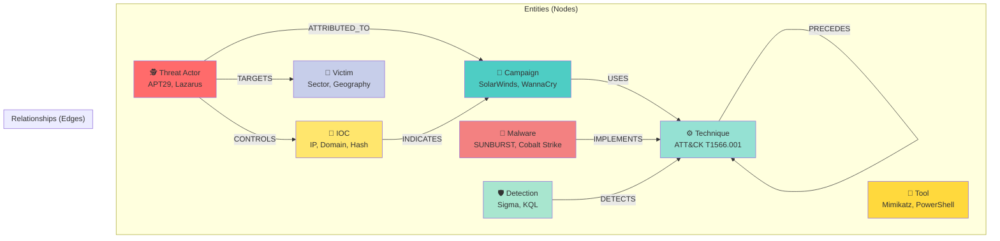
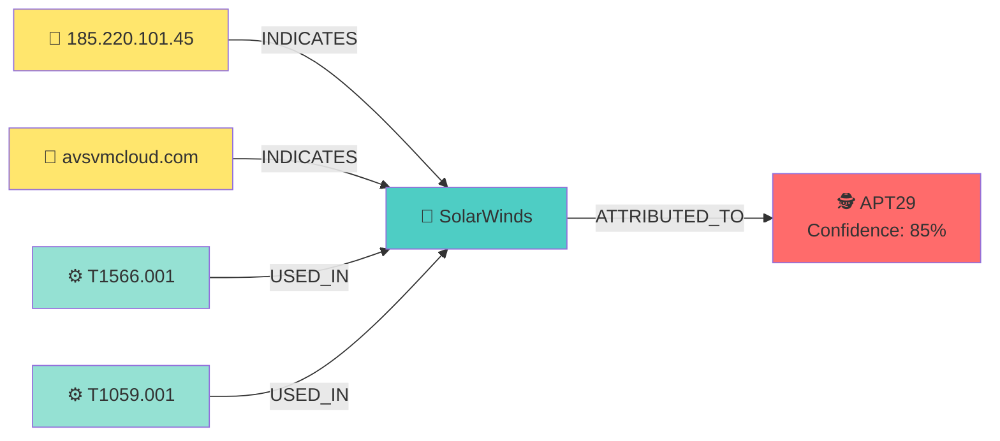
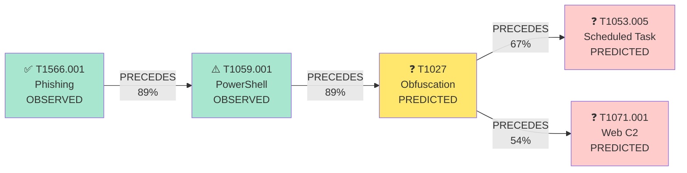
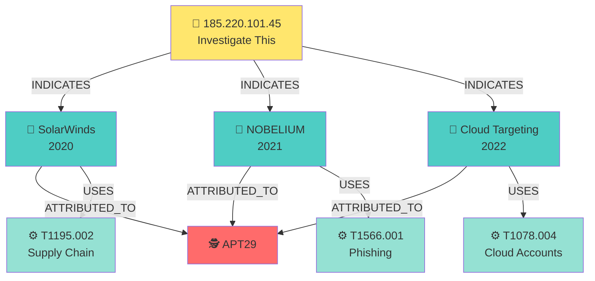
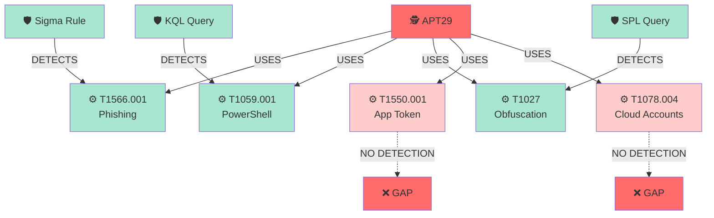
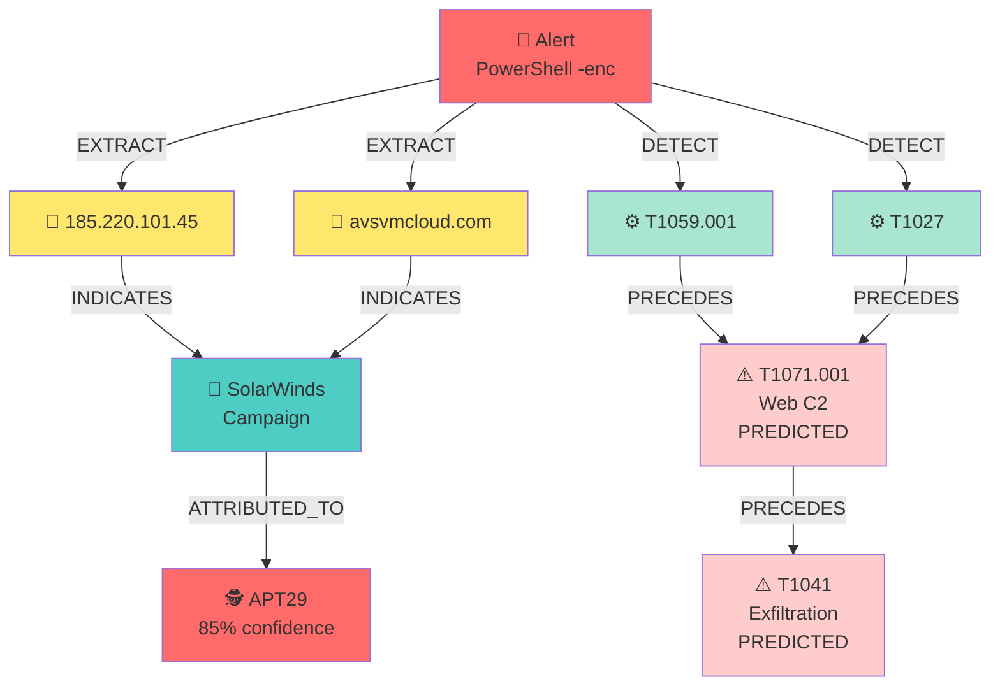
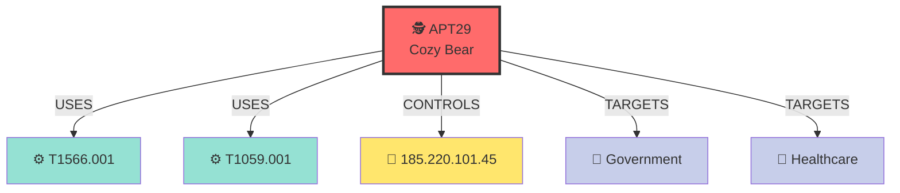

# Graph Features: Visual Quick Reference

## 🎯 The Big Picture

### Current (v0.4): Linear Analysis
```
┌─────────────┐     ┌──────────┐     ┌───────────┐     ┌────────────┐
│ Threat Intel│────→│Extract   │────→│Map to     │────→│Generate    │
│   (Text)    │     │IOCs      │     │ATT&CK     │     │Detections  │
└─────────────┘     └──────────┘     └───────────┘     └────────────┘
```

### Future (v0.5+): Graph-Based Intelligence
```
                    ╔═══════════════════════════════╗
                    ║   THREAT INTELLIGENCE GRAPH   ║
                    ╚═══════════════════════════════╝
                                  │
        ┌─────────────────────────┼─────────────────────────┐
        │                         │                         │
        ▼                         ▼                         ▼
  ┌──────────┐              ┌──────────┐              ┌──────────┐
  │Attribution│              │Prediction│              │  Pivot   │
  │"Who did   │              │"What's   │              │"Show me  │
  │ this?"    │              │ next?"   │              │everything│
  └──────────┘              └──────────┘              └──────────┘
```

---

## 🗺️ Graph Data Model



---

## 🔍 Key Use Cases

### 1. Threat Actor Attribution
**Question:** "Who's behind this attack?"



**Result:** "85% confidence APT29 based on IOC/technique overlap"

---

### 2. Attack Chain Prediction
**Question:** "What technique comes next?"



**Result:** "89% chance of obfuscation next, then persistence or C2"

---

### 3. Campaign Tracking
**Question:** "What campaigns used this IOC?"



**Result:** "IOC linked to 3 APT29 campaigns spanning 2020-2022"

---

### 4. Detection Gap Analysis
**Question:** "What techniques lack detections?"



**Result:** "2/5 techniques lack detections (T1550.001, T1078.004)"

---

## 🛠️ New MCP Tools (v0.5)

### Tool 1: `attribute_threat_actor`
```python
Input:
  iocs: ["185.220.101.45", "avsvmcloud.com"]
  techniques: ["T1566.001", "T1059.001"]

Output:
  {
    "APT29": 0.85,
    "APT28": 0.10,
    "UNC2452": 0.05
  }
```

### Tool 2: `predict_next_techniques`
```python
Input:
  observed_techniques: ["T1566.001", "T1059.001"]

Output:
  {
    "T1027": 0.89,      # Obfuscation
    "T1053.005": 0.67,  # Scheduled Task
    "T1071.001": 0.54   # Web C2
  }
```

### Tool 3: `find_related_campaigns`
```python
Input:
  ioc: "185.220.101.45"
  max_distance: 2

Output:
  {
    "campaigns": ["SolarWinds", "NOBELIUM"],
    "threat_actors": ["APT29", "UNC2452"],
    "graph": "mermaid syntax..."
  }
```

### Tool 4: `find_detection_gaps`
```python
Input:
  threat_actor: "APT29"

Output:
  {
    "coverage": {"total": 47, "covered": 32, "uncovered": 15},
    "gaps": ["T1550.001", "T1078.004", "T1199"],
    "recommendations": [...]
  }
```

### Tool 5: `visualize_threat_landscape`
```python
Input:
  center_entity: "APT29"
  depth: 2

Output:
  "graph TD\n    APT29 --> T1566.001\n    ..."
```

---

## 📊 Real-World Example

### Scenario: SOC Analyst Investigating Alert

**Step 1: Initial Alert**
```
Alert: Suspicious PowerShell execution
Host: WORKSTATION-42
User: jdoe
Command: powershell -enc <base64>
```

**Step 2: Extract Context**
```
IOCs Found:
- IP: 185.220.101.45
- Domain: avsvmcloud.com
- Hash: a1b2c3d4...

Techniques Detected:
- T1059.001 (PowerShell)
- T1027 (Obfuscation)
```

**Step 3: Graph Analysis**



**Step 4: Actionable Intelligence**
```
Attribution: APT29 (85% confidence)
Campaign: Likely SolarWinds-related activity
Next Steps:
  1. Monitor for Web C2 (T1071.001) - 89% probability
  2. Watch for exfiltration attempts (T1041)
  3. Check for lateral movement to other hosts
  4. Review cloud account activity (T1078.004)
  
Recommended Detections:
  - Deploy Sigma rule for APT29 PowerShell patterns
  - Alert on connections to known APT29 infrastructure
  - Monitor for scheduled task creation (T1053.005)
```

---

## 🎨 Visualization Styles

### Style 1: Threat Actor Landscape


### Style 2: Attack Timeline

```mermaid
gantt
    title APT29 Attack Chain Timeline
    dateFormat HH:mm
    section Initial Access
    Spearphishing Email    :done, 09:00, 09:15
    section Execution
    PowerShell -enc        :done, 09:15, 09:20
    section Defense Evasion
    Obfuscation            :done, 09:20, 09:25
    section C2
    Web Protocol C2        :active, 09:25, 09:45
    section Exfiltration
    Data Staging           :crit, 09:45, 10:00
    C2 Channel Exfil       :crit, 10:00, 10:15
```


### Style 3: Detection Coverage Heatmap
```
APT29 Technique Coverage:
━━━━━━━━━━━━━━━━━━━━━━━━━━━━━━━━━━━━━━━━
Initial Access    ████████░░ 80% (4/5)
Execution         ██████████ 100% (5/5)
Persistence       ██████░░░░ 60% (3/5)
Defense Evasion   ████░░░░░░ 40% (2/5)
Credential Access ██████████ 100% (3/3)
Discovery         ████████░░ 75% (3/4)
Lateral Movement  ██████░░░░ 67% (2/3)
Collection        ████████░░ 80% (4/5)
C2                ████░░░░░░ 50% (2/4)
Exfiltration      ██████░░░░ 67% (2/3)
Impact            ██░░░░░░░░ 20% (1/5)
━━━━━━━━━━━━━━━━━━━━━━━━━━━━━━━━━━━━━━━━
Overall Coverage: 68% (31/46 techniques)
```

---

## 🚀 Getting Started (When Released)

### 1. Build Initial Graph
```bash
# Auto-populate from threat actor profiles
python scripts/build_threat_graph.py

# Output: data/threat_intel_graph.graphml
# 500+ nodes, 2000+ edges
```

### 2. Use in MCP Client
```
User: "Attribute this attack: IOCs [185.220.101.45, avsvmcloud.com], 
       techniques [T1566.001, T1059.001]"