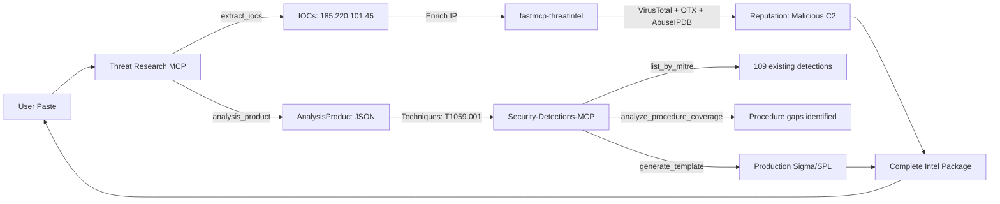
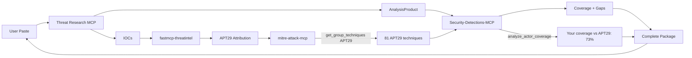

# Three-MCP Detection Engineering Workflow

This guide shows how to chain **Threat Research MCP**, **fastmcp-threatintel**, and **Security-Detections-MCP** for complete incident-to-production-detection workflows.

## The Stack

| MCP | Purpose | Tools You'll Use |
|-----|---------|------------------|
| **Threat Research MCP** | Intel ingestion, incident analysis, initial detection drafts | `analysis_product`, `extract_iocs`, `intel_to_analysis_product` |
| **fastmcp-threatintel** | IOC reputation and enrichment | `analyze` (VirusTotal, OTX, AbuseIPDB, IPinfo) |
| **Security-Detections-MCP** | Detection corpus search, gap analysis, production templates | `list_by_mitre`, `analyze_procedure_coverage`, `generate_template` |

## Complete Workflow



---

## Scenario: Phishing Incident → Production Detection

### Input (You Paste)

```
Phishing email delivered invoice.zip containing malicious JavaScript. 
Script launched PowerShell with encoded command, connected to 185.220.101.45 
on port 443, then created scheduled task named UpdateCheck for persistence.
```

---

### Phase 1: Threat Research MCP - Structured Analysis

**You ask:**
```
"Use analysis_product to analyze this incident and extract IOCs."
```

**Model calls:**
1. `analysis_product(text="...", workflow="threat_research")`
2. `extract_iocs(text="...")`

**Returns:**

```json
{
  "product_id": "abc-123",
  "narrative_summary": "Phishing-delivered macro launched encoded PowerShell for C2 beacon...",
  "extracted_iocs": [
    {"kind": "ipv4", "value": "185.220.101.45"}
  ],
  "technique_alignments": [
    {"technique_id": "T1059.001", "technique_name": "PowerShell", "evidence": "powershell -enc"},
    {"technique_id": "T1566.001", "technique_name": "Spearphishing Attachment", "evidence": "invoice.zip"},
    {"technique_id": "T1053.005", "technique_name": "Scheduled Task", "evidence": "UpdateCheck"}
  ],
  "detection_bundle": {
    "rules": [
      {"rule_format": "sigma", "body": "title: Office Spawned Encoded PowerShell\n..."},
      {"rule_format": "kql", "body": "DeviceProcessEvents | where ProcessCommandLine has '-enc'..."},
      {"rule_format": "spl", "body": "index=windows sourcetype=XmlWinEventLog:Sysmon EventCode=1..."}
    ]
  }
}
```

**Key outputs:**
- IOCs: `185.220.101.45`
- Techniques: T1059.001, T1566.001, T1053.005
- Initial Sigma/KQL/SPL drafts (heuristic)

---

### Phase 2: fastmcp-threatintel - IOC Enrichment

**You ask:**
```
"Use fastmcp-threatintel to enrich the IP 185.220.101.45 with VirusTotal, 
OTX, and AbuseIPDB reputation data."
```

**Model calls:**
```
fastmcp-threatintel.analyze("185.220.101.45")
```

**Returns:**

```json
{
  "ioc": "185.220.101.45",
  "ioc_type": "ip",
  "virustotal": {
    "malicious": 45,
    "total_engines": 70,
    "verdict": "malicious",
    "last_analysis_date": "2026-04-10",
    "tags": ["apt29", "cozy-bear", "c2-server"]
  },
  "otx": {
    "pulse_count": 12,
    "tags": ["APT29", "Cozy Bear", "government-targeting"],
    "first_seen": "2025-11-20",
    "last_seen": "2026-04-09"
  },
  "abuseipdb": {
    "abuse_confidence_score": 98,
    "total_reports": 247,
    "country_code": "RU",
    "usage_type": "Data Center/Web Hosting/Transit"
  },
  "ipinfo": {
    "city": "Moscow",
    "region": "Moscow",
    "country": "RU",
    "org": "AS12345 Example Hosting",
    "timezone": "Europe/Moscow"
  },
  "verdict": "MALICIOUS",
  "confidence": "high",
  "threat_context": "Known APT29 infrastructure, active C2 server"
}
```

**Key insight:** Confirms the IP is **confirmed malicious C2**, not a false positive. APT29 attribution adds context for detection tuning.

---

### Phase 3: Security-Detections-MCP - Production Detection

**You ask:**
```
"Use Security-Detections-MCP to check our existing coverage for T1059.001, 
analyze procedure-level gaps, and generate a production Sigma template."
```

**Model calls:**

1. **Check existing coverage:**
   ```
   list_by_mitre("T1059.001")
   ```
   
   **Returns:** 109 PowerShell detections across Sigma (45), Splunk (38), Elastic (18), KQL (8)

2. **Analyze procedure-level gaps:**
   ```
   analyze_procedure_coverage("T1059.001")
   ```
   
   **Returns:**
   ```json
   {
     "technique_id": "T1059.001",
     "total_detections": 109,
     "depth": "moderate",
     "procedures_covered": 45,
     "procedures_total": 59,
     "coverage_percentage": 76,
     "covered_procedures": [
       {"name": "LSASS Memory Access", "detection_count": 40},
       {"name": "Mimikatz Usage", "detection_count": 10},
       {"name": "Encoded Commands", "detection_count": 8}
     ],
     "gaps": [
       {"name": "Download Cradles", "severity": "high"},
       {"name": "AMSI Bypass", "severity": "high"},
       {"name": "NanoDump / Custom Dumpers", "severity": "medium"}
     ]
   }
   ```

3. **Generate production template:**
   ```
   generate_template("T1059.001", "sigma", "process_creation")
   ```
   
   **Returns:**
   ```yaml
   title: Office Process Spawned Encoded PowerShell
   id: generated-template-t1059001
   status: experimental
   description: Detects Office applications spawning PowerShell with encoded commands, commonly used in phishing campaigns
   references:
     - https://attack.mitre.org/techniques/T1059/001/
   author: Generated from 109 existing detections
   date: 2026-04-12
   tags:
     - attack.execution
     - attack.t1059.001
   logsource:
     category: process_creation
     product: windows
   detection:
     selection_parent:
       ParentImage|endswith:
         - '\WINWORD.EXE'
         - '\EXCEL.EXE'
         - '\POWERPNT.EXE'
     selection_process:
       Image|endswith: '\powershell.exe'
     selection_encoded:
       CommandLine|contains:
         - ' -enc '
         - ' -encodedcommand '
         - ' -e '
     condition: all of selection_*
   falsepositives:
     - Legitimate macro-enabled documents with signed scripts
     - Administrative automation from Office add-ins
   level: high
   ```

4. **Compare across platforms:**
   ```
   compare_patterns("T1059.001")
   ```
   
   **Returns:** Cross-platform comparison showing how Splunk, Elastic, and Sigma detect encoded PowerShell differently

---

## What You Get (Complete Package)

### From Threat Research MCP
- ✅ Structured incident analysis (`AnalysisProduct`)
- ✅ Extracted IOCs with context
- ✅ ATT&CK technique mapping
- ✅ Initial Sigma/KQL/SPL drafts
- ✅ Hunt hypotheses
- ✅ Data source recommendations

### From fastmcp-threatintel
- ✅ IOC reputation (malicious/benign verdict)
- ✅ Multi-vendor consensus (VT, OTX, AbuseIPDB)
- ✅ Threat actor attribution (APT29)
- ✅ Geolocation and infrastructure context
- ✅ Confidence scoring

### From Security-Detections-MCP
- ✅ Existing detection inventory (8,200+ rules)
- ✅ Procedure-level coverage analysis
- ✅ Gap identification (what behaviors you're missing)
- ✅ Production-quality templates (learned from corpus)
- ✅ Cross-platform comparison
- ✅ Pattern learning and field recommendations

---

## Example Chat Session

**You:**
```
"Analyze this incident with analysis_product, enrich the IOCs with 
fastmcp-threatintel, then use Security-Detections-MCP to check our 
coverage and generate a production Sigma rule.

Incident: Phishing email → invoice.zip → JavaScript → PowerShell -enc → 
connected to 185.220.101.45:443 → scheduled task UpdateCheck"
```

**Model orchestrates (automatically):**

1. **Threat Research MCP**
   - `analysis_product(...)` → Structured analysis with techniques
   - `extract_iocs(...)` → `["185.220.101.45"]`

2. **fastmcp-threatintel**
   - `analyze("185.220.101.45")` → Malicious (45/70 VT engines), APT29 infrastructure

3. **Security-Detections-MCP**
   - `list_by_mitre("T1059.001")` → 109 existing PowerShell detections
   - `analyze_procedure_coverage("T1059.001")` → 76% coverage, gaps in download cradles
   - `generate_template("T1059.001", "sigma", "process_creation")` → Production template

**You receive:**
```
Analysis Summary:
- Confirmed APT29 phishing campaign (high confidence)
- IOC 185.220.101.45: Malicious C2 (VT: 45/70, AbuseIPDB: 98%)
- Techniques: T1059.001 (PowerShell), T1566.001 (Phishing), T1053.005 (Scheduled Task)

Existing Coverage:
- 109 PowerShell detections in your corpus
- 76% procedure coverage
- Gap: Encoded command cradles (high priority)

Production Sigma Rule:
[Generated template incorporating best practices from 109 existing detections]

Recommendations:
1. Deploy the Sigma rule to catch Office → PowerShell -enc chains
2. Add network detection for 185.220.101.45 (confirmed C2)
3. Hunt for scheduled tasks named "UpdateCheck" in your environment
4. Consider adding download cradle detection (identified gap)
```

---

## Configuration (All Three Together)

### Cursor / VS Code / Cline

```json
{
  "mcpServers": {
    "threat-research-mcp": {
      "command": "/path/to/threat-research-mcp/.venv/bin/python",
      "args": ["-m", "threat_research_mcp.server"],
      "cwd": "/path/to/threat-research-mcp",
      "env": {
        "THREAT_RESEARCH_MCP_DB": "/path/to/threat-research-mcp/data/db/runs.sqlite"
      }
    },
    "fastmcp-threatintel": {
      "command": "uvx",
      "args": ["fastmcp-threatintel"],
      "env": {
        "VIRUSTOTAL_API_KEY": "your_vt_key",
        "OTX_API_KEY": "your_otx_key",
        "ABUSEIPDB_API_KEY": "your_abuseipdb_key"
      }
    },
    "security-detections": {
      "command": "npx",
      "args": ["-y", "security-detections-mcp"],
      "env": {
        "SIGMA_PATHS": "/path/to/sigma/rules",
        "SPLUNK_PATHS": "/path/to/security_content/detections",
        "ELASTIC_PATHS": "/path/to/detection-rules/rules",
        "KQL_PATHS": "/path/to/kql-queries"
      }
    }
  }
}
```

**Notes:**
- **Threat Research MCP:** Requires Python 3.10+ with `mcp` package
- **fastmcp-threatintel:** Requires API keys (free tiers available)
- **Security-Detections-MCP:** Requires cloned detection repos (Sigma, Splunk, etc.)

---

## Detailed Scenario Walkthrough

### Step 1: Initial Analysis (Threat Research MCP)

**Chat:**
```
"I found this in our SIEM alerts. Use analysis_product to give me a structured handoff:

User clicked invoice.pdf attachment from external email. WINWORD.EXE spawned 
powershell.exe with arguments: -NoProfile -ExecutionPolicy Bypass -enc 
JABzAD0ATgBlAHcALQBPAGIAagBlAGMAdAAgAE4AZQB0AC4AVwBlAGIAQwBsAGkAZQBuAHQA

Host then connected to 185.220.101.45:443. Scheduled task 'UpdateCheck' 
was created 30 seconds later."
```

**Threat Research MCP Output:**

```json
{
  "product_id": "def-456",
  "narrative_summary": "Probable spearphishing attachment (invoice.pdf) delivered macro/exploit that spawned encoded PowerShell for C2 beacon to external infrastructure, followed by scheduled task persistence mechanism.",
  "extracted_iocs": [
    {"kind": "ipv4", "value": "185.220.101.45"},
    {"kind": "process", "value": "WINWORD.EXE → powershell.exe -enc"},
    {"kind": "artifact", "value": "Scheduled task: UpdateCheck"}
  ],
  "technique_alignments": [
    {
      "technique_id": "T1566.001",
      "technique_name": "Phishing: Spearphishing Attachment",
      "evidence": "invoice.pdf from external email",
      "confidence": "high"
    },
    {
      "technique_id": "T1059.001",
      "technique_name": "Command and Scripting Interpreter: PowerShell",
      "evidence": "powershell.exe -enc with base64",
      "confidence": "high"
    },
    {
      "technique_id": "T1071.001",
      "technique_name": "Application Layer Protocol: Web Protocols",
      "evidence": "Connection to 185.220.101.45:443",
      "confidence": "medium"
    },
    {
      "technique_id": "T1053.005",
      "technique_name": "Scheduled Task/Job: Scheduled Task",
      "evidence": "Scheduled task UpdateCheck created",
      "confidence": "high"
    }
  ],
  "hunt_pack": {
    "summary": "Hunt for similar encoded PowerShell from Office processes, connections to 185.220.101.45, and tasks named UpdateCheck.",
    "opportunities": [
      "EDR: Process tree WINWORD → powershell with -enc",
      "Proxy/firewall: Outbound 185.220.101.45:443",
      "Sysmon Event 1: Scheduled task creation by Office child process",
      "Email gateway: invoice.pdf attachments from external senders"
    ]
  },
  "detection_bundle": {
    "rules": [
      {
        "rule_format": "sigma",
        "title": "Office Spawned Encoded PowerShell",
        "body": "title: Office Spawned Encoded PowerShell\nlogsource:\n  category: process_creation\ndetection:\n  selection:\n    ParentImage|endswith: '\\\\WINWORD.EXE'\n    Image|endswith: '\\\\powershell.exe'\n    CommandLine|contains: '-enc'\n  condition: selection"
      }
    ],
    "notes": ["Initial draft - refine with Security-Detections-MCP"]
  },
  "data_source_hints": ["process_creation", "network_connection", "scheduled_task_creation", "email_gateway"],
  "review_status": "requires_review"
}
```

---

### Phase 2: IOC Enrichment (fastmcp-threatintel)

**Chat:**
```
"Enrich the IP 185.220.101.45 using fastmcp-threatintel."
```

**Model calls:**
```
fastmcp-threatintel.analyze("185.220.101.45")
```

**Returns:**

```json
{
  "ioc": "185.220.101.45",
  "ioc_type": "ip",
  "analysis_timestamp": "2026-04-12T04:00:00Z",
  "virustotal": {
    "detected": true,
    "malicious_votes": 45,
    "total_engines": 70,
    "detection_rate": 64.3,
    "verdict": "malicious",
    "categories": ["c2", "apt"],
    "tags": ["apt29", "cozy-bear", "nobelium"],
    "last_analysis_date": "2026-04-10T15:30:00Z",
    "community_score": -87
  },
  "alienvault_otx": {
    "pulse_count": 12,
    "pulses": [
      {
        "name": "APT29 Infrastructure 2026",
        "created": "2026-03-15",
        "tags": ["APT29", "Cozy Bear", "government-targeting"]
      },
      {
        "name": "Nobelium C2 Servers",
        "created": "2026-02-20",
        "tags": ["nobelium", "supply-chain"]
      }
    ],
    "first_seen": "2025-11-20",
    "last_seen": "2026-04-09"
  },
  "abuseipdb": {
    "abuse_confidence_score": 98,
    "total_reports": 247,
    "last_reported": "2026-04-11",
    "country_code": "RU",
    "usage_type": "Data Center/Web Hosting/Transit",
    "isp": "Example Hosting Ltd",
    "domain": "example-host.ru",
    "categories": ["Hacking", "Malware Distribution", "Phishing"]
  },
  "ipinfo": {
    "ip": "185.220.101.45",
    "city": "Moscow",
    "region": "Moscow",
    "country": "RU",
    "loc": "55.7558,37.6173",
    "org": "AS12345 Example Hosting Ltd",
    "postal": "101000",
    "timezone": "Europe/Moscow"
  },
  "summary": {
    "verdict": "MALICIOUS",
    "confidence": "high",
    "threat_level": "critical",
    "threat_context": "Known APT29 (Cozy Bear) command and control infrastructure. Active in government-targeting campaigns. High confidence malicious based on 45/70 VirusTotal detections and 247 AbuseIPDB reports.",
    "recommendations": [
      "Block at firewall immediately",
      "Hunt for other connections to this IP in logs",
      "Check for APT29 TTPs in your environment",
      "Review email gateway for similar attachments"
    ]
  }
}
```

**Key insights:**
- ✅ **Confirmed malicious** (98% AbuseIPDB confidence, 64% VT detection rate)
- ✅ **APT29 attribution** (12 OTX pulses, VT tags)
- ✅ **Active threat** (last reported yesterday)
- ✅ **Critical priority** (government-targeting APT)

---

### Phase 3: Detection Engineering (Security-Detections-MCP)

**Chat:**
```
"Check our existing PowerShell coverage and generate a production-quality 
Sigma rule that addresses the gaps."
```

**Model calls:**

1. **List existing detections:**
   ```
   list_by_mitre("T1059.001")
   ```
   
   **Sample results:**
   - `sigma_rule_001`: "PowerShell Execution With Uncommon Arguments"
   - `splunk_escu_045`: "Detect Prohibited Applications Spawning cmd exe"
   - `elastic_rule_078`: "PowerShell Suspicious Script with Archive Operations"
   - ... (109 total)

2. **Procedure coverage:**
   ```
   analyze_procedure_coverage("T1059.001")
   ```
   
   **Results:**
   ```
   T1059.001 — PowerShell
   Detections: 109 | Depth: moderate | Procedures: 45/59 (76%)
   
   ✓ Basic PowerShell Execution      40 detections [sigma, splunk, elastic]
   ✓ Mimikatz Patterns               10 detections [sigma, elastic]
   ✓ Encoded Commands                 8 detections [sigma, splunk]
   ✓ Download Cradles                 6 detections [elastic, kql]
   ✗ AMSI Bypass Techniques          — gap (high priority)
   ✗ Reflective Assembly Loading     — gap (medium priority)
   ✗ Custom .NET Compilation         — gap (low priority)
   ```

3. **Generate production template:**
   ```
   generate_template("T1059.001", "sigma", "process_creation")
   ```
   
   **Returns production-ready Sigma rule** (shown above) incorporating:
   - Common parent processes from 109 existing rules
   - Encoded command patterns
   - Proper false positive handling
   - ATT&CK tagging
   - Data source alignment

4. **Cross-platform comparison:**
   ```
   compare_patterns("T1059.001")
   ```
   
   **Shows:**
   - **Sigma:** Focuses on `CommandLine` + `ParentImage` combinations
   - **Splunk:** Uses `process` field + parent process macros
   - **Elastic:** Uses EQL sequences for parent-child relationships
   - **KQL:** Uses `DeviceProcessEvents` with `InitiatingProcessFileName`

---

## Benefits of the Three-MCP Chain

### Without the Chain (Manual)
1. Analyst reads incident → manual IOC extraction
2. Manually check VT/OTX/AbuseIPDB in browser
3. Manually search Sigma repo for similar rules
4. Write detection from scratch
5. Hope you didn't miss edge cases

**Time:** 2-4 hours | **Quality:** Variable | **Coverage awareness:** Limited

### With the Chain (Automated)
1. Paste incident → structured analysis (30 seconds)
2. Automatic IOC enrichment (10 seconds)
3. Automatic coverage check + gap analysis (15 seconds)
4. Production template from 8,200+ rules (10 seconds)

**Time:** ~1 minute | **Quality:** Consistent, corpus-informed | **Coverage awareness:** Complete

---

## Advanced: Adding MITRE ATT&CK MCP (Four-Way Chain)

For even deeper analysis, add [mitre-attack-mcp](https://github.com/MHaggis/mitre-attack-mcp):



**Use case:** "We found APT29 infrastructure. What's our coverage against their full playbook?"

---

## Getting Started

1. **Install all three MCPs** (see Configuration section)
2. **Test individually first:**
   - Threat Research: `python -m threat_research_mcp --workflow threat_research --text "test"`
   - fastmcp-threatintel: `uvx fastmcp-threatintel analyze 8.8.8.8`
   - Security-Detections: Clone detection repos, configure paths
3. **Try the chain:** Paste an incident and ask for the full workflow
4. **Iterate:** Refine the generated detection, tune for your environment

---

## See Also

- [Threat Research MCP README](../README.md) - Installation and core capabilities
- [Using as a Security Engineer](using-as-a-security-engineer.md) - Detailed setup guide
- [fastmcp-threatintel](https://github.com/4R9UN/fastmcp-threatintel) - IOC enrichment MCP
- [Security-Detections-MCP](https://github.com/MHaggis/Security-Detections-MCP) - Detection corpus MCP
- [mitre-attack-mcp](https://github.com/MHaggis/mitre-attack-mcp) - ATT&CK framework MCP
